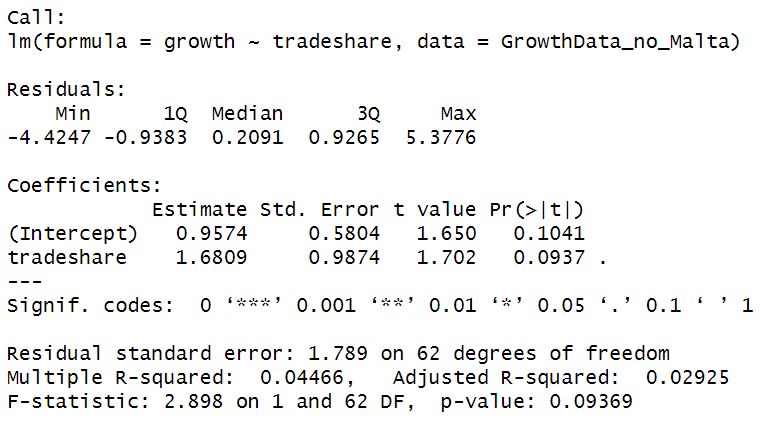
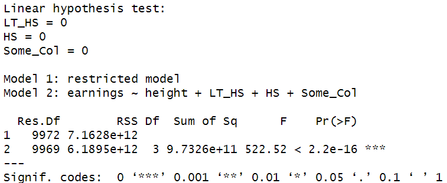
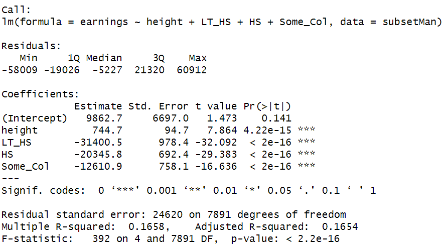

# Econometrics HW1

date: 2025/3/31

## E4.1 

**On the text website, http://www.pearsonglobaleditions.com, you will find the  data file Growth, which contains data on average growth rates from 1960  through 1995 for 65 countries, along with variables that are potentially related  to growth.1 A detailed description is given in Growth_Description, also avail able on the website. In this exercise, you will investigate the relationship  between growth and trade.**

### a.

**Construct a scatterplot of average annual growth rate (Growth) on the  average trade share (TradeShare). Does there appear to be a relationship  between the variables?**


There's a positive relationship between the variables.

### b.

**One country, Malta, has a trade share much larger than the other countries. Find Malta on the scatterplot. Does Malta look like an outlier?**


It looks like a outlier.

### c.

**Using all observations, run a regression of Growth on TradeShare. What  is the estimated slope? What is the estimated intercept? Use the regression to predict the growth rate for a country with a trade share of 0.5 and  for another with a trade share equal to 1.0.**


slope = 2.31, intercept = 0.64

If trade share = 0.5, growth rate = 1.80

If trade share = 1, growth rate = 2.95

### d.

**Estimate the same regression, excluding the data from Malta. Answer  the same questions in (c).**



slope = 1.68, intercept = 0.96

If trade share = 0.5, growth rate = 1.80

If trade share = 1, growth rate = 2.44

### e.

**Plot the estimated regression functions from (c) and (d). Using the scatterplot in (a), explain why the regression function that includes Malta is  steeper than the regression function that excludes Malta.**


Because the point of Malta lies above the function excludes Malta.

### f.

**Where is Malta? Why is the Malta trade share so large? Should Malta be  included or excluded from the analysis?**

Malta is located in the central Mediterranean Sea, between Europe, Africa, and the Middle East.

Malta has large trade share because:

1. Malta is an important hub for shipping. Its port facilities, the Port of Valletta,  serve as key transit points for goods.
2. Malta is a highly open economy with free trade policies. As a member of the European Union, Malta benefits from free trade policies within the EU.
3. Malta may export energy resources from the Middle East and North Africa through its port facilities.

Malta should be excluded, because it is a special case, not common.

## E4.2

**On the text website, http://www.pearsonglobaleditions.com, you will find the data file Earnings_and_Height, which contains data on earnings, height, and other characteristics of a random sample of U.S. workers. A detailed description is given in Earnings_and_Height_Description, also  available on the website. In this exercise, you will investigate the relationship  between earnings and height.**

### a.

**What is the median value of height in the sample?**

67

### b.

**i. Estimate average earnings for workers whose height is at most 67 inches. ii. Estimate average earnings for workers whose height is greater than 67 inches. iii. On average, do taller workers earn more than shorter workers? How  much more? What is a 95% confidence interval for the difference in  average earnings?**

i. average earnings = \$44488.44

ii. average earnings = \$49987.88

iii. On average, taller workers earn more than shorter workers. Around \$5499.44 more. 95% confidence interval is [4706.24, 6292.64].

### c.


Because the dataset constructor estimated a value of average earnings based on information in the certain section, and these average values were assigned to all workers with incomes in the corresponding section.

### d.

**Run a regression of Earnings on Height. i. What is the estimated slope? ii. Use the estimated regression to predict earnings for a worker who  is 67 inches tall, for a worker who is 70 inches tall, and for a worker  who is 65 inches tall.**


estimated slope = 707.67

| 65       | 67       | 70       |
| -------- | -------- | -------- |
| 45485.92 | 46901.26 | 49024.28 |

### e.

**Suppose height were measured in centimeters instead of inches. Answer  the following questions about the Earnings on Height (in cm) regression. i. What is the estimated slope of the regression? ii. What is the estimated intercept? iii. What is the $R^2$? iv. What is the standard error of the regression?**


estimated slope = 278.61

estimated intercept = -512.73

$R^2$ = 0.01088

standard error = 26780

### f.

**Run a regression of Earnings on Height, using data for female workers only. i. What is the estimated slope? ii. A randomly selected woman is 1 inch taller than the average  woman in the sample. Would you predict her earnings to be higher  or lower than the average earnings for women in the sample? By  how much?**


estimated slope = 511.2

average woman height = 64.49

predicted earnings = \$46132.22

predicted earnings are \$511.22 higher than the average earnings for women.

### g.

**Repeat (f) for male workers.**


estimated slope = 1306.9

average woman height = 70.08

predicted earnings = \$49766.61

predicted earnings are \$1306.86 higher than the average earnings for women.

### h.

**Do you think that height is uncorrelated with other factors that cause  earning? That is, do you think that the regression error term, ui has a  conditional mean of 0 given Height (Xi)? (You will investigate this more  in the Earnings and Height exercises in later chapters.)**

I don't think it's uncorrelated with other factors. Height should have correlations with factors like gender, race, weight, etc.

## E5.1

**Using the data set Growth described in Empirical Exercise 4.1, but excluding  the data for Malta, run a regression of Growth on TradeShare.**

### a.

**Is the estimated regression slope statistically significant? That is, can you  reject the null hypothesis H0: b1 = 0 vs. a two-sided alternative hypothesis at the 10%, 5%, or 1% significance level?**


It's significant at 10% level, not significant at 5% and 1% level.

### b.

**What is the p-value associated with the coefficient’s t-statistic?**

p-value = 0.09369

### c.

**Construct a 90% confidence interval for $\beta_1$.**

```R
confidence_level <- 0.90
t_critical <- qt((1 + confidence_level) / 2, df = 62)
ci_lower <- 1.6809 - t_critical * 0.9874
ci_upper <- 1.6809 + t_critical * 0.9874
```

90% confidence interval: [0.032, 3.330]

## E5.2

**Use the data set Earnings_and_Height described in Empirical Exercise 4.2 to  carry out the following exercises.**

### a.

**Run a regression of Earnings on Height. i. Is the estimated slope statistically significant? ii. Construct a 95% confidence interval for the slope coefficient.**


p < 2e-16, it's statistically significant.

95% confidence interval: [608.7047 ,  806.6353]

### b.

**Repeat (a) for women.**


p = 2.4e-07, it's statistically significant.

95% confidence interval: [317.336 ,  705.064]

### c.

**Repeat (a) for men.**


p < 2e-16

95% confidence interval: [1109.305 ,  1504.495]

### d.

**Test the null hypothesis that the effect of height on earnings is the same  for men and women. (Hint: See Exercise 5.15.)**


height: sex p = 1.79e-08

We can say the null hypothesis that the effect of height on earnings is the same  for men and women.

## E6.1

**Use the Birthweight_Smoking data set introduced in Empirical Exercise E5.3  to answer the following questions.**

### a.

**Regress Birthweight on Smoker. What is the estimated effect of smoking  on birth weight?**


smoking decreases birth weight.

### b.

**Regress Birthweight on Smoker, Alcohol, and Nprevist. i. Using the two conditions in Key Concept 6.1, explain why the  exclusion of Alcohol and Nprevist could lead to omitted variable bias in the regression estimated in (a). ii. Is the estimated effect of smoking on birth weight substantially  different from the regression that excludes Alcohol and Nprevist?  Does the regression in (a) seem to suffer from omitted variable bias? iii. Jane smoked during her pregnancy, did not drink alcohol, and had 8  prenatal care visits. Use the regression to predict the birth weight of  Jane’s child. iv. Compute $R^2$ and $\bar{R^2}$. Why are they so similar? v. How should you interpret the coefficient on Nprevist? Does the coefficient measure a causal effect of prenatal visits on birth weight?  If not, what does it measure?**


omitted variable bias result from two conditions: the omitted variable is correlated with the included regressor and the omitted variable is a determinant of  the dependent variable. Alcohol has negative effect on birth weight while number of prenatal visits is positively correlated with birth weight. Smokers are more likely to be alcoholics and the action of smoking reveals that they pay less attention to the health of fetus, thus having less number of prenatal visits. So, variable "Smoker" is correlated with "Alcohol" and "Nprevist".

There's substantial difference. It seems that regression in a suffers from omitted variable bias.

Jane's child's birth weight = 3106.228

Similar $R^2$ and $\bar{R^2}$ indicates that the number of independent variable is appropriate and independent variables have strong causal effect on dependent variable.

The coefficient on Nprevist doesn't necessarily measure a causal effect. It's possible that healthier pregnancies lead to more prenatal visits, rather than prenatal visits causing better health outcomes. Also, there may be other unobserved factors that influenced both the number of prenatal visits and birth weight, like economic status. The coefficient on Nprevist perhaps measure the correlation not causation. Or, it might reflect indirect effects.

### c.

**Estimate the coefficient on Smoking for the multiple regression model  in (b), using the three-step process in Appendix 6.3 (the Frisch–Waugh theorem). Verify that the three-step process yields the same estimated  coefficient for Smoking as that obtained in (b).**

The Frisch–Waugh theorem states  that the OLS coefficient in step 3 equals the OLS coefficient on X1 in the multiple regression model.

1. Regress $X_1$ on $X_2, X_3,..., X_k$ and let $\bar{X_1}$ denote the residuals from this regression; 
2. Regress $Y$ on $X_2, X_3,..., X_k$ and let $\bar{Y}$ denote the residuals from this regression;
3. Regress $\bar{Y}$ on $\bar{X_1}$


coefficient = -217.6, nearly same as the coefficient obtained in (b).

### d.

**An alternative way to control for prenatal visits is to use the binary  variables Tripre0 through Tripre3. Regress Birthweight on Smoker,  Alcohol, Tripre0, Tripre2, and Tripre3. i. Why is Tripre1 excluded from the regression? What would happen if  you included it in the regression? ii. The estimated coefficient on Tripre0 is large and negative. What does this coefficient measure? Interpret its value. iii. Interpret the value of the estimated coefficients on Tripre2 and Tripre3. i v. Does the regression in (d) explain a larger fraction of the variance in  birth weight than the regression in (b)?**


Because Tripre0 to Tripre1 is a group of dummy variable whose sum is 1, if all of them are included in the regression, it will cause multicollinearity, and make it impossible to calculate OLS estimator.

The coefficient on Tripre0 means that compared to Tripre1, the effect on the birthweight of no prenatal visit.

The coefficient on Tripre2/Tripre3 means that compared to Tripre1, the effect on the birthweight if 1st  prenatal care visit in 2nd/3rd trimester.

Adjusted R-squared = 0.04487 < 0.07192

## E6.2

### a.

**Construct a table that shows the sample mean, standard deviation,  and minimum and maximum values for the series Growth, TradeShare,  YearsSchool, Oil, Rev_Coups, Assassinations, and RGDP60. Include the  appropriate units for all entries.**

|                |     Mean     |      SD      |    Min     |     Max      |
| :------------- | :----------: | :----------: | :--------: | :----------: |
| Growth         |  1.9427154   |  1.8971198   | -2.811945  |  7.1568546   |
| TradeShare     |  0.5647030   |  0.2892703   |  0.140502  |  1.9926157   |
| YearsSchool    |  3.9850769   |  2.5420004   |  0.200000  |  10.0699997  |
| Oil            |  0.0000000   |  0.0000000   |  0.000000  |  0.0000000   |
| Rev_Coups      |  0.1674501   |  0.2246798   |  0.000000  |  0.9703704   |
| Assassinations |  0.2775641   |  0.4915284   |  0.000000  |  2.4666667   |
| RGDP60         | 3103.7846487 | 2512.6568457 | 366.999939 | 9895.0039062 |

### b.

**Run a regression of Growth on TradeShare, YearsSchool, Rev_Coups,  Assassinations, and RGDP60. What is the value of the coefficient on  Rev_Coups? Interpret the value of this coefficient. Is it large or small in  a real-world sense?**


coefficient on Rev_Coups = - 2.16

I think it's small in real-world sense.

### c.

**Use the regression to predict the average annual growth rate for a  country that has average values for all regressors.**

```R
average_values <- colMeans(GrowthData[, c("tradeshare", "yearsschool", "rev_coups", "assasinations", "rgdp60")])
new_data <- data.frame(
  tradeshare = average_values["tradeshare"],
  yearsschool = average_values["yearsschool"],
  rev_coups = average_values["rev_coups"],
  assasinations = average_values["assasinations"],
  rgdp60 = average_values["rgdp60"]
)
predicted_growth <- predict(model, newdata = new_data)
```

predicted average annual growth rate = 1.94

### d.

**Repeat (c), but now assume that the country’s value for TradeShare is one standard deviation above the mean.**

predicted average annual growth rate = 2.39

### e.

**Why is Oil omitted from the regression? What would happen if it were  included?**

Oil has all zero values across observations, making it linearly dependent on other variables with no variation. Since the Oil variable lacks variation, it cannot explain changes in the dependent variable, Growth, and thus, does not contribute to the model's explanatory power.

## E7.1

**Use the Birthweight_Smoking data set introduced in Empirical Exercise E5.3  to answer the following questions. To begin, run three regressions:  (1) Birthweight on Smoker (2) Birthweight on Smoker, Alcohol, and Nprevist (3) Birthweight on Smoker, Alcohol, Nprevist, and Unmarried**


### a.

**What is the value of the estimated effect of smoking on birth weight in  each of the regressions?**

(1): -253.23

(2): -217.58

(3): -175.377

### b.

**Construct a 95% confidence interval for the effect of smoking on birth  weight, using each of the regressions.**

(1): [-306.0724 ,  -200.3876]

(2): [-269.893 ,  -165.267]

(3): [-228.5115 ,  -122.2425]

### c.

**Does the coefficient on Smoker in regression (1) suffer from omitted variable bias? Explain.**

The coefficient on Smoker in regression (1) suffer from omitted variable bias. Because its coefficients decrease from -253.23 to -217.58 after adding new variables.

### d.

**Does the coefficient on Smoker in regression (2) suffer from omitted  variable bias? Explain**

The coefficient on Smoker in regression (2) suffer from omitted variable bias. Because its coefficients decrease from -217.58 to -175.377 after adding new variables.

### e.

**Consider the coefficient on Unmarried in regression (3). i. Construct a 95% confidence interval for the coefficient. ii. Is the coefficient statistically significant? Explain. iii. Is the magnitude of the coefficient large? Explain. iv. A family advocacy group notes that the large coefficient suggests  that public policies that encourage marriage will lead, on average, to  healthier babies. Do you agree? (Hint: Review the discussion of control variables in Section 6.8. Discuss some of the various factors that Unmarried may be controlling for and how this affects the interpretation of its coefficient.)**

95% confidence interval: [-228.5115 ,  -122.2425]

The coefficient is statistically significant. p = 1.13e-10

The magnitude of the coefficient is large.

Unmarried may control for factors like lack of attention and excessive laboring in pregnancy. Its coefficient does not have causal interpretation.

### f.

**Consider the various other control variables in the data set. Which do you  think should be included in the regression? Using a table like Table 7.1, examine the robustness of the confidence interval you constructed in (b). What is a reasonable 95% confidence interval for the effect of smoking on birth weight?**

other control variables should be included:

1. "drinks". I think "drinks" is a more precise variable to control the factor of drinking compared to "alcohol".
2.  "educ". The one who is more educated has more cognition of the harm of smoking to her child.


a reasonable 95% confidence interval: [-228.489, -122.264]

## E7.2

**In the empirical exercises on earning and height in Chapters 4 and 5, you  estimated a relatively large and statistically significant effect of a worker’s  height on his or her earnings. One explanation for this result is omitted variable bias: Height is correlated with an omitted factor that affects earnings.  For example, Case and Paxson (2008) suggest that cognitive ability (or intelligence) is the omitted factor. The mechanism they describe is straightforward:  Poor nutrition and other harmful environmental factors in utero and in early  childhood have, on average, deleterious effects on both cognitive and physical development. Cognitive ability affects earnings later in life and thus is an  omitted variable in the regression.**

### a.

**Suppose that the mechanism described above is correct. Explain how this leads to omitted variable bias in the OLS regression of Earnings  on Height. Does the bias lead the estimated slope to be too large or too  small? [Hint: Review Equation (6.1).]**

Cognitive ability affects earnings later as well as associates with physical development, for example, height. However, Cognitive ability is excluded from the regression. So, this leads to omitted variable bias in the OLS regression. The bias lead the estimated slope to be too large.

**If the mechanism described above is correct, the estimated effect of height  on earnings should disappear if a variable measuring cognitive ability is  included in the regression. Unfortunately, there isn’t a direct measure of cognitive ability in the data set, but the data set does include years of education for  each individual. Because students with higher cognitive ability are more likely  to attend school longer, years of education might serve as a control variable for  cognitive ability; in this case, including education in the regression will eliminate, or at least attenuate, the omitted variable bias problem. Use the years of education variable (educ) to construct four indicator  variables for whether a worker has less than a high school diploma   (LT_HS = 1 if educ < 12, 0 otherwise), a high school diploma (HS = 1 if  educ = 12, 0 otherwise), some college (Some_Col = 1 if 12 < educ < 16, 0  otherwise), or a bachelor’s degree or higher (College = 1 if educ > 16, 0  otherwise).**

### b.

**Focusing first on women only, run a regression of (1) Earnings on Height  and (2) Earnings on Height, including LT_HS, HS, and Some_Col as  control variables. i. Compare the estimated coefficient on Height in regressions (1) and  (2). Is there a large change in the coefficient? Has it changed in a way consistent with the cognitive ability explanation? Explain. ii. The regression omits the control variable College. Why? iii. Test the joint null hypothesis that the coefficients on the education  variables are equal to 0. iv. Discuss the values of the estimated coefficients on LT_HS, HS, and  Some_Col. (Each of the estimated coefficients is negative, and the  coefficient on LT_HS is more negative than the coefficient on HS,  which in turn is more negative than the coefficient on Some_Col.  Why? What do the coefficients measure?)**


There is a large change in coefficient. The way it changed is consistent with the cognitive ability explanation.

The regression omits the control variable College to avoid multicollinearity.



p-value < 2.2e-16, so we can reject the original hypothesis.

The coefficients on LT_HS, HS and Some_Col measure the income difference between the  workers who have finished college and the workers whose education level are less than high school, high school and some college. LT_HS is more negative than HS, because workers in LT_HS have lower education level.

### c.

**Repeat (b), using data for men**




There is a large change in coefficient. The way it changed is consistent with the cognitive ability explanation.


p-value < 2.2e-16, so we can reject the original hypothesis.
