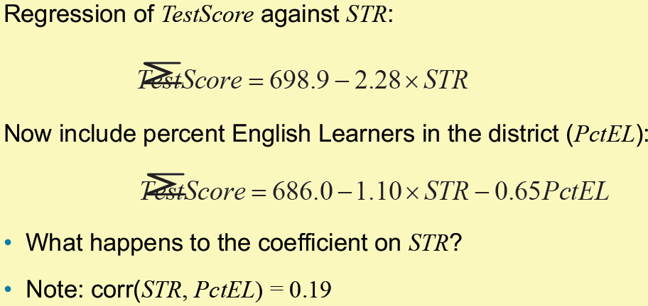

# Econometrics

笔记使用中英双语。斜体为个人批注。翻译在括号中。

教材："Introduction to Econometrics (4th Edition)" by Stock, Watson

## Lecture 1

### 1.1 The population linear regression model (总体回归函数)

Linear regression lets us estimate the population regression line and its slope.

- The The population regression line is the **expected value** of $Y$ given  $X$
- The estimated regression can be used either for:
  - **causal inference** (learning about the causal effect on Y of a change in X)
  - **prediction** (predicting the value of Y given X, for an observation not in the data set)
- **Causal inference** and **prediction** place different requirements  on the data – but both use the same regression toolkit.

Statistical, or econometric,  inference about the slope entails

1. Estimation:
   - How should we draw a line through the data to estimate the  population slope？
     - Answer: ordinary least squares (OLS, 最小二乘法).

2. Hypothesis testing

3. Confidence intervals (置信区间)

$$
Y_i = \beta_0 + \beta_1X_i + u_i, i = 1, ...,n \tag{1}
$$

- We have $n$ observations, $(X_i, Y_i), i = 1, ..., n$.
- $X$ is the independent variable or regressor
- $Y$ is the dependent variable
- $\beta_0$ = intercept
- $\beta_1$ = slope
- $u_i$ = the regression error
- The regression error consists of omitted factors and error in the  measurement of $Y$.

### 1.2 Derivation (推导) of OLS estimator (估计值) $\hat{\beta_0}$ and $\hat{\beta_1}$

Pick $\hat{\beta_0}$ and $\hat{\beta_1}$ to minimize the sum of the squared errors.
$$
S = \sum_{i=1}^n (Y_i - \hat{Y_i})
$$
We get
$$
\hat{\beta_0} = \bar{Y} - \hat{\beta_1}\bar{X}\\
\hat{\beta_1} = \frac{\sum_i^n(X_i-\bar{X})(Y_i-\bar{Y})}{\sum_i^n(X_i-\bar{X})^2} \tag{2}
$$
The OLS predicted values $\hat{Y_i}$ and residuals $u_i$ are
$$
\hat{Y_i} = \hat{\beta_0} + \hat{\beta_1}X_i\\
\hat{u_i} = Y_i - \hat{Y_i} \tag{3}
$$

### 1.3 Measures of Fit

Two regression statistics provide complementary measures of **how well the regression line “fits”** or explains the data.

#### 1.3.1 The Regression $R^2$

It measures the fraction (比例) of the variance of $Y$ is explained by $X$. It ranges from 0 (no fit) to 1 (perfect fit).
$$
R^2 = \frac{\text{ESS}}{\text{TSS}} = \frac{\sum_i^n(\hat{Y_i}-\bar{\hat{Y}})^2}{\sum_i^n(Y_i-\bar{Y})^2} \tag{4}
$$

- **TSS（Total Sum of Squares）**：$Y$的总变异（实际值与均值的偏离）。
- **ESS（Explained Sum of Squares）**：回归模型能解释的变异（预测值与均值的偏离）。
- **RSS（Residual Sum of Squares）**：$\sum_i^n\hat{u_i}^2$
  模型无法解释的残差异变（实际值与预测值的偏离）。

$$
\text{TSS} = \text{ESS} + \text{RSS} \tag{5}
$$

#### 1.3.2 The Standard Error of the Regression (SER)

The SER measures the spread of the distribution of $u$. The SER is (almost) the sample standard deviation of the OLS residuals
$$
\text{SER} = \sqrt{\frac{1}{n-2}\sum_i^n(\hat{u_i}-\bar{\hat{u}})^2}\\
= \sqrt{\frac{1}{n-2}\sum_i^n\hat{u_i}^2} \tag{6}
$$
The second equality holds because $\bar{\hat{u}} = \frac{1}{n}\sum_i^n\hat{u_i} = 0$.

Division by $n-2$ is a "degrees of freedom" correction, because two parameters ($\beta_0$ and $\beta_1$) have been estimated.

When $n$ is large, it doesn't matter whether $n$, $n-1$, or $n-2$ are used.

#### 1.3.3 Adjusted $R^2$

The measure $R^2$ defined earlier keeps on increasing as we add extra explanatory variables and thus **not take account of the degrees of freedom problem**.

*增加变量会增强模型的拟合能力，RSS会相应减小，$R^2 = 1-\frac{\text{RSS}}{\text{TSS}}$则增大，直到等于1. 过度增加变量会导致过拟合。*

The adjusted $R^2$ is simply $R^2$ adjusted for degrees of freedom.
$$
1 - \bar{R}^2 = \frac{n-1}{n-(k+1)}(1-R^2) \tag{7}
$$
where $k$ is the number of regressors.

*参数比变量多一个$\beta_0$*.

If $R^2$ does not increase significantly on the addition of a new independent variable, then the value of $\bar{R}^2$ will actually decrease. Vice versa.

### 1.4 The Least Square Assumption for Causal Inference

We have treated OLS as a way to draw a straight line through the data on $Y$ and $X$. We want to know under what conditions does the slope of this line have a causal interpretation?

**The least square assumption for causal inference**:

1. The conditional distribution of $u$ given $X$ has mean zero, that is $E(u|X = x) = 0$
   - It implies that $X_i$ and $u_i$ are uncorrelated. *这就意味着X是一个足够独立的变量在影响Y，而不会通过u作用于Y。*
2. $(X_i,Y_i)$ are independently and indentically distributed (独立同分布).
   - The main place we will encounter non-i.i.d. sampling is when data are **recorded over time** for the same entity.
3. Large outliers in $X$ and/or $Y$ are rare.
   - The substance of this assumption is that a large outlier can
     strongly influence the results – so we need to **rule out** large
     outliers.

### 1.5 The Sampling Distribution

The OLS estimator is computed from a sample of data. A different sample yields a different value of $\hat{\beta_1}$ This is the source of the "sampling uncertainty" of $\hat{\beta_1}$.

If the three Least Squares Assumptions hold:

1. $E(\hat{\beta_1}) = \beta_1$ and $E(\hat{\beta_0}) = \beta_0$. That is $\hat{\beta_1}$ and $\hat{\beta_0}$ are unbiased estimator of $\beta_1$ and $\beta_0$.

2. $$
   \sigma_{\hat{\beta}_1}^2 = \frac{1}{n} \frac{\text{var}[(X_i - \mu_X)u_i]}{[\text{var}(X_i)]^2}
   $$

   $$
   \sigma_{\hat{\beta}_0}^2 = \frac{1}{n} \frac{\text{var}(H_i \mu_i)}{[E(H_i^2)]^2}, \text{ where } H_i = 1 - \left[\frac{\mu_X}{E(X_i^2)}\right] X_i.
   $$

   - This implies that OLS estimators are consistent - when the sample size is large, $\hat{\beta_1}$ and $\hat{\beta_0}$ will be close to the $\beta_1$ and $\beta_0$.

   - The larger is the variance of $X_i$, the smaller is the variance of $\hat{\beta_1}$

     

   - The smaller is the variance of the error $u_i$, the smaller is the variance of $\hat{\beta_1}$.

     if the errors are smaller, then the data will have a tighter scatter around the population regression line, so its slope will be estimated more precisely.

### 1.6 The Least Squares Assumption for Prediction

You just need to replace LSA#1 for Causal Inference.

1. The out of sample observation $(X^{OOS},Y^{OOS})$ is drawn from the same distribution as the estimation sample $(X_i,Y_i), i = 1,…,n$.
2. $(X_i,Y_i)$ are independently and indentically distributed.
3. Large outliers in $X$ and/or $Y$ are rare.

## Lecture 2

### 2.1 Hypothesis Testing and the Standard Error of $\hat{\beta}_1$

For $n$ large, $\hat{\beta}_1$ is approximately distributed
$$
\hat{\beta}_1\sim N\left(\beta_1,\frac{\sigma_v^2}{n(\sigma_X^2)^2}\right),\mathrm{~where~}v_i=(X_i-\mu_X)u_i
$$
The objective is to test a hypothesis, like $\beta_1 = 0$, using data – to reach a tentative(尝试性的) conclusion whether the (null) hypothesis is correct or incorrect.

**Null hypothesis** and two-sided alternative (双边备择假设):
$$
H_0{:}\beta_1=\beta_{1,0}\text{ vs. }H_1{:}\beta_1\neq\beta_{1,0}
$$
In general,
$$
t = \frac{\hat{\beta}_1 - \beta_{1,0}}{SE(\hat{\beta}_1)} \tag{1}
$$
Reject at 5% significance level if $|t| > 1.96$.

**The $p$-value** is $p = P\{|t| > |t^{act}|\} = $ probability in tails of normal outside $|t^{act}|$; you reject at the 5% significance level if the $p$-value is < 5%. *$t^{act}$是实际算出来的。p-value很小可以认为是$\hat{\beta}_1$取到了不可能的值*.

This procedure relies on the large-$n$ approximation that $\hat{\beta}_1$ is normally distributed; typically $n = 50$ is large enough for the approximation to be excellent.

### 2.2 Confidence Intervals for $\beta_1$

A 95% confidence is, equivalently:

- The set of points that cannot be rejected at the 5% significance level;
-  A set-valued function of the data that contains the true parameter value 95% of the time in repeated samples. *这个区间有95%的概率包含真实值。*

Because the $t$-statistic for $\beta_1$ is $N(0,1)$ in large samples, construction of a 95% confidence for $\beta_1$ is just like the case of the sample mean:
$$
\text{95\% confidence interval for } \beta_1 = \{\hat{\beta}_1 \pm 1.96 \times SE(\hat{\beta}_1)\} \tag{2}
$$
A concise (and conventional) way to report regressions: Put standard errors in parentheses (圆括号) below the estimated coefficients to which they apply.

### 2.3 Regression when $X$ is Binary

**Binary regressors** are sometimes called **dummy variables**.

So far, $\beta_1$ has been called a “slope,” but that doesn’t make sense if $X$ is binary.

When $X_i = 0, Y_i = \beta_0 + u_i, E(Y_i|X_i = 0) = \beta_0$;
When $X_i = 1, Y_i = \beta_0 + \beta_1 + u_i, E(Y_i|X_i = 1) = \beta_0 + \beta_1$.

So
$$
\beta_1 = E(Y_i|X_i = 1) - E(Y_i|X_i = 0)\\ \tag{3}
= \text{population difference in group means}
$$
$SE(\hat{\beta}_1)$ has the usual interpretation. $t$-statistics, confidence intervals constructed as usual.

### 2.4 Dummy Variables When There Are More Than Two Groups

If a qualitative variable assumes <u>$J$ outcomes, $J-1$ dummy variables</u> are included into the model. Equivalently, one category is always dropped.

This is because knowing one person is not in the $J-1$ categories tells us they must be in the $J$th category. Including J dummy variables would create <u>perfect multi-collinearity</u>.

We can left out any group, but <u>the interpretation of the regression coefficients is affected</u> by the group left out.

*比如研究收入与学历，我不将大学以上学历的人群作为虚拟变量，那么$\beta_i$的含义就是i组人群相比大学以上学历的人群收入差多少。*

The results are always compared to the one category that is left out。

### 2.5 Interactive Variables

Dummy variables allow the intercept of regression line to vary between different groups as characterized by some qualitative (定性的) variable.

It is sometimes useful, however, to allow the slope coefficient to vary across the groups as well.

This is accomplished by incorporation by using an **interaction variable (or interaction term)**.
$$
Earnings_i=\beta_0+\beta_1Gender_i+\beta_2Edu_i+\varepsilon_i,
$$
In this model $\beta_1$ measures the difference in earnings between male and female, holding education constant.

The slope coefficient on education, $\beta_2$, measures the increment in earnings resulting from an additional year of schooling, $\frac{\partial Earnings}{\partial Edu} = \beta_2$. In this specification, this “return” to education is assumed to be equal for men and women.

But it is possible that it differs by gender. To allow for this possibility we include a new variable in the model. It is the <u>education variable multiplied by the gender variable</u>.
$$
Earning_i=\beta_0+\beta_1Gender_i+\beta_2Edu_i+\beta_3Gender_i\times Edu_i+\varepsilon_i \tag{4}
$$

$$
\frac{\Delta Earning}{\Delta Edu}=\beta_2+\beta_3Gender=
\begin{cases}
\quad\beta_2,Gender=0 \\
\beta_2+\beta_3,Gender=1 & 
\end{cases}
$$

Thus, $\beta_3$ represents the difference in slope between men and women.

### 2.6 Heteroskedasticity and Homoskedasticity

If $var(u|X = x)$ is constant – that is, if the variance of the conditional distribution of $u$ given $X$ does not depend on $X$ – then $u$ is said to be **homoskedastic** (同方差性). 

Otherwise, $u$ is **heteroskedastic** (异方差性).

So far, we have assumed that $u$ might be heteroskedastic. If $u$ is homoskedastic, $var(u_i|X_i = x) = \sigma_u^2$, then
$$
\begin{aligned}
\mathrm{var}(\hat{\beta}_{1}) & =\frac{\mathrm{var}[(X_i-\mu_x)u_i]}{n(\sigma_X^2)^2}\quad\text{(general formula)} \\
 & =\frac{\sigma_u^2}{n\sigma_X^2}\quad\text{(simplification of }u\text{ is homoscedastic)}
\end{aligned}
$$
Along with this homoskedasticity-only formula for the variance of $\hat{\beta}_1$, we have **homoskedasticity-only standard errors**:
$$
SE(\hat{\beta}_1)=\sqrt{\frac{1}{n}\times\frac{\frac{1}{n-2}\sum_{i=1}^n\hat{u}_i^2}{\frac{1}{n}\sum_{i=1}^n\left(X_i-\bar{X}\right)^2}}.
$$
The usual standard errors is called **heteroskedasticity – robust standard errors**. They are valid whether or not the errors are heteroskedastic.

The main advantage of the homoskedasticity-only standard errors is that the <u>formula is simpler</u>. But the disadvantage is that <u>the formula is only correct if the errors are homoskedastic</u>.

## Lecture 3: Linear Regression with Multiple Regressors

### 3.1 Omitted Variable Bias

When $\beta_1$ is a causal effect, the first least squares assumption for causal inference must hold: $E(u|X) = 0$.

The error $u$ arises because of factors that influence $Y$ but are not included in the regression function**.**

**Omitted variable bias**: there are always omitted variables, but only if the omission of those variables results in $E(u|X) \neq 0$, then the OLS estimator will be biased.

For omitted variable bias to occur, the <u>omitted variable $Z$ must satisfy two conditions</u>:

1. $Z$ is a determinant of $Y$.
2. $Z$ is correlated with the regressor$X$.

Three ways to overcome omitted variable bias: 

1. <u>Run a randomized controlled experiment in which treatment ($STR$, student-teacher ratio) is randomly assigned</u>: then $PctEL$ (percentage of english learners) is still a determinant of $TestScore$, but $PctEL$ is uncorrelated with $STR$.
2. Adopt the “cross tabulation” approach, with finer gradations (划分) of $STR$ and $PctEL$ – <u>within each group, all classes have the same $PctEL$</u>, so we control for $PctEL$.
3. Use a regression in which the omitted variable ($PctEL$) is no longer omitted: <u>include PctEL as an additional regressor in a multiple regression</u>.

### 3.2 The Population Multiple Regression Model

$$
Y_i=\beta_0+\beta_1X_{1i}+\beta_2X_{2i}+u_i,i=1,...,n \tag{1}
$$

- $(Y_i, X_{1i}, X_{2i})$ denote the $i^{\text{th}}$ observation on $Y, X_1, X_2$.
- $\beta_0$ = unknown population intercept
- $\beta_1$ = effect on $Y$ of a change in $X_1$, holding $X_2$ constant.
- $\beta_2$ = effect on $Y$ of a change in $X_2$, holding $X_1$ constant.
- $u_i$ = th regression error (omitted factors).

*加入额外的变量后，如果相关系数为正，原本的变量的系数会减小。*

 

### 3.3 Measures of Fit for Multiple Regression

#### 3.3.1 SER and RMSE

As in regression with a single regressor, the $SER$ (Standard Error of Regression) and the $RMSE$ (Root Mean Squared Error) are measures of the spread of the $Y$s around the regression line:
$$
\mathrm{SER} =\sqrt{\frac{1}{n-k-1}\sum_{i=1}^n\hat{u}_i^2} \tag{2}
$$

$$
\mathrm{RMSE} =\sqrt{\frac{1}{n}\sum_{i=1}^n\hat{u}_i^2} \tag{3}
$$

#### 3.3.2 $R^2$ and Adjusted $R^2$

The $R^2$ is the fraction of the variance explained – same definition as in regression with a single regressor:
$$
R^2=\frac{ESS}{TSS}=1-\frac{SSR}{TSS} \tag{4}
$$
*为什么$R^2$随变量增多而减小？因为变量增多，意味着$u_i$中的omitted factors减少，$SSR$减小，所以$R^2$增加。*

The $\bar{R}^2$ (the adjusted $R^2$) corrects this problem by "penalizing" you for including another regressor, so the $\bar{R}^2$ does not necessarily increase when you add another regressor.

Note that $\bar{R}^2 < R^2$, however if $n$ is large the two will be very close.
$$
\overline{R}^2=1-\left(\frac{n-1}{n-k-1}\right)\frac{SSR}{TSS} \tag{5}
$$

### 3.4 The Least Squares Assumptions for Causal Inference in Multiple Regression

Let $\beta_1, \beta_2, ..., \beta_k$ be causal effects.
$$
Y_i = \beta_0 + \beta_1 X_{1i} + \beta_2 X_{2i} + ... + \beta_k X_{ki} + u_i
$$

1. The conditional distribution of $u$ given the $X$ has mean zero, $E(u_i|X_{1i}=x_1,\ldots,X_{ki}=x_k)=0$.

2. $(X_{1i}, ..., X_{ki}, Y_i)$ are i.i.d.
3. Large outliers are unlikely.
4. There is no perfect multicollinearity.

#### 3.4.1 Perfect Multicollinearity

**Perfect multicollinearity** is when one of the regressors is an exact linear function of the other regressors.

Under the four Least Squares Assumptions,

- The sampling distribution of $\hat{\beta}_1$ has mean $\beta_1$
- $\text{var}(\hat{\beta}_1)$ is inversely proportional to $n$.
- Other than its mean and variance, the exact (finite-$n$) distribution of $\hat{\beta}_1$ is very complicated; but for large $n$...
  - $\hat{\beta}_1$ is consistent: $\hat{\beta}_1 \stackrel{p}{\rightarrow} \beta_1$ (law of large numbers)
  - $\frac{\hat{\beta}_1 - E(\hat{\beta}_1)}{\sqrt{\text{var}(\hat{\beta}_1)}}$ is approximately distributed $N(0,1)$
  - These statements hold for $\hat{\beta}_1, ..., \hat{\beta}_k$

Suppose you have a set of multiple dummy variables, which are mutually exclusive and exhaustive (互斥且穷尽), like Freshmen, Sophomores, Juniors, Seniors, Other. <u>If you include all these dummy variables and a constant, you will have perfect multicollinearity</u> – this is sometimes called the **dummy variable trap**.

*导致多重共线性的原因是所有的虚拟变量加起来后等于1.*

Solutions to the dummy variable trap: 

1 .
