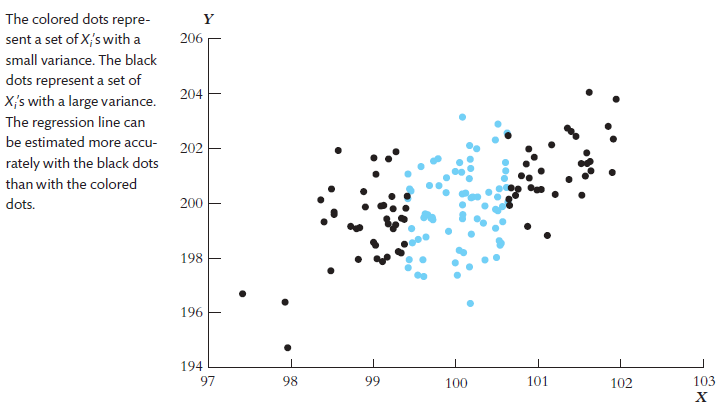

# Econometrics

笔记使用中英双语。斜体为个人批注。翻译在括号中。

教材："Introduction to Econometrics (4th Edition)" by Stock, Watson

## Lecture 1

### 1.1 The population linear regression model (总体回归函数)

Linear regression lets us estimate the population regression line and its slope.

- The The population regression line is the **expected value** of $Y$ given  $X$
- The estimated regression can be used either for:
  - **causal inference** (learning about the causal effect on Y of a change in X)
  - **prediction** (predicting the value of Y given X, for an observation not in the data set)
- **Causal inference** and **prediction** place different requirements  on the data – but both use the same regression toolkit.

Statistical, or econometric,  inference about the slope entails

1. Estimation:
   - How should we draw a line through the data to estimate the  population slope？
     - Answer: ordinary least squares (OLS, 最小二乘法).

2. Hypothesis testing

3. Confidence intervals (置信区间)

$$
Y_i = \beta_0 + \beta_1X_i + u_i, i = 1, ...,n \tag{1}
$$

- We have $n$ observations, $(X_i, Y_i), i = 1, ..., n$.
- $X$ is the independent variable or regressor
- $Y$ is the dependent variable
- $\beta_0$ = intercept
- $\beta_1$ = slope
- $u_i$ = the regression error
- The regression error consists of omitted factors and error in the  measurement of $Y$.

### 1.2 Derivation (推导) of OLS estimator (估计值) $\hat{\beta_0}$ and $\hat{\beta_1}$

Pick $\hat{\beta_0}$ and $\hat{\beta_1}$ to minimize the sum of the squared errors.
$$
S = \sum_{i=1}^n (Y_i - \hat{Y_i})
$$
We get
$$
\hat{\beta_0} = \bar{Y} - \hat{\beta_1}\bar{X}\\
\hat{\beta_1} = \frac{\sum_i^n(X_i-\bar{X})(Y_i-\bar{Y})}{\sum_i^n(X_i-\bar{X})^2} \tag{2}
$$
The OLS predicted values $\hat{Y_i}$ and residuals $u_i$ are
$$
\hat{Y_i} = \hat{\beta_0} + \hat{\beta_1}X_i\\
\hat{u_i} = Y_i - \hat{Y_i} \tag{3}
$$

### 1.3 Measures of Fit

Two regression statistics provide complementary measures of **how well the regression line “fits”** or explains the data.

#### 1.3.1 The Regression $R^2$

It measures the fraction (比例) of the variance of $Y$ is explained by $X$. It ranges from 0 (no fit) to 1 (perfect fit).
$$
R^2 = \frac{\text{ESS}}{\text{TSS}} = \frac{\sum_i^n(\hat{Y_i}-\bar{Y})^2}{\sum_i^n(Y_i-\bar{Y})^2} \tag{4}
$$

- **TSS（Total Sum of Squares）**：$Y$的总变异（实际值与均值的偏离）。
- **ESS（Explained Sum of Squares）**：回归模型能解释的变异（预测值与均值的偏离）。
- **RSS（Residual Sum of Squares）**：$\sum_i^n\hat{u_i}^2$
  模型无法解释的残差异变（实际值与预测值的偏离）。

$$
\text{TSS} = \text{ESS} + \text{RSS} \tag{5}
$$

#### 1.3.2 The Standard Error of the Regression (SER)

The SER measures the spread of the distribution of $u$. The SER is (almost) the sample standard deviation of the OLS residuals
$$
\text{SER} = \sqrt{\frac{1}{n-2}\sum_i^n(\hat{u_i}-\bar{\hat{u}})^2}\\
= \sqrt{\frac{1}{n-2}\sum_i^n\hat{u_i}^2} \tag{6}
$$
The second equality holds because $\bar{\hat{u}} = \frac{1}{n}\sum_i^n\hat{u_i} = 0$.

Division by $n-2$ is a "degrees of freedom" correction, because two parameters ($\beta_0$ and $\beta_1$) have been estimated.

When $n$ is large, it doesn't matter whether $n$, $n-1$, or $n-2$ are used.

#### 1.3.3 Adjusted $R^2$

The measure $R^2$ defined earlier keeps on increasing as we add extra explanatory variables and thus **not take account of the degrees of freedom problem**.

*增加变量会增强模型的拟合能力，RSS会相应减小，$R^2 = 1-\frac{\text{RSS}}{\text{TSS}}$则增大，直到等于1. 过度增加变量会导致过拟合。*

The adjusted $R^2$ is simply $R^2$ adjusted for degrees of freedom.
$$
1 - \bar{R}^2 = \frac{n-1}{n-(k+1)}(1-R^2) \tag{7}
$$
where $k$ is the number of regressors.

*参数比变量多一个$\beta_0$*.

If $R^2$ does not increase significantly on the addition of a new independent variable, then the value of $\bar{R}^2$ will actually decrease. Vice versa.

### 1.4 The Least Square Assumption for Causal Inference

We have treated OLS as a way to draw a straight line through the data on $Y$ and $X$. We want to know under what conditions does the slope of this line have a causal interpretation?

**The least square assumption for causal inference**:

1. The conditional distribution of $u$ given $X$ has mean zero, that is $E(u|X = x) = 0$
   - It implies that $X_i$ and $u_i$ are uncorrelated. *这就意味着X是一个足够独立的变量在影响Y，而不会通过u作用于Y。*
2. $(X_i,Y_i)$ are independently and indentically distributed (独立同分布).
   - The main place we will encounter non-i.i.d. sampling is when data are **recorded over time** for the same entity.
3. Large outliers in $X$ and/or $Y$ are rare.
   - The substance of this assumption is that a large outlier can
     strongly influence the results – so we need to **rule out** large
     outliers.

### 1.5 The Sampling Distribution

The OLS estimator is computed from a sample of data. A different sample yields a different value of $\hat{\beta_1}$ This is the source of the "sampling uncertainty" of $\hat{\beta_1}$.

If the three Least Squares Assumptions hold:

1. $E(\hat{\beta_1}) = \beta_1$ and $E(\hat{\beta_0}) = \beta_0$. That is $\hat{\beta_1}$ and $\hat{\beta_0}$ are unbiased estimator of $\beta_1$ and $\beta_0$.

2. $$
   \sigma_{\hat{\beta}_1}^2 = \frac{1}{n} \frac{\text{var}[(X_i - \mu_X)u_i]}{[\text{var}(X_i)]^2}
   $$

   $$
   \sigma_{\hat{\beta}_0}^2 = \frac{1}{n} \frac{\text{var}(H_i \mu_i)}{[E(H_i^2)]^2}, \text{ where } H_i = 1 - \left[\frac{\mu_X}{E(X_i^2)}\right] X_i.
   $$

   - This implies that OLS estimators are consistent - when the sample size is large, $\hat{\beta_1}$ and $\hat{\beta_0}$ will be close to the $\beta_1$ and $\beta_0$.

   - The larger is the variance of $X_i$, the smaller is the variance of $\hat{\beta_1}$

     

   - The smaller is the variance of the error $u_i$, the smaller is the variance of $\hat{\beta_1}$.

     if the errors are smaller, then the data will have a tighter scatter around the population regression line, so its slope will be estimated more precisely.

### 1.6 The Least Squares Assumption for Prediction

You just need to replace LSA#1 for Causal Inference.

1. The out of sample observation $(X^{OOS},Y^{OOS})$ is drawn from the same distribution as the estimation sample $(X_i,Y_i), i = 1,…,n$.
2. $(X_i,Y_i)$ are independently and indentically distributed.
3. Large outliers in $X$ and/or $Y$ are rare.

## Lecture 2

### 2.1 Hypothesis Testing and the Standard Error of $\hat{\beta}_1$

For $n$ large, $\hat{\beta}_1$ is approximately distributed
$$
\hat{\beta}_1\sim N\left(\beta_1,\frac{\sigma_v^2}{n(\sigma_X^2)^2}\right),\mathrm{~where~}v_i=(X_i-\mu_X)u_i
$$
The objective is to test a hypothesis, like $\beta_1 = 0$, using data – to reach a tentative(尝试性的) conclusion whether the (null) hypothesis is correct or incorrect.

**Null hypothesis** and two-sided alternative (双边备择假设):
$$
H_0{:}\beta_1=\beta_{1,0}\text{ vs. }H_1{:}\beta_1\neq\beta_{1,0}
$$
In general,
$$
t = \frac{\hat{\beta}_1 - \beta_{1,0}}{SE(\hat{\beta}_1)} \tag{8}
$$
Reject at 5% significance level if $|t| > 1.96$.

**The $p$-value** is $p = P\{|t| > |t^{act}|\} = $ probability in tails of normal outside $|t^{act}|$; you reject at the 5% significance level if the $p$-value is < 5%. *$t^{act}$是实际算出来的。p-value很小可以认为是$\hat{\beta}_1$取到了不可能的值*.

This procedure relies on the large-$n$ approximation that $\hat{\beta}_1$ is normally distributed; typically $n = 50$ is large enough for the approximation to be excellent.

### 2.2 Confidence Intervals for $\beta_1$

A 95% confidence is, equivalently:

- The set of points that cannot be rejected at the 5% significance level;
-  A set-valued function of the data that contains the true parameter value 95% of the time in repeated samples. *这个区间有95%的概率包含真实值。*

Because the $t$-statistic for $\beta_1$ is $N(0,1)$ in large samples, construction of a 95% confidence for $\beta_1$ is just like the case of the sample mean:
$$
\text{95\% confidence interval for } \beta_1 = \{\hat{\beta}_1 \pm 1.96 \times SE(\hat{\beta}_1)\} \tag{1}
$$
A concise (and conventional) way to report regressions: Put standard errors in parentheses (圆括号) below the estimated coefficients to which they apply.

### 2.3 Regression when $X$ is Binary

**Binary regressors** are sometimes called **dummy variables**.

So far, $\beta_1$ has been called a “slope,” but that doesn’t make sense if $X$ is binary.

When $X_i = 0, Y_i = \beta_0 + u_i, E(Y_i|X_i = 0) = \beta_0$;
When $X_i = 1, Y_i = \beta_0 + \beta_1 + u_i, E(Y_i|X_i = 1) = \beta_0 + \beta_1$.

So
$$
\beta_1 = E(Y_i|X_i = 1) - E(Y_i|X_i = 0)\\ \tag{2}
= \text{population difference in group means}
$$
$SE(\hat{\beta}_1)$ has the usual interpretation. $t$-statistics, confidence intervals constructed as usual.

### 2.4 Dummy Variables When There Are More Than Two Groups

If a qualitative variable assumes <u>$J$ outcomes, $J-1$ dummy variables</u> are included into the model. Equivalently, one category is always dropped.

This is because knowing one person is not in the $J-1$ categories tells us they must be in the $J$th category. Including J dummy variables would create <u>perfect multi-collinearity</u>.

We can left out any group, but <u>the interpretation of the regression coefficients is affected</u> by the group left out.

*比如研究收入与学历，我不将大学以上学历的人群作为虚拟变量，那么$\beta_i$的含义就是i组人群相比大学以上学历的人群收入差多少。*

The results are always compared to the one category that is left out。

### 2.5 Interactive Variables

Dummy variables allow the intercept of regression line to vary between different groups as characterized by some qualitative (定性的) variable.

It is sometimes useful, however, to allow the slope coefficient to vary across the groups as well.

This is accomplished by incorporation by using an **interaction variable (or interaction term)**.
