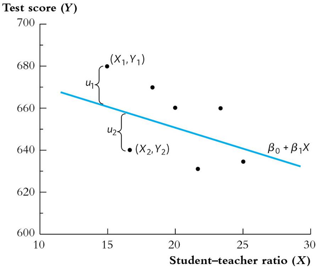

# Econometrics

英文授课，故笔记使用英文。斜体为个人批注，为中文。翻译在括号中。

教材："Introduction to Econometrics (4th Edition)" by Stock, Watson

## Lecture 1

date: 2024/2/20

### 1.1 The population linear regression model (总体回归函数)

Linear regression lets us estimate the population regression line and its slope.

- The The population regression line is the **expected value** of $Y$ given  $X$.
- The estimated regression can be used either for:
  - **causal inference** (learning about the causal effect on Y of a  change in X)
  - **prediction** (predicting the value of Y given X, for an  observation not in the data set)
- **Causal inference** and **prediction** place different requirements  on the data – but both use the same regression toolkit.

Statistical, or econometric,  inference about the slope entails

- Estimation:
  - How should we draw a line through the data to estimate the  population slope？
    - Answer: ordinary least squares (OLS).
  - Hypothesis testing
  - Confidence intervals (置信区间)

$$
Y_i = \beta_0 + \beta_1X_i + u_i, i = 1, ...,n
$$

- We have n observations, $(X_i, Y_i), i = 1, ..., n$.
- $X$ is the independent variable or regressor
- $Y$ is the dependent variable
- $\beta_0$ = intercept
- $\beta_1$ = slope
- $u_i$ = the regression error
- The regression error consists of omitted factors and error in the  measurement of $Y$.

### 1.2 Derivation (推导) of OLS estimator $\hat{\beta_0}$ and $\hat{\beta_1}$

Pick $\hat{\beta_0}$ and $\hat{\beta_1}$ to minimize the sum of the squared errors.
$$
S = \sum_{i=1}^n (Y_i - \hat{Y_i})
$$
