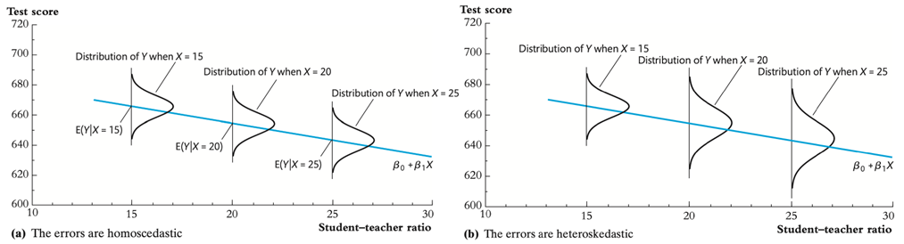

# Econometrics

笔记使用中英双语。斜体为个人批注。翻译在括号中。

教材："Introduction to Econometrics (4th Edition)" by Stock, Watson

## Lecture 1

### 1.1 The population linear regression model (总体回归函数)

Linear regression lets us estimate the population regression line and its slope.

- The The population regression line is the **expected value** of $Y$ given  $X$
- The estimated regression can be used either for:
  - **causal inference** (learning about the causal effect on $Y$ of a change in $X$)
  - **prediction** (predicting the value of $Y$ given $X$, for an observation not in the data set)
- **Causal inference** and **prediction** place different requirements  on the data – but both use the same regression toolkit.

Statistical, or econometric, inference about the slope entails

1. Estimation:
   - How should we draw a line through the data to estimate the  population slope？
     - Answer: ordinary least squares (OLS, 最小二乘法).

2. Hypothesis testing

3. Confidence intervals (置信区间)

$$
Y_i = \beta_0 + \beta_1X_i + u_i, i = 1, ...,n \tag{1}
$$

- We have $n$ observations, $(X_i, Y_i), i = 1, ..., n$.
- $X$ is the independent variable or **regressor**
- $Y$ is the dependent variable
- $\beta_0$ = intercept
- $\beta_1$ = slope
- $u_i$ = the regression error
- The regression error consists of omitted factors and error in the measurement of $Y$.

### 1.2 Derivation (推导) of OLS estimator (估计值) $\hat{\beta_0}$ and $\hat{\beta_1}$

Pick $\hat{\beta_0}$ and $\hat{\beta_1}$ to minimize the sum of the squared errors.
$$
S = \sum_{i=1}^n (Y_i - \hat{Y_i})
$$
We get
$$
\hat{\beta_0} = \bar{Y} - \hat{\beta_1}\bar{X}\\
\hat{\beta_1} = \frac{\sum_i^n(X_i-\bar{X})(Y_i-\bar{Y})}{\sum_i^n(X_i-\bar{X})^2} \tag{2}
$$
The OLS predicted values $\hat{Y_i}$ and residuals $u_i$ are
$$
\hat{Y_i} = \hat{\beta_0} + \hat{\beta_1}X_i\\
\hat{u_i} = Y_i - \hat{Y_i} \tag{3}
$$

### 1.3 Measures of Fit

Two regression statistics provide complementary measures of **how well the regression line “fits”** or explains the data.

#### 1.3.1 The Regression $R^2$

It measures the fraction (比例) of the variance of $Y$ is explained by $X$. It ranges from 0 (no fit) to 1 (perfect fit).
$$
R^2 = \frac{\text{ESS}}{\text{TSS}} = \frac{\sum_i^n(\hat{Y_i}-\bar{Y})^2}{\sum_i^n(Y_i-\bar{Y})^2} \tag{4}
$$

- **TSS（Total Sum of Squares）**：$Y$的总变异（实际值与均值的偏离）。
- **ESS（Explained Sum of Squares）**：回归模型能解释的变异（预测值与均值的偏离）。
- **RSS（Residual Sum of Squares）**：$\sum_i^n\hat{u_i}^2$
  模型无法解释的残差异变（实际值与预测值的偏离）。

$$
\text{TSS} = \text{ESS} + \text{RSS} \tag{5}
$$

#### 1.3.2 The Standard Error of the Regression (SER)

The SER measures the spread of the distribution of $u$. The SER is (almost) the sample standard deviation of the OLS residuals
$$
\text{SER} = \sqrt{\frac{1}{n-2}\sum_i^n(\hat{u_i}-\bar{\hat{u}})^2}\\
= \sqrt{\frac{1}{n-2}\sum_i^n\hat{u_i}^2} \tag{6}
$$
The second equality holds because $\bar{\hat{u}} = \frac{1}{n}\sum_i^n\hat{u_i} = 0$.

Division by $n-2$ is a "degrees of freedom" correction, because two parameters ($\beta_0$ and $\beta_1$) have been estimated.

When $n$ is large, it doesn't matter whether $n$, $n-1$, or $n-2$ are used.

#### 1.3.3 Adjusted $R^2$

The measure $R^2$ defined earlier keeps on increasing as we add extra explanatory variables and thus **not take account of the degrees of freedom problem**.

*增加变量会增强模型的拟合能力，RSS会相应减小，$R^2 = 1-\frac{\text{RSS}}{\text{TSS}}$则增大，直到等于1. 过度增加变量会导致过拟合。*

The adjusted $R^2$ is simply $R^2$ adjusted for degrees of freedom.
$$
1 - \bar{R}^2 = \frac{n-1}{n-(k+1)}(1-R^2) \tag{7}
$$
where $k$ is the number of regressors.

*参数比变量多一个$\beta_0$*.

If $R^2$ does not increase significantly on the addition of a new independent variable, then the value of $\bar{R}^2$ will actually decrease. Vice versa.

### 1.4 The Least Square Assumption for Causal Inference

We have treated OLS as a way to draw a straight line through the data on $Y$ and $X$. We want to know under what conditions does the slope of this line have a causal interpretation?

**The least square assumption for causal inference**:

1. The conditional distribution of $u$ given $X$ has mean zero, that is $E(u|X = x) = 0$
   - It implies that $X_i$ and $u_i$ are uncorrelated. *这就意味着X是一个足够独立的变量在影响Y，而不会通过u作用于Y。*
2. $(X_i,Y_i)$ are independently and indentically distributed (独立同分布).
   - The main place we will encounter non-i.i.d. sampling is when data are **recorded over time** for the same entity.
3. Large outliers in $X$ and/or $Y$ are rare.
   - The substance of this assumption is that a large outlier can strongly influence the results – so we need to **rule out** large outliers.

### 1.5 The Sampling Distribution

The OLS estimator is computed from a sample of data. A different sample yields a different value of $\hat{\beta_1}$ This is the source of the "sampling uncertainty" of $\hat{\beta_1}$.

If the three Least Squares Assumptions hold:

1. $E(\hat{\beta_1}) = \beta_1$ and $E(\hat{\beta_0}) = \beta_0$. That is $\hat{\beta_1}$ and $\hat{\beta_0}$ are unbiased estimator of $\beta_1$ and $\beta_0$.

2. $$
   \sigma_{\hat{\beta}_1}^2 = \frac{1}{n} \frac{\text{var}[(X_i - \mu_X)u_i]}{[\text{var}(X_i)]^2}
   $$

   $$
   \sigma_{\hat{\beta}_0}^2 = \frac{1}{n} \frac{\text{var}(H_i \mu_i)}{[E(H_i^2)]^2}, \text{ where } H_i = 1 - \left[\frac{\mu_X}{E(X_i^2)}\right] X_i.
   $$

   - This implies that OLS estimators are consistent - when the sample size is large, $\hat{\beta_1}$ and $\hat{\beta_0}$ will be close to the $\beta_1$ and $\beta_0$.

   - The larger is the variance of $X_i$, the smaller is the variance of $\hat{\beta_1}$

     

   - The smaller is the variance of the error $u_i$, the smaller is the variance of $\hat{\beta_1}$.

     if the errors are smaller, then the data will have a tighter scatter around the population regression line, so its slope will be estimated more precisely.

### 1.6 The Least Squares Assumption for Prediction

You just need to replace LSA#1 for Causal Inference.

1. The out of sample observation $(X^{OOS},Y^{OOS})$ is drawn from the same distribution as the estimation sample $(X_i,Y_i), i = 1,…,n$.
2. $(X_i,Y_i)$ are independently and indentically distributed.
3. Large outliers in $X$ and/or $Y$ are rare.

## Lecture 2: Hypothesis Tests and Confidence Intervals

### 2.1 Hypothesis Testing and the Standard Error of $\hat{\beta}_1$

For $n$ large, $\hat{\beta}_1$ is approximately distributed
$$
\hat{\beta}_1\sim N\left(\beta_1,\frac{\sigma_v^2}{n(\sigma_X^2)^2}\right),\mathrm{~where~}v_i=(X_i-\mu_X)u_i
$$
The objective is to test a hypothesis, like $\beta_1 = 0$, using data – to reach a tentative(尝试性的) conclusion whether the (null) hypothesis is correct or incorrect.

**Null hypothesis** and two-sided alternative (双边备择假设):
$$
H_0{:}\beta_1=\beta_{1,0}\text{ vs. }H_1{:}\beta_1\neq\beta_{1,0}
$$
In general,
$$
t = \frac{\hat{\beta}_1 - \beta_{1,0}}{SE(\hat{\beta}_1)} \tag{1}
$$
Reject at 5% significance level if $|t| > 1.96$.

**The $p$-value** is $p = P\{|t| > |t^{act}|\} = $ probability in tails of normal outside $|t^{act}|$; you reject at the 5% significance level if the $p$-value is < 5%. *$t^{act}$是实际算出来的。p-value很小可以认为是$\hat{\beta}_1$取到了不可能的值*.

This procedure relies on the large-$n$ approximation that $\hat{\beta}_1$ is normally distributed; typically $n = 50$ is large enough for the approximation to be excellent.

### 2.2 Confidence Intervals for $\beta_1$

A 95% confidence is, equivalently:

- The set of points that cannot be rejected at the 5% significance level;
-  A set-valued function of the data that contains the true parameter value 95% of the time in repeated samples. *这个区间有95%的概率包含真实值。*

Because the $t$-statistic for $\beta_1$ is $N(0,1)$ in large samples, construction of a 95% confidence for $\beta_1$ is just like the case of the sample mean:
$$
\text{95\% confidence interval for } \beta_1 = \{\hat{\beta}_1 \pm 1.96 \times SE(\hat{\beta}_1)\} \tag{2}
$$
A concise (and conventional) way to report regressions: Put standard errors in parentheses (圆括号) below the estimated coefficients to which they apply.

### 2.3 Regression when $X$ is Binary

**Binary regressors** are sometimes called **dummy variables**.

So far, $\beta_1$ has been called a “slope,” but that doesn’t make sense if $X$ is binary.

When $X_i = 0, Y_i = \beta_0 + u_i, E(Y_i|X_i = 0) = \beta_0$;
When $X_i = 1, Y_i = \beta_0 + \beta_1 + u_i, E(Y_i|X_i = 1) = \beta_0 + \beta_1$.

So
$$
\beta_1 = E(Y_i|X_i = 1) - E(Y_i|X_i = 0)\\ \tag{3}
= \text{population difference in group means}
$$
$SE(\hat{\beta}_1)$ has the usual interpretation. $t$-statistics, confidence intervals constructed as usual.

### 2.4 Dummy Variables When There Are More Than Two Groups

If a qualitative variable assumes <u>$J$ outcomes, $J-1$ dummy variables</u> are included into the model. Equivalently, one category is always dropped.

This is because knowing one person is not in the $J-1$ categories tells us they must be in the $J$th category. Including J dummy variables would create <u>perfect multi-collinearity</u>.

We can left out any group, but <u>the interpretation of the regression coefficients is affected</u> by the group left out.

*比如研究收入与学历，我不将大学以上学历的人群作为虚拟变量，那么$\beta_i$的含义就是i组人群相比大学以上学历的人群收入差多少。*

The results are always compared to the one category that is left out。

### 2.5 Interactive Variables

Dummy variables allow the intercept of regression line to vary between different groups as characterized by some qualitative (定性的) variable.

It is sometimes useful, however, to allow the slope coefficient to vary across the groups as well.

This is accomplished by incorporation by using an **interaction variable (or interaction term)**.
$$
Earnings_i=\beta_0+\beta_1Gender_i+\beta_2Edu_i+\varepsilon_i,
$$
In this model $\beta_1$ measures the difference in earnings between male and female, holding education constant.

The slope coefficient on education, $\beta_2$, measures the increment in earnings resulting from an additional year of schooling, $\frac{\partial Earnings}{\partial Edu} = \beta_2$. In this specification, this “return” to education is assumed to be equal for men and women.

But it is possible that it differs by gender. To allow for this possibility we include a new variable in the model. It is the <u>education variable multiplied by the gender variable</u>.
$$
Earning_i=\beta_0+\beta_1Gender_i+\beta_2Edu_i+\beta_3Gender_i\times Edu_i+\varepsilon_i \tag{4}
$$

$$
\frac{\Delta Earning}{\Delta Edu}=\beta_2+\beta_3Gender=
\begin{cases}
\quad\beta_2,Gender=0 \\
\beta_2+\beta_3,Gender=1 & 
\end{cases}
$$

Thus, $\beta_3$ represents the difference in slope between men and women.

### 2.6 Heteroskedasticity and Homoskedasticity

If $var(u|X = x)$ is constant – that is, if the variance of the conditional distribution of $u$ given $X$ does not depend on $X$ – then $u$ is said to be **homoskedastic** (同方差性). 

Otherwise, $u$ is **heteroskedastic** (异方差性).

So far, we have assumed that $u$ might be heteroskedastic. If $u$ is homoskedastic, $var(u_i|X_i = x) = \sigma_u^2$, then
$$
\begin{aligned}
\mathrm{var}(\hat{\beta}_{1}) & =\frac{\mathrm{var}[(X_i-\mu_x)u_i]}{n(\sigma_X^2)^2}\quad\text{(general formula)} \\
 & =\frac{\sigma_u^2}{n\sigma_X^2}\quad\text{(simplification of }u\text{ is homoscedastic)}
\end{aligned}
$$
Along with this homoskedasticity-only formula for the variance of $\hat{\beta}_1$, we have **homoskedasticity-only standard errors**:
$$
SE(\hat{\beta}_1)=\sqrt{\frac{1}{n}\times\frac{\frac{1}{n-2}\sum_{i=1}^n\hat{u}_i^2}{\frac{1}{n}\sum_{i=1}^n\left(X_i-\bar{X}\right)^2}}.
$$
The usual standard errors is called **heteroskedasticity – robust standard errors**. They are valid whether or not the errors are heteroskedastic.

The main advantage of the homoskedasticity-only standard errors is that the <u>formula is simpler</u>. But the disadvantage is that <u>the formula is only correct if the errors are homoskedastic</u>.

## Lecture 3: Linear Regression with Multiple Regressors

### 3.1 Omitted Variable Bias

When $\beta_1$ is a causal effect, the first least squares assumption for causal inference must hold: $E(u|X) = 0$.

The error $u$ arises because of factors that influence $Y$ but are not included in the regression function**.**

**Omitted variable bias**: there are always omitted variables, but only if the omission of those variables results in $E(u|X) \neq 0$, then the OLS estimator will be biased.

For omitted variable bias to occur, the <u>omitted variable $Z$ must satisfy two conditions</u>:

1. $Z$ is a determinant of $Y$.
2. $Z$ is correlated with the regressor$X$.

Three ways to overcome omitted variable bias: 

1. <u>Run a randomized controlled experiment in which treatment ($STR$, student-teacher ratio) is randomly assigned</u>: then $PctEL$ (percentage of english learners) is still a determinant of $TestScore$, but $PctEL$ is uncorrelated with $STR$.
2. Adopt the “cross tabulation” approach, with finer gradations (划分) of $STR$ and $PctEL$ – <u>within each group, all classes have the same $PctEL$</u>, so we control for $PctEL$.
3. Use a regression in which the omitted variable ($PctEL$) is no longer omitted: <u>include PctEL as an additional regressor in a multiple regression</u>.

### 3.2 The Population Multiple Regression Model

$$
Y_i=\beta_0+\beta_1X_{1i}+\beta_2X_{2i}+u_i,i=1,...,n \tag{1}
$$

- $(Y_i, X_{1i}, X_{2i})$ denote the $i^{\text{th}}$ observation on $Y, X_1, X_2$.
- $\beta_0$ = unknown population intercept
- $\beta_1$ = effect on $Y$ of a change in $X_1$, holding $X_2$ constant.
- $\beta_2$ = effect on $Y$ of a change in $X_2$, holding $X_1$ constant.
- $u_i$ = th regression error (omitted factors).

*加入额外的变量后，如果相关系数为正，原本的变量的系数会减小。*

 

### 3.3 Measures of Fit for Multiple Regression

#### 3.3.1 SER and RMSE

As in regression with a single regressor, the SER (Standard Error of Regression) and the RMSE (Root Mean Squared Error) are measures of the spread of the $Y$s around the regression line:
$$
\mathrm{SER} =\sqrt{\frac{1}{n-k-1}\sum_{i=1}^n\hat{u}_i^2} \tag{2}
$$

$$
\mathrm{RMSE} =\sqrt{\frac{1}{n}\sum_{i=1}^n\hat{u}_i^2} \tag{3}
$$

#### 3.3.2 $R^2$ and Adjusted $R^2$

The $R^2$ is the fraction of the variance explained – same definition as in regression with a single regressor:
$$
R^2=\frac{ESS}{TSS}=1-\frac{SSR}{TSS} \tag{4}
$$
*为什么$R^2$随变量增多而减小？因为变量增多，意味着$u_i$中的omitted factors减少，$SSR$减小，所以$R^2$增加。*

The $\bar{R}^2$ (the adjusted $R^2$) corrects this problem by "penalizing" you for including another regressor, so the $\bar{R}^2$ does not necessarily increase when you add another regressor.

Note that $\bar{R}^2 < R^2$, however if $n$ is large the two will be very close.
$$
\overline{R}^2=1-\left(\frac{n-1}{n-k-1}\right)\frac{SSR}{TSS} \tag{5}
$$

### 3.4 The Least Squares Assumptions for Causal Inference in Multiple Regression

Let $\beta_1, \beta_2, ..., \beta_k$ be causal effects.
$$
Y_i = \beta_0 + \beta_1 X_{1i} + \beta_2 X_{2i} + ... + \beta_k X_{ki} + u_i
$$

1. The conditional distribution of $u$ given the $X$ has mean zero, $E(u_i|X_{1i}=x_1,\ldots,X_{ki}=x_k)=0$.

2. $(X_{1i}, ..., X_{ki}, Y_i)$ are i.i.d.
3. Large outliers are unlikely.
4. There is no perfect multicollinearity.

#### 3.4.1 Perfect Multicollinearity

**Perfect multicollinearity** is when one of the regressors is an exact linear function of the other regressors.

Under the four Least Squares Assumptions,

- The sampling distribution of $\hat{\beta}_1$ has mean $\beta_1$
- $\text{var}(\hat{\beta}_1)$ is inversely proportional to $n$.
- Other than its mean and variance, the exact (finite-$n$) distribution of $\hat{\beta}_1$ is very complicated; but for large $n$...
  - $\hat{\beta}_1$ is consistent: $\hat{\beta}_1 \stackrel{p}{\rightarrow} \beta_1$ (law of large numbers)
  - $\frac{\hat{\beta}_1 - E(\hat{\beta}_1)}{\sqrt{\text{var}(\hat{\beta}_1)}}$ is approximately distributed $N(0,1)$
  - These statements hold for $\hat{\beta}_1, ..., \hat{\beta}_k$

Suppose you have a set of multiple dummy variables, which are mutually exclusive and exhaustive (互斥且穷尽), like Freshmen, Sophomores, Juniors, Seniors, Other. <u>If you include all these dummy variables and a constant, you will have perfect multicollinearity</u> – this is sometimes called the **dummy variable trap**.

*导致多重共线性的原因是所有的虚拟变量加起来后等于1.*

Solutions to the dummy variable trap: 

1. Omit one of the groups;
2. Omit the intercept.

*如果使用方法一：$\beta_0$（截距）表示参考组的平均成绩，$\beta_i$表示第$i$组相对于参考组的成绩平均差异。*

*如果使用方法二：每一个虚拟变量的系数都表示该组的平均成绩。*

#### 3.4.2 Imperfect multicollinearity

**Imperfect multicollinearity** occurs when two or more regressors are very highly correlated.

Imperfect multicollinearity implies that one or more of the regression coefficients will be imprecisely estimated.

- The idea: the coefficient on $X_1$ is the effect of $X_1$ holding $X_2$ constant; but if $X_1$ and $X_2$ are highly correlated, there is very little variation in $X_1$ once $X_2$ is held constant.
- Imperfect multicollinearity results in large standard errors for one or more of the OLS coefficients.

#### 3.4.3 Control Variables

But usually you can’t observe all omitted causal factors. In this case, you can include **control variables** which are <u>correlated with these omitted causal factors, but which themselves are not causal</u>.

Example:

$LchPct$ is the control variable. It is correlated with and controls for income-related outside learning opportunities.

We need a mathematical condition for what makes an effective control variable. This condition is **conditional mean independence**: <u>given the control variable, the mean of $u_i$ doesn’t depend on the variable of interest</u>.

Let $X_i$ denote the variable of interest and $W_i$ denote the control variable(s). 
$$
E(u_i|X_i, W_i) = E(u_i|W_i) \tag{6}
$$
If $W$ is such that conditional mean independence satisfied, then

- The OLS estimator of the effect of interest $\hat{\beta}_1$ is unbiased.
- The OLS estimator of the coefficient on the control variable $\hat{\beta}_2$ does not have a causal interpretation. The reason is that the control variable is correlated with omitted variables in the error term, so that $\hat{\beta}_2$ is subject to omitted variable bias.

## Lecture 4: Hypothesis Tests and Confidence Intervals in Multiple Regression

### 4.1 Some Kinds of Distribution

#### 4.1.1 $\chi^2$- Distribution

If $x_1$, $x_2$, . . . , $x_n$ are independent normal variables with mean zero and variance 1, that is, $x_i \sim N(0,1),i=1,2,..., n$, then $Z=\sum_ix_i^2$ is said to have the $\chi^2$-distribution with degrees of freedom $n$, and we will write this as $Z \sim \chi_n^2.$

The subscript $n$ denotes degrees of freedom.

The $\chi_n^2$ distribution is <u>the distribution of the sum of squares of $n$ independent standard normal variables</u>.

If $x_i \sim N(0,\sigma^2)$, then $Z$ should be defined as $Z=\sum_i\frac{x_i^2}{\sigma^2}=\frac{\sum_ix_i^2}{\sigma^2}$.

The $\chi_n^2$ -distribution has an "additive property". If $Z _1\sim \chi _n^2;$ and $Z_2\sim\chi_m^2$ and $Z_1$, and $Z_2$ are independent, then $Z_1+Z_2\sim\chi_{n+m}^2$.

We can consider simple additions only, not any general linear combinations.

#### 4.1.2 $t$ - Distribution

If $x\sim N(0, 1)$ and $y \sim \chi _n^2$ and $x$ and $y$ are independent, $Z=\frac x{\sqrt{y/n}}$ has a $t$ - distribution with degrees of freedom $n$. We write this as $Z\sim t_n$. 

The subscript $n$ again denotes the degrees of freedom.

Thus the $t$ - distribution is <u>the distribution of a standard normal variable divided by the square root of an independent averaged $x^2$ variable</u> $(x^2$ variable divided by its degrees of freedom).

The $t$ - distribution is a symmetric probability distribution like the normal distribution but is flatter than the normal and has longer tails. As the degrees of freedom $n$ approaches infinity, the t-distribution approaches the normal distribution.

#### 4.1.3 $F$ - Distribution

If $y_1\sim\chi_{n_1}^2$ and $y_2\sim\chi_{n_2}^2$ and $y_1$ and $y_2$ are independent, $Z=\frac{y_1/n_1}{y_2/n_2}$ has the $F$ - distribution with degrees of freedom (d.f.) $n_1$ and $n_2$. We write this as $Z\thicksim F_{n_1,n_2}$.

The first subscript, $n_1$ refers to the d.f. of the numerator, and the second subscript, $n_2$ refers to the d.f. of the denominator.

The F-distribution is thus <u>the distribution of the ratio of two independent averaged $\chi^2$ variables</u>.

### 4.2 Hypothesis Tests and Confidence Intervals for a Single Coefficient

Hypothesis tests and confidence intervals for a single coefficient in multiple regression follow the same logic and recipe as for the slope coefficient in a single-regressor model.

$\frac{\hat{\beta}_{1}-E(\hat{\beta}_{1})}{\sqrt{\operatorname{var}(\hat{\beta}_{1})}}$ is approximately distributed $N(0,1)$ (CLT).

Thus <u>hypotheses on $\beta_{1}$ can be tested using the usual $t$-statistic</u>, and <u>confidence intervals are constructed as $\{\hat{\beta}_{1} \pm 1.96 \times \operatorname{SE} \hat{\beta}_{1}\}$.</u>

## Lecture 5: Nonlinear Regression Functions

### 5.1 The General Nonlinear Population Regression Function

$$
Y_i = f(X_{1i}, X_{2i, ..., X_{ki}}) + u_i, i = 1, ..., n \tag{1}
$$

Assumptions:

1. $E(u_{i}|X_{1i},X_{2i},\ldots,X_{ki})=0$ (same), so $f$ is the conditional expectation of $Y$ given the $X$'s.
2. $(X_{1i},\ldots,X_{ki},Y_{i})$ are i.i.d. (same).
3. Big outliers are rare (same idea; the precise mathematical condition depends on the specific $f$).
4. No perfect multicollinearity (same idea; the precise statement depends on the specific $f$).

The expected difference in Y associated with a difference in $X_1$, holding$ X_2,..., X_k$ constant is
$$
\Delta Y=f(X_1+\Delta X_1,X_2,...,X_k)-f(X_1,X_2,...,X_k) \tag{2}
$$

### 5.2 Nonlinear Functions of a Single Independent Variable

We'll look at two complementary approaches:

1. Polynomials in $X$

   The population regression function is approximated by a quadratic, cubic, or higher-degree polynomial.

2. Logarithmic transformations

   $Y$ and/or $X$ is transformed by taking its logarithm, which probivides a "percentages" interpretaion of the coefficents that makes sense in many applications.

#### 5.2.1 Polynomials in $X$

$$
Y_i = \beta_0 + \beta_1 X_i + \beta_2 X_i^2 + ... + \beta_r X_i^r + u_i
$$

This is just the linear multiple regression model - except that the regressors are powers of $X$.

Esitmation, hypothesis testing, etc. proceeds as in the multiple regression model using OLS.

Interpreting the estimated regression function:

- The individual coefficients have complicated interpretations.
- plot predicted values as a function of $x$.
- compute predicted $\Delta Y/\Delta X$ for different values of $x$.

<u>Caution: Don't extrapolate (推测) outside the range of the data.</u>

#### 5.2.2 Logarithmic Functions of $Y$ and/or $X$

Logarithmic transforms permit modeling relations in "percentage" terms (like elasticities), rather than linearly.

Three log regression specifications:

1. linear-log
   $$
   Y_i = \beta_0 + \beta_1 \ln(X_i) + u_i
   $$

2. log-linear
   $$
   \ln(Y_i) = \beta_0 + \beta_1 X_i + u_i
   $$

3. log-log
   $$
   \ln(Y_i) = \beta_0 + \beta_1 \ln(X_i) + u_i
   $$

Linear-log regression:

- for small $\Delta X$, $\beta_{1} \cong \frac{\Delta Y}{\Delta X / X}$
- Now $100 \times \frac{\Delta X}{X}$ = percentage change in $X$, so a 1% increase in $X$ (multiplying $X$ by 1.01) is associated with a $0.01\beta_{1}$ change in $Y$.

Log-linear regression:

- for small $\Delta X$, $\beta_{1} \cong \frac{\Delta Y / Y}{\Delta X}$

- Now a change in $X$ by one unit ($\Delta X = 1$) is associated with a $100\beta_{1}\%$ change in $Y$.

- What are the units of $u_i$ and the $\text{SER}$?

  fractional (proportional) deviations

Linear-log regression:

- for small $\Delta X$, $\beta_{1} \cong \frac{\Delta Y / Y}{\Delta X / X}$
- Now $100 \times \frac{\Delta Y}{Y}$ = percentage change in $Y$, and $100 \times \frac{\Delta X}{X}$ = percentage change in $X$, so a 1% increase in $X$ is associated with a $\beta_{1}\%$ change in $Y$.
- In the log-log specification, $\beta_1$ has the interpretation of an elasticity.

#### 5.2.3 Negative Exponential Growth

Here is a nonlinear function in which $Y$ always increases with $X$ and there is a maximum (asymptote, 渐近线) value of $Y$:
$$
Y = \beta_0 - \alpha e^{-\beta_1 X}
$$

$\beta_0$, $\beta_1$, and $\alpha$ are unknown parameters. This is called a negative exponential growth curve. The asymptote as $X \to \infty$ is $\beta_0$.

We want to estimate the parameters of
$$
Y_i = \beta_0 [1-e^{\beta_1X_i+\beta_2}] + u_i,\text{ where } \alpha = \beta_0 e^{\beta_2}
$$
 The linear-log and polynomial models are linear in the  parameters $\beta_0$ and $\beta_1$ – but the model forgoing (前述的) is not.

Models that are nonlinear in one or more parameters can be estimated by nonlinear least squares (NLS).
$$
\min_{\beta_0,\beta_1,\beta_2}\sum_{i=1}^n\left\{Y_i-\beta_0\left[1-e^{-\beta_1X_i+\beta_2}\right]\right\}^2
$$
*NLS只能用STATA等软件计算，无法手算。*

The choice of functional form should be guided by judgment (which interpretation makes the most sense in your application), tests (RMSE), and plotting predicted values.

### 5.3 Interaction Between Independent Variables

Perhaps smaller classes help more if there are many English learners, who need individual attention. That is, $\frac{\Delta TestScore}{\Delta STR}$ might depend on $PctEL$.

#### 5.3.1 Interactions between two binary variables

To allow the effect of changing $D_{1}$ to depend on $D_{2}$, include the "interaction term" $D_{1i} \times D_{2i}$ as a regressor:
$$
Y_{i} = \beta_{0} + \beta_{1}D_{li} + \beta_{2}D_{2i} + \beta_{3}(D_{li} \times D_{2i}) + u_{i}
$$
$D_{1i}, D_{2i}$ are binary.

<u>General rule: compare the various cases</u>

- (a) $E(Y_i \mid D_{1i} = 0, D_{2i} = d_2) = \beta_0 + \beta_2 d_2$

- (b) $E(Y_i \mid D_{1i} = 1, D_{2i} = d_2) = \beta_0 + \beta_1 + \beta_2 d_2 + \beta_3 d_2$

- subtract (a) - (b):

  $E(Y_i \mid D_{1i} = 1, D_{2i} = d_2) - E(Y_i \mid D_{1i} = 0, D_{2i} = d_2) = \beta_1 + \beta_3 d_2$

- The effect of $D_1$ depends on $d_2$ (what we wanted). $\beta_3$ = increment to the effect of $D_1$, when $D_2 = 1$

#### 5.3.2 Interactions between continuous and binary variables

To allow the effect of $X$ to depend on $D$, include the "interaction term" $D_{i} \times X_{i}$ as a regressor:
$$
Y_{i} = \beta_{0} + \beta_{1}D_{i} + \beta_{2}X_{i} + \beta_{3}(D_{i} \times X_{i}) + u_{i}
$$
$D_i$ is binary variable and $X_i$ is continuous variable.

General rule: compare the various cases

- (a) $Y = \beta_{0} + \beta_{1}D + \beta_{2}X + \beta_{3}(D \times X)$

- (b) $Y + \Delta Y = \beta_{0} + \beta_{1}D + \beta_{2}(X + \Delta X) + \beta_{3}[D \times (X + \Delta X)]$

- subtract (a) - (b):

  $$\Delta Y = \beta_{2} \Delta X + \beta_{3} D \Delta X \quad \text{or} \quad \frac{\Delta Y}{\Delta X} = \beta_{2} + \beta_{3} D$$

- The effect of $X$ depends on $D$ (what we wanted). $\beta_{3}$ = increment to the effect of $X$, when $D = 1$

#### 5.3.3 Interactions between two continuous variables

To allow the effect of $X_{1i}$ to depend on $X_{2i}$, include the "interaction term" $X_{1i} \times X_{2i}$ as a regressor:
$$
Y_{i} = \beta_{0} + \beta_{1}X_{1i} + \beta_{2}X_{2i} + \beta_{3}(X_{1i} \times X_{2i}) + u_{i}
$$
$X_{1i}, X_{2i}$ are continuous variables.

General rule: compare the various cases

- (a) $Y = \beta_{0} + \beta_{1}X_{1i} + \beta_{2}X_{2i} + \beta_{3}(X_{1i} \times X_{2i})$

- (b) $Y + \Delta Y = \beta_{0} + \beta_{1}(X_{1i} + \Delta X_{1i}) + \beta_{2}X_{2i} + \beta_{3}[X_{2i} \times (X_{1i} + \Delta X_{1i})]$

- subtract (a) - (b):

  $$\Delta Y = \beta_{1} \Delta X_{1i} + \beta_{3} X_{2i} \Delta X_{1i} \quad \text{or} \quad \frac{\Delta Y}{\Delta X_{1i}} = \beta_{1} + \beta_{3} X_{2i}$$

- The effect of $X_{1}$ depends on $X_{2}$ (what we wanted). $\beta_{3}$ = increment to the effect of $X_1$ from a unit change in $X_2$

## Lecture 6: Regression with Panel Data

### 6.1 Panel Data

#### 6.1.1 What is Panel Data

 A **panel dataset** contains observations on multiple entities (individuals, states, companies…), where <u>each entity is observed at two or more points in time</u>.

- Data on 1000 individuals, in four different months, for 4000 observations total.

Another term for panel data is **longitudinal data**.

**balanced panel**:  no missing observations, that is, all variables are observed for all entities (states) and all time periods (years).

#### 6.1.2 Notation for Panel Data

A double subscript distinguishes entities (states) and time periods (years).

- $i$ = entity, $n$ = number of entities

  so $i = 1, ..., n$

- $t$ = time period, $T$ = number of time periods

  so $t = 1, ..., T$

- Suppose we have 1 regressor, the data are: $(X_{it}, Y_{it})$.

  panel data with $k$ regressor: $(X_{1, it}, X_{2, it}, ..., X_{k, it}, Y_{it})$

#### 6.1.3 Why are Panel Data Useful?

With panel data we can <u>control for factors</u> that:

1. Vary across entities but do not vary over time.
2. Could cause omitted variable bias if they are omitted.
3. Are unobserved or unmeasured – and therefore cannot be included in the regression using multiple regression.

Here’s the key idea: If an omitted variable does not change over time, then any changes in $Y$ over time cannot be caused by the omitted variable.

### 6.2 Panel Data with Two Time Periods

Consider the panel data model,
$$
FatalityRate_{it} = \beta_{0} + \beta_{1} BeerTax_{it} + \beta_{2}Z_{i} + u_{it}
$$
$Z_{i}$ is a factor that does not change over time.

Suppose $Z_{i}$ is not observed, so its omission could result in omitted variable bias.

The effect of $Z_{i}$ can be eliminated using $T=2$ years.
$$
FatalityRate_{i1988}=\beta_0+\beta_1BeerTax_{i1988}+\beta_2Z_i+u_{i1988}\\FatalityRate_{i1982}=\beta_0+\beta_1BeerTax_{i1982}+\beta_2Z_i+u_{i1982}
$$

$$
FatalityRate_{i1988}-FatalityRate_{i1982}=\\\beta_{1}(BeerTax_{i1988}-BeerTax_{i1982})+(u_{i1988}-u_{i1982})
$$

This differences regression doesn’t have an intercept – it was eliminated by the subtraction step.

### 6.3 Fixed Effects Regression

#### 6.3.1 Model Setting

What if you have more than 2 time periods ($T > 2$)? Fixed effect regression model.

Suppose we have $n = 3$ states: California, Texas, and Massachusetts.

Population regression for California (that is, $i = CA$):
$$
\begin{align}
Y_{CA,t} &= \beta_0 + \beta_1 X_{CA,t} + \beta_2 Z_{CA} + u_{CA,t}\\
&= (\beta_0 + \beta_2 Z_{CA}) + \beta_1 X_{CA,t} + u_{CA,t}
\end{align}
$$

- $\alpha_{CA} = \beta_0 + \beta_2 Z_{CA}$ doesn’t change over time
- $\alpha_{CA}$ is the intercept for CA, and $\beta_1$ is the slope
- The intercept is unique to CA, but <u>the slope is the same in all the states</u>: parallel lines. *因为我们用一个模型来拟合各个州的数据。*

$$
Y_{_{it}}=\alpha_{_i}+\beta_{_1}X_{_{it}}+u_{_{it}},i=\mathrm{CA,~TX,~MA,~}t=1,...,T
$$

In binary regressor form:
$$
Y_{it} = \beta_0 + \gamma_{CA} DCA_i + \gamma_{TX} DTX_i + \beta_1 X_{it} + u_{it}
$$

- $DCA_i = 1$ if state is CA, = 0 otherwise.
- $DTX_i = 1$ if state is TX, = 0 otherwise.
- leave out $DMA_i$ in case of multicollinearity.

**Summary: Two ways to write the fixed effects model**

1. **“n-1 binary regressor” form**

   $Y_{it} = \beta_{0} + \beta_{1}X_{it} + \gamma_{2}D_{2i} + \ldots + \gamma_{n}D_{ni} + u_{it}$

   where $D_{2i} = \begin{cases} 1 \text{ for } i=2 \text{ (state \#2)} \\ 0 \text{ otherwise} \end{cases}$, etc.

2. **“Fixed effects” form**

   $Y_{it} = \beta_{1}X_{it} + \alpha_{i} + u_{it}$

   $\alpha_{i}$ is called a “state fixed effect” or “state effect” – it is the constant (fixed) effect of being in state $i$.

#### 6.3.2 Estimaition

Three estimation methods:

1. “$n-1$ binary regressors” OLS regression
2. “Entity-demeaned” OLS regression
3. “Changes” specification, without an intercept (only works for T = 2)
- These three methods produce identical estimates of the regression coefficients, and identical standard errors.
- Methods 1 and 2 work for general T.
- Method 1 is only practical when n isn’t too big.

**"$n-1$ binary regressors" OLS regression**: 

**"Entity-demeaned" OLS regression**: 

The fixed effects regression model is $Y_{it} = \beta_1 X_{it} + \alpha_i + u_{it}$.

The entity averages satisfy $\frac{1}{T} \sum_{t=1}^{T} Y_{it} = \alpha_i + \beta_1 \frac{1}{T} \sum_{t=1}^{T} X_{it} + \frac{1}{T} \sum_{t=1}^{T} u_{it}$

Deviation from entity averages is $Y_{it} - \frac{1}{T} \sum_{t=1}^{T} Y_{it} = \beta_1 \left( X_{it} - \frac{1}{T} \sum_{t=1}^{T} X_{it} \right) + \left( u_{it} - \frac{1}{T} \sum_{t=1}^{T} u_{it} \right)$

denote: $\tilde{Y}_{it}\:=\:Y_{it}\:-\:\frac{1}{T}\sum_{t=1}^{T}Y_{it}$,  $\tilde{X}_{it}\:=\:X_{it}\:-\:\frac{1}{T}\sum_{t=1}^{T}X_{it}$. $\tilde{X}$ and $\tilde{Y}$ are "entity-demeaned" (中心化) data.

Using OLS to regress $\tilde{Y_{it}} = \beta_1 \tilde{X_{it}} + \tilde{u_{it}}$.

This is like the “changes” approach, but instead $Y_{it}$ is  deviated from the state average instead of $Y_{i1}$.

### 6.4 Time Fixed Effect Regression

An omitted variable might vary over time but not across states:

- Safer cars (air bags, etc.); changes in national laws. *这些对全国产生影响的因素，在不同的州内的某一时间点上是统一的。*

- These produce intercepts that change over time.

- Let $S_t$ denote the combined effect of variables which changes over time but not states ("safer cars").

- The resulting population regression model is:
  $$
  Y_{it} = \beta_0 + \beta_1 X_{it} + \beta_2 Z_i + \beta_3 S_t + u_{it}
  $$
  *前面我们已经固定了不同州的差异因素，比如文化、制度等，它们不随时间变化，即图中的$Z_i$.*

Two formulations of regression with time fixed effects:

1. **"T-1 binary regressor" version:**

  $$Y_{it} = \beta_0 + \beta_1 X_{it} + \delta_2 B2_t + \ldots \delta_T BT_t + u_{it}$$

  where $B2_t = \begin{cases} 1 \text{ when } t=2 \text{ (year \#2)} \\ 0 \text{ otherwise} \end{cases}$, etc.

2. **"Time effects" version:**

  $$Y_{it} = \beta_1 X_{it} + \lambda_t + u_{it}$$

Estimation methods:

1. **"T-1 binary regressor" OLS regression**

  $$Y_{it} = \beta_{0} + \beta_{1}X_{it} + \delta_{2}B2_{it} + \ldots \delta_{T}BT_{it} + u_{it}$$

  - Create binary variables $B2, ..., BT$
  - $B2 = 1$ if $t = \text{year \#2}$, $= 0$ otherwise
  - Regress $Y$ on $X, B2, ..., BT$ using OLS
  - Ignoring B1 in case of multicollinearity.

2. **"Year-demeaned" OLS regression**
- Deviate $Y_{it}$, $X_{it}$ from year (not state) averages
- Estimate by OLS using “year-demeaned” data

Estimation with both entity and time fixed effects:
$$
Y_{it} = \beta_1 X_{it} + \alpha_i + \lambda_t + u_{it}
$$

- When $T = 2$, computing the first difference and including an intercept is <u>equivalent</u> to (gives exactly the same regression as) including entity and time fixed effects.

  *差分法和固定效应法（引入虚拟变量）的回归结果是一样的。*

  *差分法只能消除实体固定效应，如果时间固定效应存在，需要引入时间差分变量。*

- When $T > 2$, there are various equivalent ways to incorporate both entity and time fixed effects:

  - entity demeaning & $T - 1$ time indicators

  - time demeaning & $n - 1$ entity indicators

  - $T - 1$ time indicators & $n - 1$ entity indicators

  - entity & time demeaning

### 6.5 The Fixed Effects Regression Assumptions and Standard Errors

#### 6.5.1 Assumptions

Assumption #1: $E(u_{it} | X_{i1}, ..., X_{iT}, \alpha_i) = 0$
- $u_{it}$ has mean zero, given the entity fixed effect and the entire history of the $X$'s for that entity

- This is an extension of the previous multiple regression Assumption #1

- This means there are no omitted lagged (滞后的，指$t$期之前的变量对$u_t$有影响) effects (any lagged effects of $X$ must enter explicitly)

- Also, there is no feedback from $u$ to future $X$.

  *因为这个条件期望将所有时间的X都包含了进来，所以就控制了过去和未来的X对u的影响，确保二者之间没有因果关系。*

Assumption #2: $(X_{i1},...,X_{iT},u_{i1},...,u_{iT}),$  $i=1,...,n,$ are i.i.d. draws from their joint distribution.  

- This is an extension of Assumption #2 for multiple regression  with cross-section data.
- This is satisfied if entities are randomly sampled from their population by simple random sampling.  
- This does not require observations to be i.i.d. over time for the same entity – that would be unrealistic.

Assumption #3 and #4:

- Large outliers are unlikely: $(X_{it}, u_{it})$ have finite fourth moments. 
- There is no perfect multicollinearity (multiple X ’s).

#### 6.5.2 Autocorrelation (serial correlation)

Suppose a variable $Z$ is observed at different dates $t$, so observations are on $Z_t$, $t=1,\ldots,T$. Then $Z_t$ is said to be autocorrelated or serially correlated if $\text{corr}(Z_t, Z_{t+j})\neq 0$ for some dates $j\neq 0$.
- "Autocorrelation" means correlation with itself.
- $\text{cov}(Z_t, Z_{t+j})$ is called the $j^{th}$ autocovariance of $Z_t$.

In the drunk driving example, $u_{it}$ includes the omitted variable of annual weather conditions for state $i$. If snowy winters come in clusters (one follows another) then $u_{it}$ will be autocorrelated.

In many panel data applications, $u_{it}$ is plausibly autocorrelated.

#### 6.5.3 Clustered Standard Error

The usual OLS standard errors will in general be wrong because they assume that $u_{it}$ is serially uncorrelated. This problem is solved by using clustered standard errors.

*一个简单的例子说明CSE的思想*

Clustered SEs for the mean estimated using panel data: 

$$Y_{it} = \mu + u_{it}, i = 1, \ldots, n, t = 1, \ldots, T$$

The estimator of $\mu$ mean is $\bar{Y} = \frac{1}{nT} \sum_{i=1}^{n} \sum_{t=1}^{T} Y_{it}$.

It is useful to write $\bar{Y}$ as the average across entities of the mean value for each entity:
$$
\bar{Y} = \frac{1}{nT} \sum_{i=1}^{n} \sum_{t=1}^{T} Y_{it} = \frac{1}{n} \sum_{i=1}^{n} \left( \frac{1}{T} \sum_{t=1}^{T} Y_{it} \right) = \frac{1}{n} \sum_{i=1}^{n} \bar{Y}_{i}
$$
where $\bar{Y}_{i} = \frac{1}{T} \sum_{t=1}^{T} Y_{it}$ is the sample mean for entity $i$.

Because observations are i.i.d. across entities, $(\bar{Y}_1, ..., \bar{Y}_n)$ are i.i.d.

Thus, $$\bar{Y} = \frac{1}{n} \sum_{i=1}^{n} \bar{Y}_i \xrightarrow{d} N(0, \sigma_{\bar{Y}_i}^2 / n), \text{where } \sigma_{\bar{Y}_i}^2 = \text{var}(\bar{Y}_i).$$

- The $SE$ of $\bar{Y}$ is the square root of an estimator of $\sigma_{\bar{Y}_i}^2 / n$.
- The natural estimator of $\sigma_{\bar{Y}_i}^2$ is the sample variance of $\bar{Y}_i$, $s_{\bar{Y}_i}^2$. This delivers the clustered standard error formula for $\bar{Y}$ computed using panel data:
  $$
  \text{Clustered } SE \text{ of } \bar{Y} = \sqrt{\frac{s_{\bar{Y}_i}^2}{n}}, \text{where } s_{\bar{Y}_i}^2 = \frac{1}{n-1} \sum_{i=1}^{n} (\bar{Y}_i - \bar{Y})^2
  $$

The previous derivation is the same as was used in Ch. 3 to derive the SE of the sample average, except that here the “data” are the i.i.d. entity averages instead of a single i.i.d. observation for each entity.
