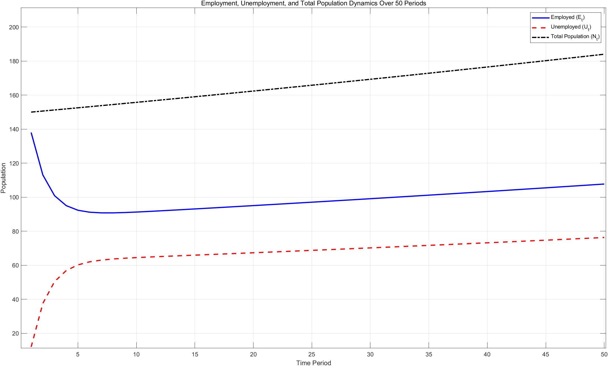

# HW5

冼名儒 2300017466

## 1. Write the Bellman Equation

$$
V_{E,t}(w) = u(w) + \beta [\alpha V_{U,t+1} + (1-\alpha)V_{E,t+1}(w)]\\
V_{U,t} = u(b) + \beta [(1-\gamma)V_{U,t+1} + \gamma \mathbb{E}_{w'} (\max\{V_{E,t+1}(w'),V_{U,t+1}\})]
$$

## 2. McCall Model

$V_E, V_U$:

保留工资随$\alpha$的变化：

保留工资随失业救济的变化：

## 3. Lake Model

总人口、就业人口与失业人口：

就业率与失业率：

Baby boom: 

## 4. Lake + McCall

Employment rate:

Unemployment rate:

Welfare:

