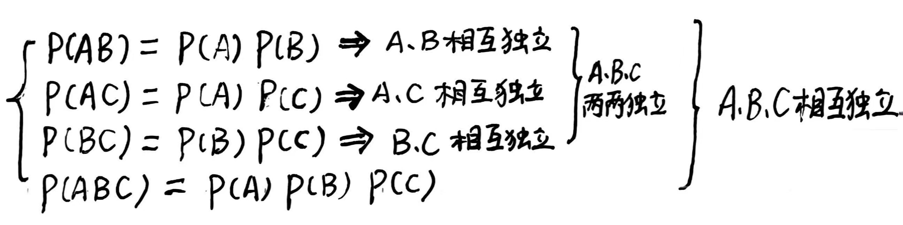
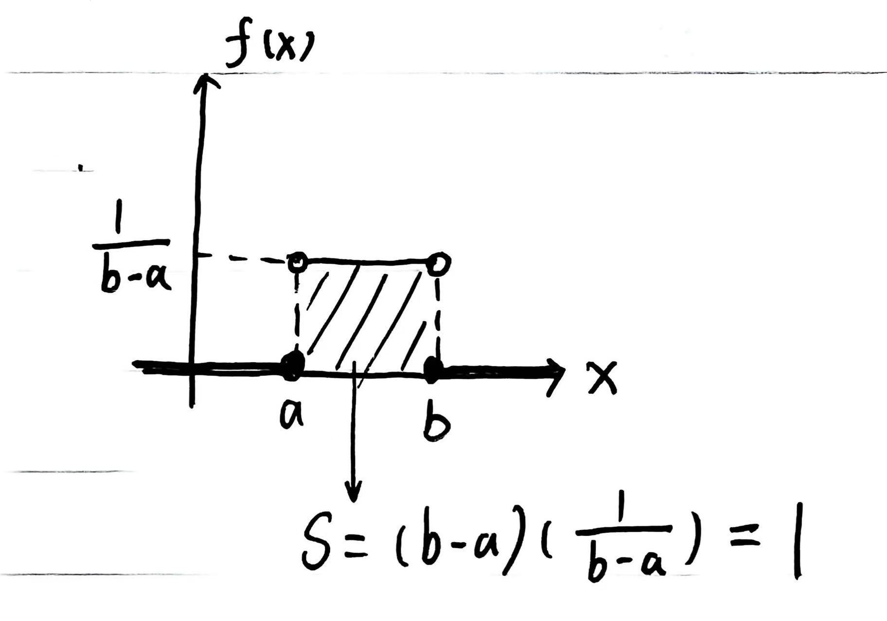
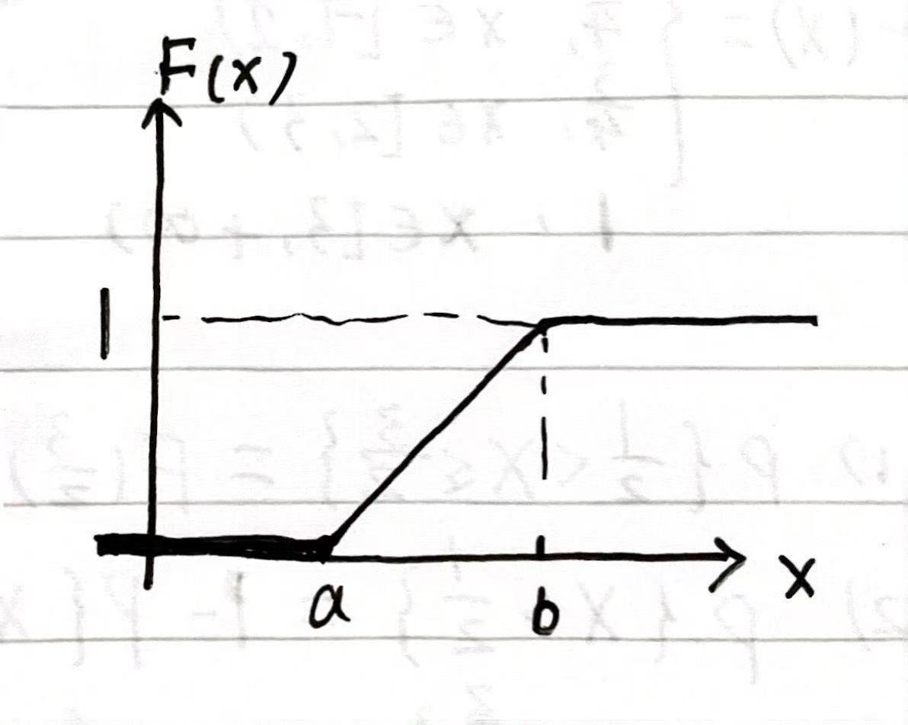
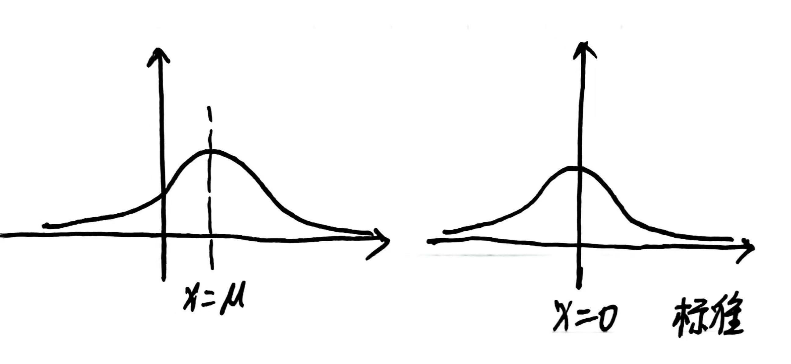
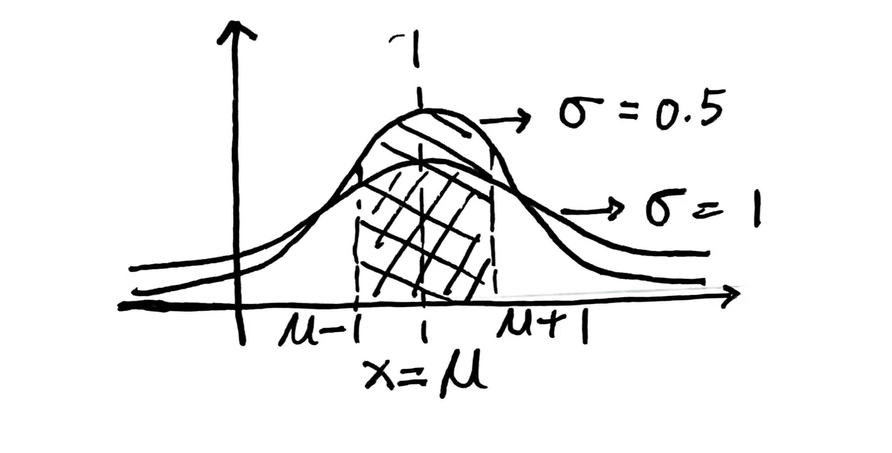
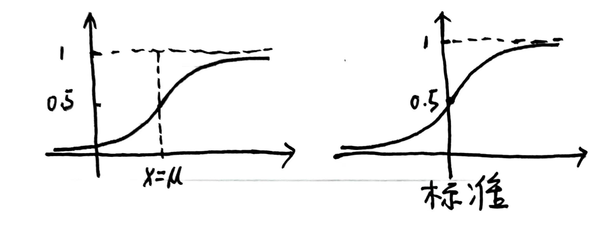
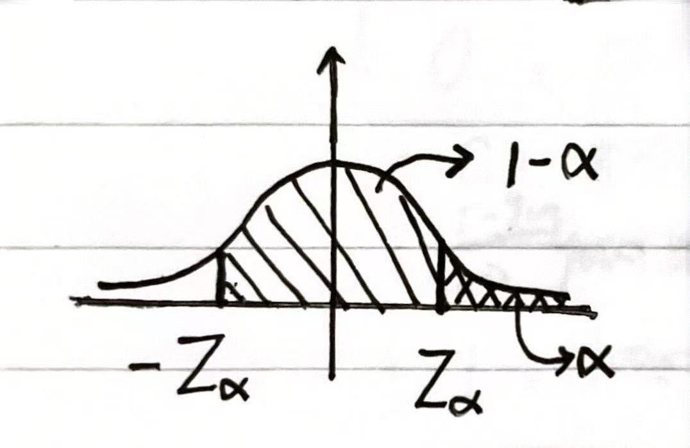
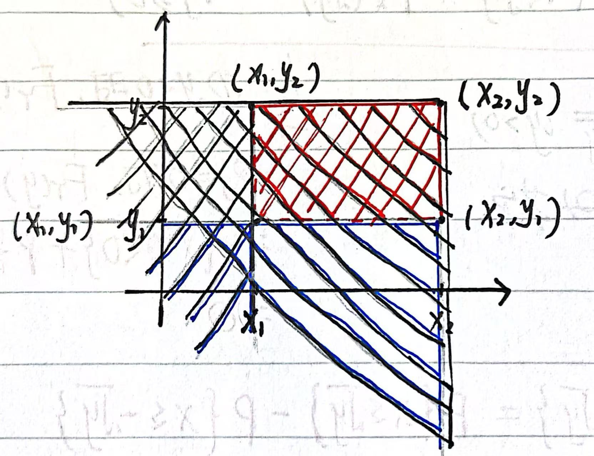
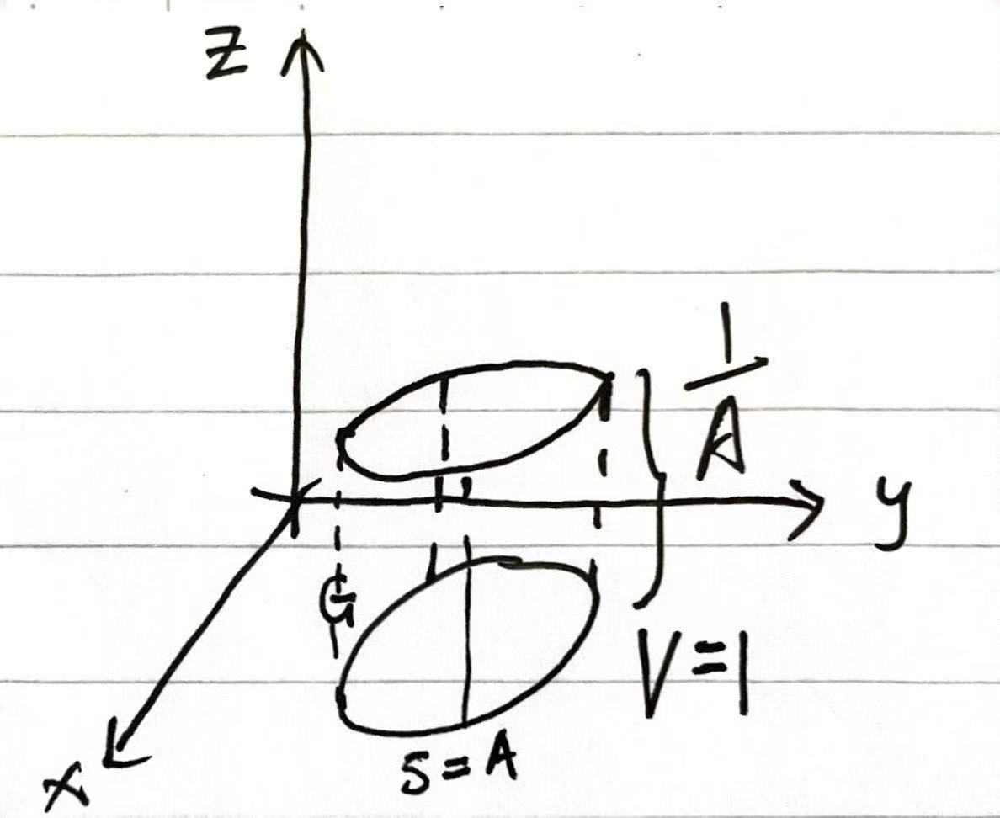

# 概率统计

依据孔祥仁的概率统计课程整理。[孔祥仁概率统计课程视频链接](https://www.bilibili.com/video/BV1hD4y1b7Y4?spm_id_from=333.788.videopod.episodes&vd_source=4319b22bb2ab7d63a87f0bb67c0218fe&p=4)

教材：概率论与数理统计 浙大第五版

斜体为个人批注，仅供参考。

## 第一章 概率论的基本概念

### 1. 随机试验

#### 1.1 名词

确定性现象：结果呈现确定性的现象。

随机现象：在个别实验中呈现不确定性，在大量重复实验中表现出统计规律性的现象。

#### 1.2 随机试验

随机试验：对随机现象的实现或者对其的观察，记为$E$。

特点：

1. 相同条件可重复
2. 试验结果明确可知且结果不止一个
3. 试验前不能确定哪个结果会出现

### 2. 样本空间与随机事件

#### 2.1 样本空间

定义：将$E$的所有可能结果组成的集合称为$E$的样本空间，记为$S$。

样本点：$S$的元素。

#### 2.2 随机事件

定义：称$E$的样本空间（$S$）的子集为$E$的随机事件。

事件发生：在一次实验中，该子集的一个样本点出现。

基本事件：由一个样本点组成的单点集。不可以再划分的事件。

必然事件：$S$本身。

不可能时间：$\emptyset$。

### 3. 事件间的关系及运算

1. $A \subset B$：包含关系。A包含于B（B包含A）。A发生$\Rightarrow$B发生。
2. 和事件（并事件）：A与B至少发生一个，记作$A \cup B$或$A+B$。
3. 积事件（交事件）：A与B同时发生，记作$A \cap B$或$AB$。
4. 差事件：A发生且B不发生，记作$A-B$。
5. 互斥事件（互不相容事件）：A与B不能同时发生，$A \cap B = \emptyset$。
6. 逆事件（对立事件）：A与B有且只有一个发生，$A \cap B = \emptyset$且$A \cup B = S$

### 4. 事件的运算律

1. 交换律：$A \cup B = B \cup A$；$AB = BA$

2. 结合律：$A \cup (B \cup C) = (A \cup B) \cup C$；

   $A \cap (B \cap C) = (A \cap B) \cap C$；

   括号里外开口相同。

3. 分配律：$A \cup (B \cap C) = (A \cup B) \cap (A \cup C)$；

   $A \cap (B \cup C) = (A \cap B) \cup (A \cap C)$；

   括号里外开口不同。

1. 德摩根律：$\overline{A \cup B} = \bar{A} \cap \bar{B}$；

   $\overline{A \cap B} = \bar{A} \cup \bar{B}$；

   “长（短）杠变短（长）杠，开口换方向”。

### 5. 频率与概率

#### 5.1 频率

定义：事件发生的频数与试验总署之间的比值

基本性质：

1. $0 \leq f_n(A) \leq 1$
2. $f_n(S) = 1$
3. 若$A_1, A_2,...,A_k$为两两不相容事件，则$f_n(A_1 \cup A_2 \cup ... \cup A_k) = f_n(A_1) + f_n(A_2) + ... + f_n(A_k)$

#### 5.2 概率

含义：用于衡量事件A发生的可能性的大小，用$P$来表示

基本性质：

1. 非负性：任一事件A，$P(A) \geq 0$
2. 规范形：必然事件S$\Rightarrow P(S) = 1$，反之不成立
3. 可列可加性：若$A_1, A_2,...$为两两不相容事件，$P(A_1 \cup A_2 \cup ... \cup A_k) = P(A_1) + P(A_2) + ... $

重要性质：

1. $P(\emptyset) = 0$：不可能事件$\Rightarrow$概率为0，反之不成立。

2. 有限可加性：若$A_1, A_2,...,A_n$为两两不相容事件，则$P(A_1 \cup A_2 \cup ... \cup A_n) = P(A_1) + P(A_2) + ... + P(A_k)$

3. 若$A \subset B$，则$P(B) \geq P(A)$

4. 任一事件A，$P(A) \leq 1$

5. 任一事件A，$P(\bar{A}) = 1 - P(A)$

6. 对于任意两个事件A，B，有$P(A \cup B) = P(A) + P(B) - P(AB)$。这是一个一定成立的性质。

   - 任意三个事件A，B，C，有$P(A) + P(B) + P(C) - P(AB) - P(AC) - P(BC) + P(ABC)$

   - 任意四个事件A，B，C，D，有
     $$
     P(A) + P(B) + P(C) + P(D) - P(AB) - P(AC) - P(AD) - P(BC) - P(BD) - P(CD) + P(ABC) + P(ABD) + P(ACD) + P(BCD) - P(ABCD)
     $$

*补充一个性质：*$P(A-B) = P(A) - P(AB)$

### 6. 古典概型

#### 6.1 特点

1. 有限性：$S$包含的样本点是有限个
2. 等可能性：样本点（基本事件）发生的可能性相同

#### 6.2 计算方法

事件$A$包含了$k$个基本事件，$S$有$n$个样本点。
$$
P(A) = \frac{k}{n}
$$

### 7. 条件概率

#### 7.1 定义

设A, B为两个事件，且$P(A)>0$，称$P(B|A)$为条件概率
$$
P(B|A) = \frac{P(AB)}{P(A)}
$$

#### 7.2 特点

1. 非负性：对于任一事件$B$，$P(B|A) \geq 0$
2. 规范形：必然事件$S$ $\Rightarrow P(S|A) = 1$
3. 可列可加性：设$B_1,B_2,B_3,...$是两两互不相容的事件，那么$P(B_1 \cup B_2 \cup B_3 | A) = P(B_1|A) + P(B_2|A) + P(B_3|A)$
4. 补充：$P(B_1 \cup B_2|A) = P(B_1|A) + P(B_2|A) - P(B_1 B_2|A)$

### 8. 乘法定理

前提：$P(A)>0$

乘法公式：
$$
P(AB) = P(A) P(B|A)
$$
引申：
$$
P(ABC) = P(A)P(B|A)P(C|AB)
$$

### 9. 全概率公式

#### 9.1 样本空间的划分

$B_1, B_2,..., B_n$是$E$的一组事件，若满足

1. $B_iB_j = \emptyset$，$i \neq j$，$i,j = 1,2,..., n$
2. $B_1 \cup B_2 \cup ... \cup B_n = S$

则$B_1, B_2,..., B_n$为$S$的一个划分（或完备事件组）。

对立事件是一个特殊的划分。

#### 9.2 全概率公式

设$E$的样本空间为$S$，$A$是$E$的事件，$B_1, B_2,..., B_n$为$S$的划分且$P(B_i) > 0$，则
$$
P(A) = P(B_1)P(A|B_1) + P(B_2)P(A|B_2) + ... + P(B_n)P(A|B_n)
$$

### 10. 贝叶斯公式

设$E$的样本空间为$S$，$A$是$E$的事件，$B_1, B_2,..., B_n$为$S$的划分且$P(A) > 0,P(B_i) > 0$，则
$$
P(B_i|A) = \frac{P(B_i)P(A|B_i)}{\sum_{j=1}^{n}P(B_j)P(A|B_j)}
$$
这就是贝叶斯公式。

它的推导过程是，首先写出$P(B_i|A)$的条件概率公式，对分子用乘法公式改写，对分母用全概率公式改写。

### 11. 独立性

设试验$E$的事件$A,B$，若$P(A) > 0$，就可以定义$P(B|A)$，一般情况下$P(B|A) \neq P(B)$，即事件$A$发生与否会对$B$发生的概率产生影响；有的时候$P(B|A) = P(B)$，即事件$A$发生与否**不会**对$B$发生的概率产生影响

#### 11.1 定义

设$A,B$为两个事件，若满足$P(AB) = P(A)P(B)$，那么我们称$A,B$相互独立。

设$A,B,C$三个事件，当且仅当满足以下四个条件$A,B,C$相互独立：

 

## 第二章 随机变量及其分布

### 1. 随机变量

#### 1.1 定义

随机试验$E$的样本空间$S = \{e\}$，$X = X(e)$是定义在$S$上的实值单值函数，则称$X = X(e)$是随机变量。

#### 1.2 注意

1. 随机变量用大写字母表示
2. 实数用小写字母表示
3. 某些试验结果本身就是一个数，可以将实验结果本身作为随机变量。

### 2. 离散型随机变量及分布

#### 2.1 离散型随机变量

取值是有限多个或可列无穷多个的随机变量。

#### 2.2 分布律的性质

离散型随机变量的分布律：$X$的所有取值；$X$每个取值各自概率；写成图表或统一的表达式

1. $p_k \geq 0$
2. $\sum_{k=1}^\infin p_k = 1$

分布律满足上面2个性质；满足上面2个性质就是某个分布律。

#### 2.3 重要分布

##### 2.3.1 0 - 1分布（两点分布）

设$X$只可能取0, 1两个值，它的分布律满足
$$
P\{X = k\} = p^k(1-p)^{1-k}
$$
称$X$服从以$p$为参数的0 - 1分布，$p$代表$X = 1$发生的概率。

##### 2.3.2 伯努利试验及二项分布

如果$E$只有两个结果：$A$和$\bar{A}$，则称为伯努利试验。

若将该试验**重复独立**地进行n次，则称为n重伯努利试验。

- 重复：$P(A)$不变，$P(\bar{A})$也不变
- 独立：每次试验互不影响

设$X$表示n重伯努利试验中$A$发生的次数，$X = 0, 1, 2, ..., n$。假定$P(A) = p$，$P(\bar{A}) = 1 - p = q$,
$$
P(X = k) = C_n^kp^kq^{n - k}
$$
称$X$服从参数为$n$, $p$的二项分布，记作$X \sim b(n,p)$，其中$k = 0, 1, 2, ..., n$

之所以叫二项分布是因为它和二项式定理有关。

0 - 1分布是特殊的二项分布，即n = 1时的二项分布。

##### 2.3.3 泊松分布

泊松分布：设随机变量$X = 0, 1, 2, ...$，每个取值的概率满足
$$
P\{X = k\} = \frac{\lambda^k}{k!} e^{-\lambda}
$$
其中$k = 0, 1, 2, ...$，要求$\lambda$为大于0的常数，可以称$X$服从一个参数为$\lambda$的泊松分布，记作$X \sim \Pi(\lambda)$.

泊松定理： 设$\lambda$为大于0的常数，$n$为任意正整数。又设$np = \lambda$，则对任一固定的非负整数$k$，有下式成立
$$
\lim_{n \to \infin} C_n^k p^k q^{n-k} = \frac{\lambda^k}{k!} e^{-\lambda}
$$
即，将伯努利试验做很多次时，二项分布的分布律 = 泊松分布的分布律 。

一般来说，当$n \geq 20$, $p \leq 0.05$时，可以利用泊松分布近似二项分布。

##### 2.3.4 几何分布与超几何分布

几何分布的数学模型：伯努利试验“达到目的”的概率为$p$，试验第$k$次才成功的概率为
$$
P\{X = k\} = (1-p)^{k-1}p
$$
几何分布的定义：$X$的分布律满足上述等式，就是几何分布，记作$X \sim G(p)$.

超几何分布的数学模型：从有限$N$个物品（其中有$D$个特殊物品）中抽出$n$个物品，包含了特定物品$k$个（$k \leq \min\{D, n\}$）的概率为
$$
P\{X = k\} = \frac{C_D^k C_{N - D}^{n - k}}{C_N^n}
$$
超几何分布的定义：$X$的分布律满足上述等式，就是超几何分布，记作$X \sim H(N, D, n)$.

### 3. 随机变量的分布函数

#### 3.1 定义

设$X$为随机变量，$x$是任意实数，$F(x) = P\{X \leq x\}$，$-\infin <  x < +\infin$，为$X$的分布函数。

另外：$P\{x_1 < X \leq x_2\} = P\{X \leq x_2\} - P\{X \leq x_1\} = F(x_2) - F(x_1)$.

分布函数的性质：

1. $F(x)$为不减函数
2. $0 \leq F(x) \leq 1$，$\lim_{x \to -\infin}F(x) = 0$，$\lim_{x \to \infin}F(x) = 1$
3. $F(x)$是一个右连续函数，$F(x + 0) = F(x)$，$+0$表示往右一点点。

### 4. 连续型随机变量及概率密度

#### 4.1 定义

随机变量$X$的分布函数为$F(x)$，$F(x)$由一个非负的可积的的函数$f(x)$积分得来，
$$
F(x) = \int_{-\infin}^x f(t)dt
$$
称$X$是连续性随机变量，$f(x)$是$X$的概率密度函数。

注意：连续型随机变量$X$的分布函数是连续函数，$f(x)$不一定连续。

可以认为概率密度对应离散型随机变量的分布律。

#### 4.2 概率密度的性质

1. $f(x) \geq 0$.
2. $\int_{-\infin}^{+\infin} f(x) = 1$.

满足上述两点，可说明$f(x)$是某一个随机变量$X$的概率密度函数。

3. 任意实数$x_1, x_2$（$x_1 \leq x_2$），$P(x_1 < X \leq x_2) = F(x_2) - F(x_1) = \int_{x_1}^{x_2} f(x) dx$.

4. 如果$f(x)$在$x = x_0$处连续，那么$F'(x_0) = f(x_0)$.
5. $P\{X = a\} = 0$.
6. 对于连续型随机变量，$P\{x_1 \leq X \leq x_2\} = F(x_2) - F(x_1) + P\{X = x_1\} = P(x_1 < X \leq x_2)$，$P\{x_1 < X < x_2\}$和$P\{x_1 \leq X < x_2\}$同理。即，端点值不影响区域上的概率。

#### 4.3 概率分布

随机变量的概率分布包括分布函数和分布律/概率密度。求解概率分布时，如果题目给出了其中一方，求另一方即可；如果都没有，就需要求双方。

 #### 4.4 重要的连续性随机变量

##### 4.4.1 服从均匀分布的随机变量

$X$的概率密度为
$$
f(x) = 
\begin{cases}
\frac{1}{b - a}, &a < x < b\\
0, &\text{others}
\end{cases}
$$
称$X$在区间$(a, b)$服从均匀分布，记作$X \sim u(a, b)$.

 

---

分布函数为
$$
F(x) = 
\begin{cases}
0, &x < a\\
\frac{x-a}{b-a}, &a\leq x < b\\
1, &b \leq x
\end{cases}
$$
*$\frac{x-a}{b-a}$可由矩形图像面积直接得出。*

 

##### 4.4.2 服从指数分布的随机变量

$X$的概率密度为
$$
f(x) = 
\begin{cases}
\lambda e^{-\lambda x}, &x>0\\
0, &\text{others}
\end{cases}
$$
$\lambda$为大于零的常数，称$X$服从指数分布，记作$X \sim E(\lambda)$.

注意：$\lambda$与泊松分布相区分。

---

分布函数为
$$
F(x) = 
\begin{cases}
1 - e^{-\lambda x}, &x > 0\\
0, &\text{others}
\end{cases}
$$

---

无记忆性：对于任意两个数$s > 0$，$t > 0$，
$$
P\{X > t\} = P\{X > s+t|X > s\}
$$
无记忆性的例子：一个没有明显衰老的人的寿命$X$. $P\{X > 10\} = P\{X > 5+10|X > 5\}$，一个刚出生的人活十年的概率和一个五岁的人再活十年的概率相同。若不然， $P\{X > 10\} \neq P\{X > 80+10|X > 80\}$.

##### 4.4.3 服从正态分布的随机变量

$X$的概率密度为
$$
f(x) = \frac{1}{\sqrt{2\pi}\sigma} e^{-\frac{(x-\mu)^2}{2\sigma^2}}, -\infin<x<+\infin
$$
其中$\mu$，$\sigma$为常数，则称$X$服从参数为$\mu$，$\sigma$的正态分布，记作$X \sim N(\mu, \sigma^2)$.

当$u = 0$，$\sigma = 1$时，称为标准正态分布，概率密度函数写作$\varphi(x) = \frac{1}{\sqrt{2\pi}}e^{\frac{x^2}{2}}$.

$\mu$决定概率密度函数图像的位置，$u$又称为位置参数。

 

$\sigma$决定正态分布概率密度的峰值，$\sigma$越小，峰值越大。$\sigma$越小，$X$落在关于对称轴对称的区间中的概率越大。

 

---

分布函数为
$$
F(x) = \int_{-\infin}^x \frac{1}{\sqrt{2\pi}\sigma} e^{-\frac{(t-\mu)^2}{2\sigma^2}}dt
$$
当$\mu = 0$，$\sigma = 1$时，标准正态分布函数为
$$
\Phi(x) = \int_{-\infin}^{x} \frac{1}{\sqrt{2\pi}}e^{-\frac{t^2}{2}}dt
$$
 

---

正态分布的性质：

1. 概率密度函数图像关于$x = \mu$对称
2. $f(x)_{\max} = f(\mu) = \frac{1}{\sqrt{2\pi}\sigma}$.
   对于等长区间，越靠近$x = \mu$，$X$落到该区间的概率越大。
   $P\{\mu - h < X \leq \mu\} = P\{\mu < X \leq \mu + h\}$.
3. 对于标准正态分布，$\Phi(x) + \Phi(-x) = 1$
4. 引理：$X \sim N(\mu, \sigma^2)$，令$Z = \frac{x - \mu}{\sigma}$，$Z \sim N(0, 1)$.
   这个引理的作用是将一般正态分布转化为标准正态分布，从而能够通过查表求值。

---

$3\sigma$法则：

- $X \sim N(\mu, \sigma^2)$，$F(x) = P\{X \leq x\} = P\{\frac{X-\mu}{\sigma} \leq \frac{x-\mu}{\sigma}\} = \Phi(\frac{X - \mu}{\sigma})$

- 对于$(x_1, x_2]$，
  $$
  \begin{aligned}
  P\{x_1 < X \leq x_2\} &= P\{\frac{x_1 - \mu}{\sigma} < \frac{X - \mu}{\sigma} \leq \frac{x_2 - \mu}{\sigma}\}\\
  &= P\{\frac{X - \mu}{\sigma} \leq \frac{x_2 - \mu}{\sigma}\} - P\{\frac{X - \mu}{\sigma} \leq \frac{x_1 - \mu}{\sigma}\}\\
  &= \Phi(\frac{x_2 - \mu}{\sigma}) - \Phi(\frac{x_1 - \mu}{\sigma})
  \end{aligned}
  $$

- $P\{\mu-\sigma < X \leq \mu+\sigma\} = \Phi(1) - \Phi(-1) = 2\Phi(1) - 1 = 68.26\%$
  $P\{\mu-2\sigma < X \leq \mu+2\sigma\} = 2\Phi(2) - 1 = 95.44\%$
  $P\{\mu-3\sigma < X \leq \mu+3\sigma\} = 2\Phi(3) - 1 = 99.74\%$

---

上$\alpha$分位点：$X \sim N(0,1)$，$Z_\alpha$满足$P\{X > Z_\alpha\} = \alpha$，$0 < \alpha < 1$，$Z_\alpha$是上$\alpha$分位点。

*上$\alpha$分位点只针对标准正态分布。*

性质：$-Z_\alpha = Z_{1-\alpha}$

 

### 5. 随机变量的函数的分布

定理：设随机变量$X$具有的概率密度为$f_X(x)$，$-\infin<x<+\infin$，又设函数$g(x)$处处可导且恒有$g'(x) > 0$（或恒有$g'(x) < 0$），则$Y = g(x)$是连续性随机变量，其概率密度为
$$
f_Y(y) =
\begin{cases}
f_X[h(y)]|h'(y)|, \alpha < y < \beta\\
0, \text{others}
\end{cases}
$$
其中$\alpha = \min\{g(-\infin),g(\infin)\}，\beta = \max\{g(-\infin),g(\infin)\}$，$h(y)$是$g(x)$的反函数。

注意：若$f_X(x)$在$[a, b]$以外等于0，只需要要求$g(x)$在$[a, b]$恒有$g'(x) > 0$或$<0$，$\alpha = \min\{g(a),g(b)\}$，$b = \max\{g(a), g(b)\}$.

## 第三章 多维随机变量及分布

### 1. 二维随机变量

#### 1.1 二维随机变量及分布

二维随机变量：$E$的$S = \{e\}$, $e$由$(X, Y)$构成，$X$, $Y$是定义在$S$里的，称$(X,Y)$为二维随机变量。

联合分布函数：$F(x, y) = P\{X \leq x, Y \leq y\}$称为$(X, Y)$的联合分布函数。

性质：

1. $F(x,y)$为不减函数

2. $0 \leq F(x, y) \leq 1$

   特殊地：

   - $F(-\infin,y) = P\{X \leq -\infin, Y \leq y\} = 0$
   - $F(x, -\infin) = 0$
   - $F(-\infin, -\infin) = 0$
   - $F(+\infin, +\infin) = 1$

3. $F(x, y)$是关于$x,y$的右连续的函数

$P\{x_1 < X \leq x_2, y_1 < Y \leq y_2\} = F(x_2,y_2) - F(x_1,y_2) - F(x_2,y_1)$
$+F(x_1,y_1)$. 这是恒成立的等式，不论是对于连续型还是离散型。

 

#### 1.2 离散型二维随机变量及联合分布律

定义：$(X, Y)$所有取值为有限对或可列无限对，称为离散型二维随机变量。$P\{X=x_i, Y=y_i\} = p_{ij}$, $i,j = 1, 2, 3, ...$

性质：

1. $p_{ij} \geq 0$, 非负性
2. $\sum p_{ij} = 1$

#### 1.3 连续型二维随机变量及联合概率密度

定义：若$(X,Y)$的分布函数为$F(x,y)$，$f(x,y)$为非负可积的，$\int_{-\infin}^{y}\int_{-\infin}^{x} f(u,v) dudv = F(x,y)$称$(X,Y)$为连续型二维随机变量，称$f(x,y)$为$(X,Y)$的联合概率密度。

性质：

1. $f(x,y) \geq 0$
2. $\int_{-\infin}^{+\infin}\int_{-\infin}^{+\infin} f(x,y) dxdy = 1$
3. 设$G$是平面$xoy$上的某个区域，$(X,Y)$落在$G$区域的概率$P\{(X,Y)\in G\} = \iint_G f(x,y) dxdy$

4. $f(x,y)$在(x,y)点上连续，$\frac{\partial^2F(x,y)}{\partial x \partial y} = \frac{\partial^2F(x,y)}{\partial y \partial x} = f(x,y)$

### 2. 边缘分布

#### 2.1 边缘分布函数

二维随机变量$(X,Y)$具有分布函数$F(x,y)$，而$X$和$Y$都是随机变量，各自也有分布函数，将它们分别记为$F_X(x)$, $F_Y(y)$，称为二维随机变量关于$X$和关于$Y$的边缘分布函数。 

$F_X(x) = P\{X\leq x\} = P\{X\leq x,Y\leq +\infin\} = F(x,+\infin)$

同理，$F_Y(y)= F(+\infin,y)$

#### 2.2 边缘概率密度

已知$(X,Y)$的联合概率密度$f(x,y)$,  求关于$X$和$Y$的边缘概率密度：

$$F_X(x) = F(x, + \infin) = \int_{-\infin}^x \int_{-\infin}^{+\infin} f(u, y) dydu$$

$$f_X(x) = \int_{-\infin}^{+\infin} f(x, y) dy$$

同理，$f_Y(y) = \int_{-\infin}^{+\infin} f(x,y) dx$

#### 2.3 常用二维分布

1. 二维均匀分布
   $$
   f(x,y) =
   \begin{cases}
   \frac{1}{A}, (x,y) \in G \\
   0,\text{others}
   \end{cases}
   $$
   
   
2. 二维正态分布

注意：联合概率密度可以推出边缘概率密度；但是两个边缘概率密度无法推出联合概率密度。 

### 3 条件分布

#### 3.1 离散型二维随机变量的条件分布律

定义：$(X,Y)$是二维离散型随机变量，
$$
P\{X = x|Y = y\} = \frac{P\{X = x, Y = y\}}{P\{Y = y\}}
$$
称为在$Y=y$的条件下，$X$的条件分布律。

#### 3.2 连续型二维随机变量的条件概率密度

定义：$(X,Y)$的概率密度为$f(x,y)$，$(X,Y)$关于$Y$的边缘概率密度为$f_Y(y)$,在$Y=y$的条件下$X$的条件概率密度为
$$
f_{X|Y}(x|y) = \frac{f(x,y)}{f_Y(y)}
$$
$X$的条件概率分布函数为
$$
F_{X|Y}(x|y) = \int_{-\infin}^{x}\frac{f(u,y)}{f_Y(y)}du
$$
