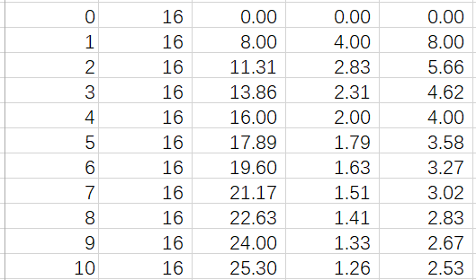
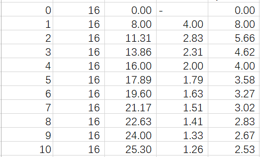
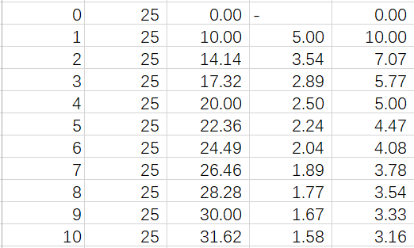
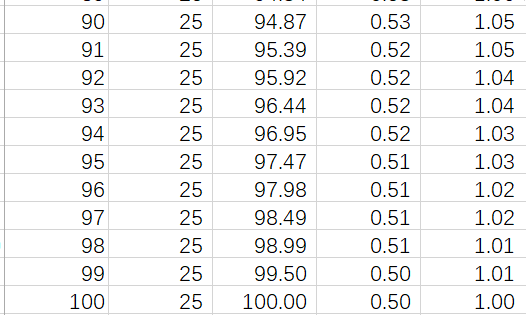
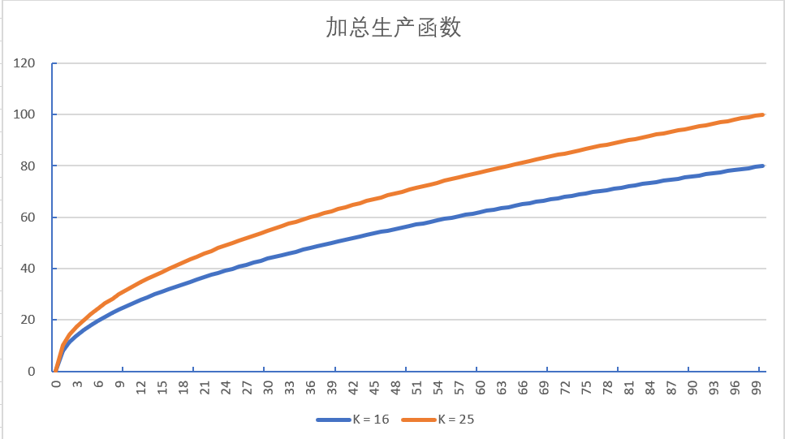
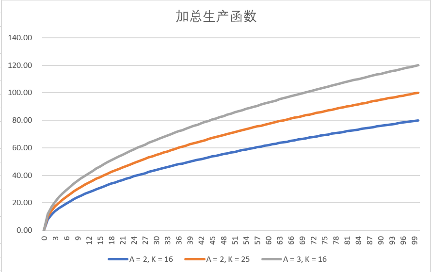
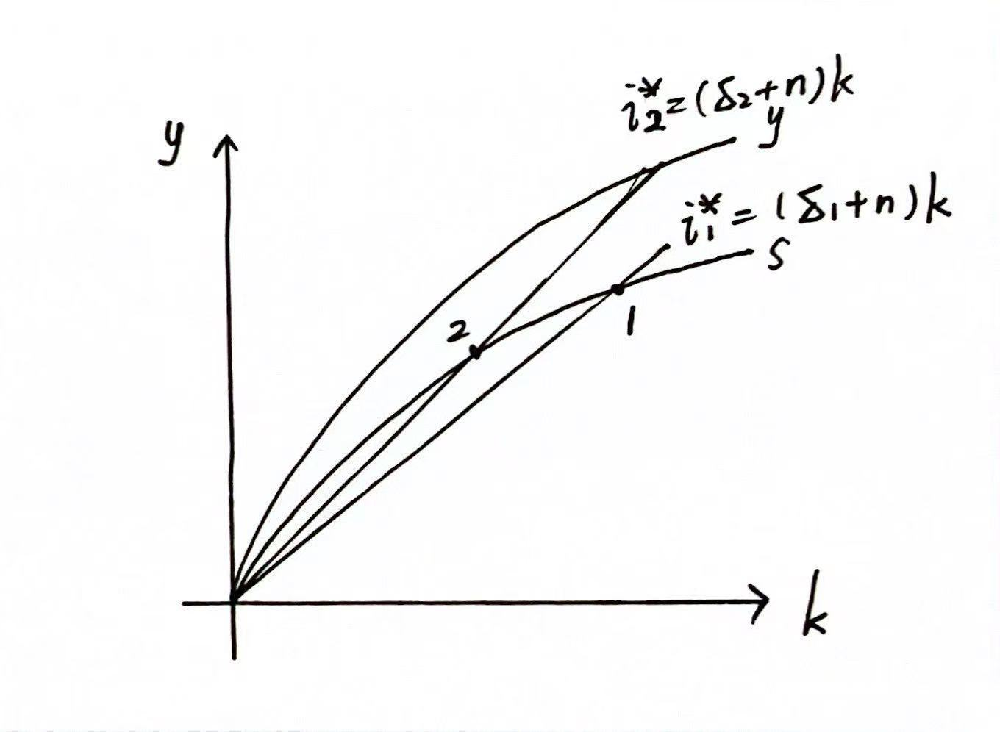

# 作业二

## 第三讲

#### 3.

#### a.

$\text{Nominal GDP}_{2022} = \$2 \times10,000 + \$4 \times2,000 + \$10\times500 = \$33,000$

$\text{Nominal GDP}_{2023} = \$2 \times11,000 + \$5 \times2,000 + \$11\times400 = \$36,400$

$\text{Nominal GDP}_{2024} = \$3 \times10,500 + \$5 \times2,500 + \$14\times500 = \$51,000$

#### b.

$\text{Real GDP}_{2022} = \$2 \times10,000 + \$4 \times2,000 + \$10\times500 = \$33,000$

$\text{Real GDP}_{2023} = \$2 \times11,000 + \$4 \times2,000 + \$10\times400 = \$34,000$

$\text{Real GDP}_{2024} = \$2 \times10,500 + \$4 \times2,500 + \$10\times500 = \$36,000$

#### c.

$\text{Real GDP}_{2022} = \$2 \times10,000 + \$5 \times2,000 + \$11\times500 = \$35,500$

$\text{Real GDP}_{2023} = \$2 \times11,000 + \$5 \times2,000 + \$11\times400 = \$36,400$

$\text{Real GDP}_{2024} = \$2 \times10,500 + \$5 \times2,500 + \$11\times500 = \$39,000$

#### d.

base = 2022: 

$\text{Growth Rate}_{2022} = (\frac{34,000}{33,000} - 1)\times 100\% = 3.03\%$

$\text{Growth Rate}_{2023} = (\frac{36,000}{34,000} - 1)\times 100\% = 5.88\%$

base = 2023: 

$\text{Growth Rate}_{2022} = (\frac{36,400}{35,500} - 1)\times 100\% = 2.54\%$

$\text{Growth Rate}_{2023} = (\frac{39,000}{36,400} - 1)\times 100\% = 7.14\%$

不一样，基期选择的不同会影响增长率的结果。

#### e.

2022: $\frac{33,000}{33,000}\times 100=100$

2023: $\frac{36,400}{34,000}\times 100=107.06$

2024: $\frac{51,000}{36,000}\times 100=141.67$

$\text{价格变化率}_{2022} = 7.06\%$

$\text{价格变化率}_{2023} = (\frac{141.67}{107.06} - 1)\times 100\% = 32.33\%$

#### f.

2022: $\frac{33,000}{35,500}\times 100=92.96$

2023: $\frac{36,400}{36,400}\times 100=100$

2024: $\frac{51,000}{39,000}\times 100=130.77$

$\text{价格变化率}_{2022} = (\frac{100}{92.96} - 1)\times 100\% = 7.57\%$

$\text{价格变化率}_{2023} = 30.77\%$

#### g.

$\text{CPI}_{2022} = 100$

$\text{CPI}_{2023} = \frac{\$35,500}{\$33,000}\times 100= 107.58$

$\text{CPI}_{2024} = \frac{\$47,000}{\$33,000}\times 100= 142.42$

$\text{价格变化率}_{2022} = 7.58\%$

$\text{价格变化率}_{2023} = (\frac{142.42}{107.58} - 1)\times 100\% = 32.39\%$

#### h.

$\text{CPI}_{2022} = \frac{\$33,000}{\$35,500}\times 100= 92.96$

$\text{CPI}_{2023} = 100$

$\text{CPI}_{2024} = \frac{\$47,000}{\$35,500}\times 100= 132.39$

$\text{价格变化率}_{2022} = (\frac{100}{92.96}-1)\times100\% = 7.58\%$

$\text{价格变化率}_{2023} = 32.39\%$

#### i.

GDP平减指数和增长率均不同；CPI存在不同，但是价格变化率相同。

GDP和CPI的计算都受到基期的影响。CPI计算的价格变化率相同是因为同一基期的CPI分母相同，相除后消掉。

## 第四讲

### 1.

#### a.

 

#### b.

MPL随着L的增加而减少。Y/L随着L的增加先增后减（0 - 1，增加；1 - 100，减少）。

经济学直觉：劳动的投入带来的边际回报越来越少。

#### c.

生产函数曲线上扬。

#### d.

 

#### e.

#### f.

科技进步同样使得加总生产函数曲线上扬。

### 2.

#### a.

| 阿富汗 | 巴西 | 中国 | 日本 |
| ------ | ---- | ---- | ---- |
| -20.7% | 4.8% | 8.4% | 2.6% |

#### b.

巴西，中国和日本。

| 巴西 | 中国 | 日本 |
| ---- | ---- | ---- |
| 43.8 | 25.0 | 80.8 |

#### c.

2021年摩洛哥GDP增长为8.2%.
$$
n \approx \frac{70\times \log_2^{1.65}}{8.2 - 5} \approx 16
$$

#### d.

精确计算的结果为16.76，和70规则计算的结果接近。

70规则中使用了$100\ln 2 \approx 70$和$\ln (1+x) \approx x$，后者在x接近0的时候更准确。

### 3.

#### a.

$y^* = A \cdot [\frac{n+\delta}{A(1-\beta}]^{1/\alpha - 1}$

$A, \beta, n, \delta, \alpha$影响。

#### b.

储蓄等于投资，人均产出中的固定部分($1 - \beta$)会成为投资/储蓄。

#### c.

均增加。

#### d.

人均产出会逐渐减少至新的稳态。总产出依然增加。人均产出增长率变为负，且绝对值不断减小。总产出增长率减小至新的稳态。

#### e.

折旧率上升使得稳态时的人均资本和人均产出减少。

 

#### 4.

#### a.

由题意得，$Y = AK^{2/3}L^{1/3}$

当劳动力提升了5%，$Y' = AK^{2/3}(1.05L)^{1/3} \approx 1.016Y$

$Y/L = A(\frac{K}{L})^{2/3}$, $Y'/L = A(\frac{K}{1.05L})^{2/3}$

所以$A$不变，总产出增加，劳动生产率下降。

#### b.

$Y_1 = A_1\times 6^{2/3} \times 3^{1/3} = 12$, $Y_2 = A_2 \times 7^{2/3} \times 4^{1/3} = 14$

$\frac{Y_2}{Y_1} = \frac{A_2}{A_1}\cdot(\frac{7}{6})^{2/3}\cdot(\frac{4}{3})^{1/3} = \frac{7}{6}$，$\frac{A_2}{A_1} = (\frac{21}{24})^{1/3} < 1$

全要素生产率下降。

#### c.

$\Delta Y = (1-\alpha)E^{-\alpha}K^{\frac{1}{3}}L^{\frac{2}{3}}\Delta E + \frac{1}{3}E^{1-\alpha}K^{-\frac{2}{3}}L^{\frac{2}{3}}\Delta K + \frac{2}{3}E^{1-\alpha}K^{\frac{1}{3}}L^{-\frac{1}{3}}\Delta L$

$\frac{\Delta Y}{Y} = (1-\alpha)\frac{\Delta E}{E}+\frac{1}{3}\frac{\Delta K}{K} + \frac{2}{3}\frac{\Delta L}{L}$

$\text{资本的贡献} = \frac{1}{3} \times 1.8\% = 0.6\%$

$\text{劳动的贡献} = \frac{2}{3} \times 1.8\% = 1.2\%$

$\text{全要素生产率的贡献} = 1.8\%\alpha$
