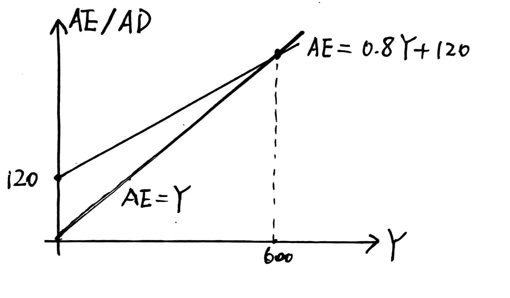
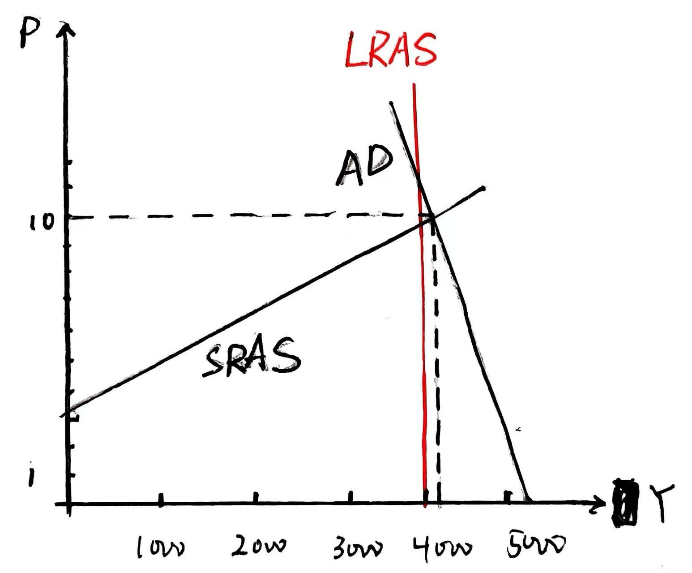

# 作业五

## 第10讲

### 1.

#### a.

我认为该图没有反映净资本外流。美国在外资产对应资本外流，在美国的“外资资产”对应资本内流，由图可知在美国的“外资资产”占GDP的比重高于美国在外资产占GDP的比重，所以应该是净资本内流。

#### b.

可以。在美国的“外资资产”和美国在外资产占GDP比重双增表明，不仅美国在外投资增加，而且外国对美国的投资也增加，世界经济联系更加紧密。

### 2.

#### a.

日本。

#### b.

中国。

#### c.

欧元区。

#### d.

中国。

## 第11讲

### 1.

#### a.

政府降低名义最低工资，失业率下降，潜在产出增加，SRAS曲线外移。

#### b.

政府增加对贫困家庭临时援助的支付，G和C均增加，AD曲线外移。

#### c.

由于政府要征收更多的税，人们预期收入减少，AD曲线内移。

#### d.

政府减少军事支出，G减少，AD曲线内移。

## 第12讲

### 1.

#### a.

$MPC = 0.8$

自主消费为-50百万。

#### b.

$Y = AD = C + G + I + NX$

$Y = -50 + 0.8(Y-50) + 70 + 100 + 60 - 20 = 0.8Y + 120$

$Y = 600$

 

#### c.

私人部门收入$Y_p = Y - G = 600 - 70 = 530$

私人部门消费$C = 390$

私人部门储蓄率$s = 1 - \frac{390}{530} = \frac{14}{53} = 0.26$

可贷资金市场供给：$Y_p - C = 140$

可贷资金市场需求：$I + G - T  + M = 140$

#### d.

$Y^* - Y = 800 - 600 = 200$

政府需要增加\$200百万。

#### e.

$Y = C + G + I + NX$

$Y = 800 - 4T$

$Y = 800, T =0$

应该减\$50百万的税。

#### f.

$Y = 600 - 4T$

$Y = 800, T = -50$，即$TR = 50$

政府应该转移支付\$50百万。

#### g.

$-50 + 0.8(Y-T) + T + 20 + 100 = Y$

$Y = T + 350$

$Y = 800, T = 450$

政府支出和税收应该增加\$450百万。

### 2.

#### a.

$620 = 700 - 2000r, r = 4\%$

#### b.

$M^s = M^d = 30000 - 50000 \times 4\% = 28000$

#### c.

$AD = C + G + I + NX = 3600 + 0.2(Y - T) - 100P + 450 + 620 - 350$
$= 4320 + 0.2(Y-100) - 100P$

$AD = 5375 - 125P$

#### d.

$SRAS = AD$

$5375 - 125P = 600P - 1875, P^* = 10, Y^* = 4125$

 

#### e.

长期均衡$Y^*_l = 4000$

$LRAS = AD$

$5375 - 125P = 4000, P^*_l = 11$

短期均衡高于长期均衡；短期失业率低于自然失业率。

#### f.

失业率回归自然时，$SRAS = 4000 = 600P - 1875, P = 9.80$

$AD = 4812.5 + 1.25G - 125P$

$4000 = 4812.5 + 1.25G - 125 \times 9.80, G = 330$

应该减少政府支出120.