# 经济学原理2（下）

范围：期中后

## 正课七：失业

时间：2025年4月14日

历史：《就业、利息与货币通论》首先讨论失业。

- 凯恩斯主义以解决失业问题为中心，其逻辑起点是**有效需求原理**。
- 大萧条中，不是工资无法降，而是物价降得更快，导致真实工资上升。

### 1. 宏观劳动状态的划分

针对年满16岁的社会成员

1. 就业：有工作的人，无论是全职还是兼职，无论有没有报酬，也无论是否临时请假。
2. 失业：没有工作但能工作的人，且**4周内在找工作**。
3. 非劳动力：包括收租、在家炒股等方式为生的人，还包括全日制学生、退休人员。

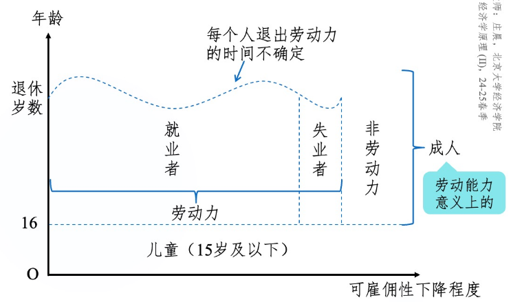

### 2. 作为存量的失业率

流量：某个时期内发生的量。

存量：某个时点的量。
$$
\text{失业率} = \frac{\text{失业人口}}{\text{劳动力}}\\
\text{劳动参与率} = \frac{\text{劳动力}}{\text{成人人口}}\\
\frac{\text{失业人口}}{\text{成人人口}} = \text{失业率}\times\text{劳动参与率}
$$

### 3. 作为流量的失业率

成人人口在3种状态下“切换”，总共有6种组合:

1. EU: 由就业转为失业（失去工作）
2. EI: 由就业转为非劳动力（退休，辞职旅游……）
3. UE: 由失业转为就业（找到工作）
4. UI: 由失业转为非劳动力（放弃寻找工作）
5. IE: 由非劳动力转为就业（有工作机会，并加入劳动力市场）
6. IU: 由非劳动力转为失业（想要加入劳动力市场，但未找到工作）

注意，大部分人口不发生“切换”，记为EE, UU, II.

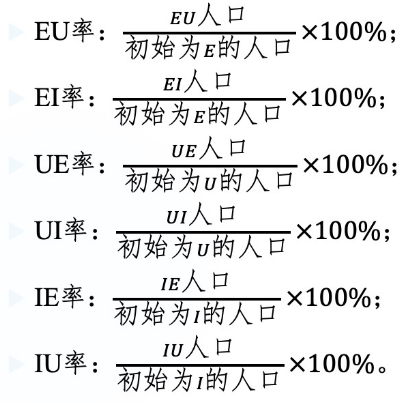 初始为E的人口 = EE + EU + EI, 其它同理。

### 4. 自愿和非自愿失业

古典经济学家认为，工人之所以失业，是因为他们不愿意接受市场均衡工资，所以是**自愿的**。

凯恩斯主义者认为，工人愿意接受当前的工资，但求职人数仍然超过岗位数，因此是**非自愿的**。

有效需求不足和工资粘性时：

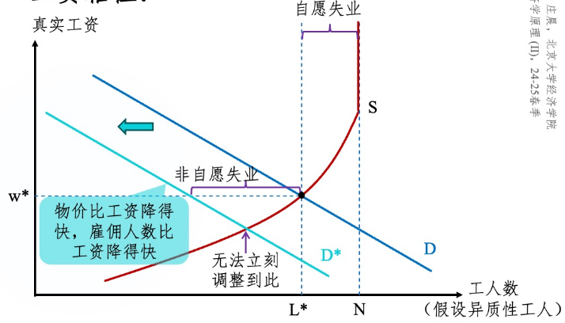

最低工资法导致非自愿事业：

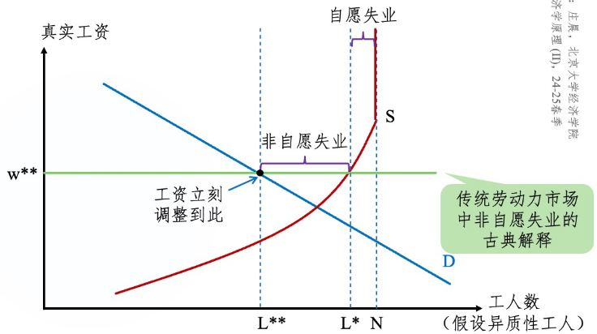

特殊情况——部分工人在某工资水平上对是否工作无差异（工会会员）：

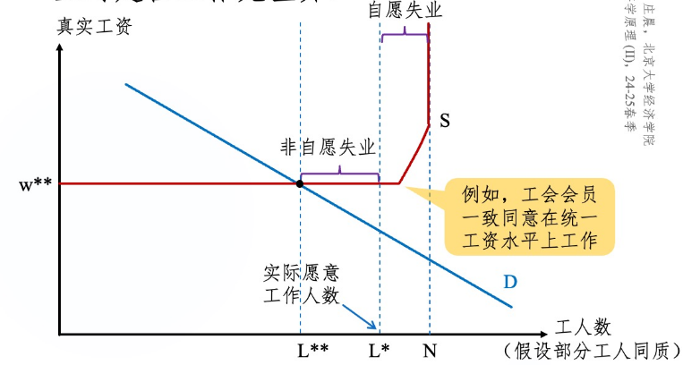

*水平线上有一段属于自愿失业的原因是：有一些既没有愿意，也没有不愿意的最终选择不工作的工人。*

还有效率工资中NSC条件导致的非自愿失业。

买方垄断造成的不是非自愿失业，加入工会或最低工资后可能引致非自愿失业。

### 5. 结构性失业

结构性失业：经济结构、体制等变动所导致的劳动力在技能、经验、主观意愿等方面的供给结构与需求不一致产生的失业。

- 这样的失业往往是非自愿的。
- **岗位创造**和**岗位毁灭**
- 既有失业又有职位空缺，但失业者不都胜任当前岗位。

模型刻画：

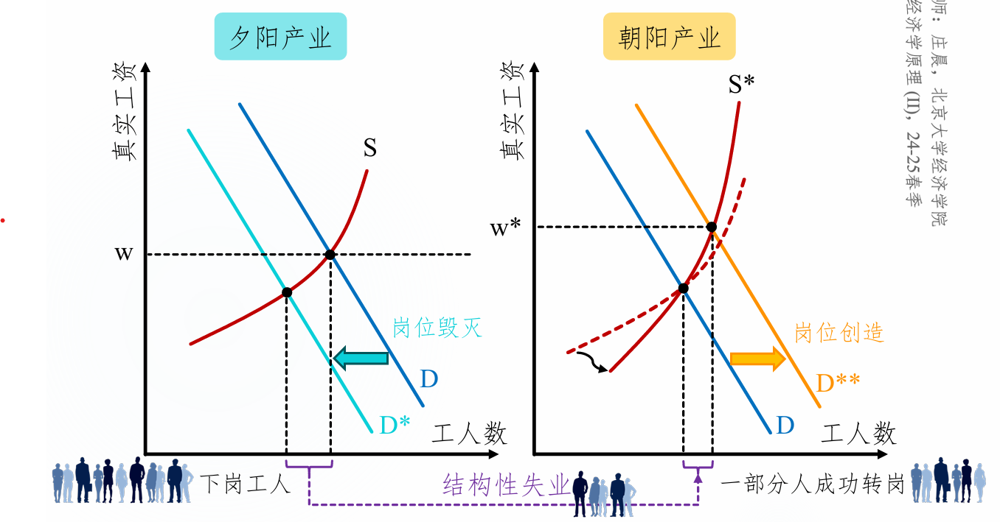

### 6. 摩擦性失业

摩擦性失业：找工作需要耗费的时间所导致的失业。

- 可以是自愿的：
  - 工作切换的过程，比较短暂
  
    *为了得到更好的平台，我愿意承受一段时间的失业。*
  
  - 为了“待价而沽”
  
    *有工作但我不去，我再看看有没有更好的。*
  
- 也可以是非自愿的：
  - 信息获取成本较高或信息不对称导致劳动力市场缺乏流动性。[^1]

#### 7. 自然失业和周期性失业

经济体中结构性和摩擦性失业长期存在，往往是不可避免的。

自然失业率也可称为长期/正常失业率：
$$
\text{自然失业率} = \frac{\text{结构性失业人口}+\text{摩擦性失业人口}}{\text{劳动力人口}}
$$
长期失业不等于长时间失业，它表示这种失业是长期存在于社会中的；自然失业不等于自愿接受的失业，也不代表它是不变的。

周期性失业是实际失业偏离自然失业的程度。

- 实际失业 = 自然失业 + 周期性失业。

- 周期性失业与“商业周期”密切相关。

  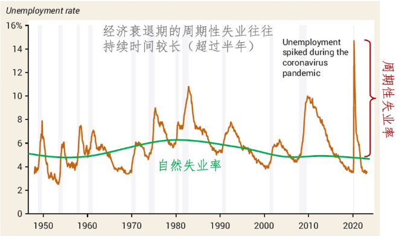

  经济衰退时，失业率上升，实际失业高于自然失业；经济过热时，企业盲目扩招，导致实际失业低于自然失业。
  
  经济衰退时各指标的变化：
  
  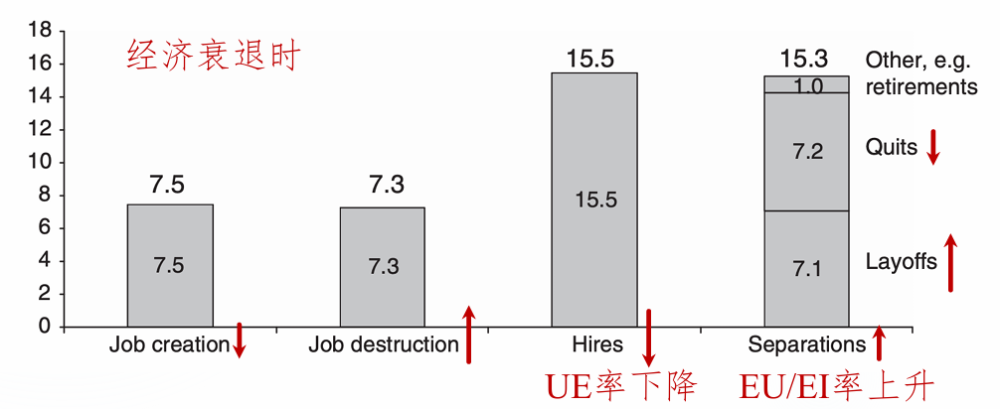

### 8. 失业率指标存在的问题

忽略了以下人群：

1. 丧志工人：指想工作但放弃找工作的人。分子分母都低估。
   - 分子分母都被低估会导致失业率被低估。（道理是：2/3 < 3/4）
2. 准待业工人是指过去(12个月)找工作但最近(4周)没有找工作的人。分子分母都低估。
3. 未充分就业工人是指想全职工作但目前兼职工作的人。分子低估。
   - 也可以指名义上是全职但实际上无所事事的人，但这不太好衡量。

### 9. 奥肯定律

阿瑟奥肯提出的一个经验关系：失业率的变化和真实GDP的增长率负相关。

两个版本：

1. 
2. 

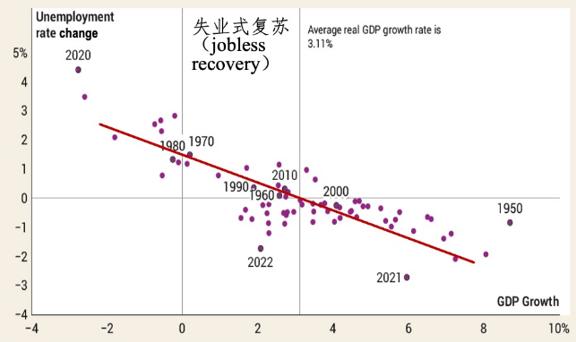

失业式复苏：经济已经开始复苏，但失业率仍在上升。

奥肯定律在中国可能不适用。

### 10. 摩擦性失业的产生机制

#### 10.1 单边搜寻模型

假设不存在非劳动力，记s为退役(下岗)比例，f为找到工作的比例，u为存量的失业率。

均衡时存在关系：$\frac{u}{1-u} = \frac{s}{f}$

一段时间内找到工作的概率：$f = \lambda[1-P(w\leq R)]$

解出失业率：$u = \frac{s}{f+s} = \frac{s}{\lambda[1-P(w\leq R)]+s}$

如何将$R$内生化？

- 

自动制动/缓冲机制：

#### 10.2 双边搜寻模型

将$\lambda$内生化。

双边搜寻模型不一定比单边搜寻模型更有效率，但更接近现实情况。

### 11. 长期就业政策

#### 11.1 减少摩擦性失业

对“信息”下手：

- 提高信息可获得性
- 提高求职者的信息获取能力
- 提高求职者的信息传达能力

对失业福利$b$进行设计：

- 过高的$b$带来消极影响
- 维持一定的$b$，允许失业的存在

## 正课八：货币制度

时间：2025年4月21日

### 1. 货币

货币的定义一（传统）：货币是作为支付手段被普遍接受的一种商品或符号。

- 核心功能：最后能当作(最终)结清债务的工具与凭证。
- 必要条件：货币必须要被普遍接受。货币在什么范围内被普遍接受，就在什么范围内流通。
  - 网络效应：产品的价值随着流通范围的扩大而递增。
  - 美元霸权
- 存在形式：货币可以是一种商品，也可以是无内在价值的符号。
  - 商品货币：有内在价值的商品，如烟草、盐砖等
  - 商品支持货币：与某一商品（金银）自由兑换的货币
  - 法币：由政府法令确定的货币，包括纸币与铸币等。依托国家信用。

货币的定义二（现代）：政府和商业银行通过银行系统对公众发生的债务。

- 债务的三方结构：
  1. 债权人：公众。拥有对发行方的债权。
  2. 债务人：政府（通过央行发行法币）和商业银行（通过贷款创造存款货币）。
  3. 中介：银行系统。
- 解读：此定义特指“狭义”的货币（现金和活期存款）。银行系统中的现金、政府在银行账户中的现金和存款、**获得前**的信贷，这些不是对公众的债务，不算货币。另外，通过银行系统形成的对公众的债务才是货币，国库券是公开发行的，不是货币。

货币的职能：

1. 交易媒介和最终支付手段
2. 计价单位
3. 价值储藏手段

按照流动性从好到差，我国将货币分为：

1. $M_0$：流通中的钞票和铸币，也是银行体系之外各单位持有的现金。

   与消费密切相关，数值高反映手头宽裕。

2. $M_1$（狭义货币）：$M_0$ + 单位活期存款 + 个人活期存款 + 非银支付机构客户备付金（微信钱包、支付宝的个人资金）

   反映现实购买力，代表家庭和企业资金的松紧。

3. $M_2$（广义货币）：$M_1$ + 单位/个人存款 + 非存款类金融机构存款 + 非存款类金融机构持有的货币市场基金份额

   反映现实和潜在购买力，体现社会总需求和未来通胀压力。

4. $M_3$：$M_2$ + 金融债券 + 商业票据 + 大额可转让定期存单等（体现金融创新）

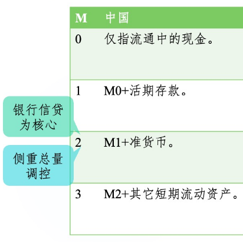 

$M_1$增速 - $M_2$增速，即$M_1$和$M_2$的剪刀差，反映市场对经济的预期。

- 剪刀差为正：预期乐观，活钱增多，更多钱流入实体经济从而增加经济活力。
- 剪刀差为负：预期悲观，说明放水很多但消费和投资跟不上，钱都堆在金融体系内而不愿意进入实体经济。

### 2. 中央银行

央行基本目标：维持宏观经济稳定；维持金融稳定。

央行的发展里程：

1. 1668 - 1971：世界各国中央银行设立和发展。1668，瑞典国家银行，第一家央行。
2. 1971 - 2008：央行从被动变为主动。1971，尼克松冲击，美元不再兑换黄金。
3. 2008 - 今：央行职能全面强化。2008，金融危机让各国看到央行的作用。

中央银行的架构：

- 行领导

- 地区分支银行

  - 准备金：商业银行库存的现金按比例存放在中央银行的存款，目的是确保商业银行在遇到突然大量提取银行存款时，有相当充足的清偿能力。

    准备金是央行对商业银行的债务。

  - 改革：从大区管理到省级管理

- 政策委员会

### 3. 金本位

金本位下，政府货币管理服从3条规则

1. 黄金与流动中纸币的比价固定。黄金的纸币价格，又称铸币价格。
2. 铸币价格与黄金市场上的买卖价相等
3. 铸币活动法定化

黄金的供给、需求与币值示意如下图：

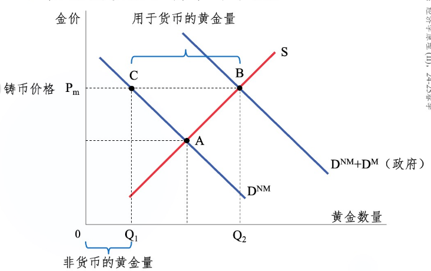

需求中有一部分是货币需要，另一部分可能是装饰等需求。

总币值 = $(Q_2 - Q_1)P_m$

物价水平 = $\frac{\text{总币值}}{\text{产品与服务量}}$，币值与物价同向变动。

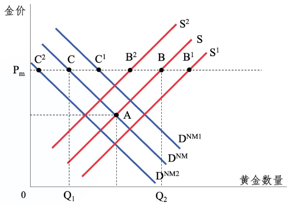

当黄金供给增加时（$S \to S_1$），总币值增加，物价水平上涨。

当非货币黄金需求增加，在$P_m$的水平，总币值减少，物价水平下降。

- 穿金戴银的风气导致通货紧缩，节俭的风气导致通货膨胀。

金本位的问题：

1. 物价水平受非货币用途的黄金需求与黄金总供给曲线变动的影响，即受非真实经济供求影响。（如上）
2. 金本位制下的汇率是固定汇率，难有独立货币政策
3. 现实中难以维持金价和铸币价的相等性，易遭受投机冲击。

### 4. 央行的货币政策工具

#### 4.1 公开市场操作

公开市场操作，就是买卖政府债券。

- 央行购买债券是放出货币
- 卖出债券是收回货币

主要买卖国库券。

美联储资产负债表：

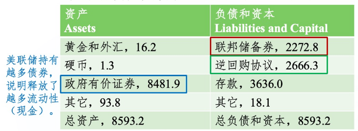

联邦储备券就是美联储印的钞；逆回购协议是市场参与者购买美联储手上持有证券的协议。

#### 4.2 法定准备金率

央行要求所有存款机构把存款的一个最低百分比，即法定准备金率$rrr$，作为准备金放到央行的账户。

实际准备金率$R \geq rrr$.

差别准备金率：按存款规模不同设定不同准备金率。

部分准备金制度：$0<rrr<1$.

假设初始新增存款$\Delta D_1$，则货币创造量$\Delta M = \frac{\Delta D_1}{rrr}$. 存款货币乘数$\frac{\Delta M}{\Delta D_1} = \frac{1}{rrr}$

当$rrr = 1$时，没有额外的货币创造；当$rrr \to 0$时，货币创造趋于无限大。

#### 4.3 贴现率和联邦基金利率

美联储直接控制贴现利率，间接控制联邦基金利率。二者都是基准利率。

贴现率：当存款机构在美联储中的准备金低于法定准备金率时向美联储贷款所付的利率。

联邦基金利率：银行之间相互拆借所形成的市场利率，由准备金的供需决定。

提高贴现率或联邦基金利率，可以降低$rrr$（银行将更多的钱作为准备金）。

## 正课九：货币增长与通货膨胀

时间：2025年4月28日

### 1. 货币需求与供给

凯恩斯理论认为货币需求来源于：交易、谨慎、投机。

凯恩斯称货币需求为“流动性偏好”。

这里的货币在M1层面。

#### 1.1 交易需求

**鲍莫尔-托宾模型**：一个1950年代基于物理现金管理的模型。

模型假设：

- 可以将收入存在名义利率为$i$的银行账户，日常交易不能直接从这个账户里支付。

- 把这部分钱转化为手持现金$M$需要支付一笔固定费用$C$（如交通、手续费等）。
- 取钱的频率为$N$.

总成本 = $N\times C + i\times\frac{\$ Y}{2N}$

- $N\times C$：取钱的固定费用。$N$越小越好。
- $i\times\frac{\$Y}{2N}$：持有钱的机会成本。$N$越大越好。
- $N$的大小存在权衡取舍。

最小化总成本（求导or不等式）得到：$N^* = (\frac{i\times \$ Y}{2C})^{0.5}，M^*=\frac{\$ Y}{2N^*}=(\frac{C\times \$Y}{2i})^{0.5}$

#### 1.2 谨慎需求

谨慎需求也被称为预防性需求。是为了防止意外发生时的临时花费或收入损失而持有货币的需求。

权衡取舍：平均机会成本与资金波动成本。

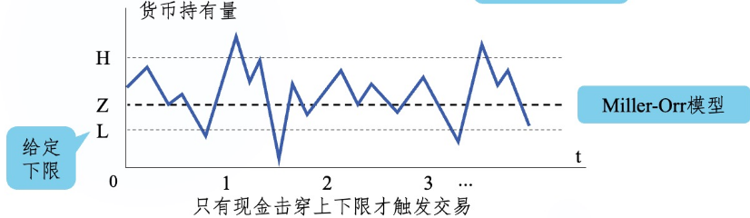 

#### 1.3 投机需求

货币的投机需求：是为了能够随时买入有价证券而持有货币的需要。

权衡取舍：平均机会成本和收益波动成本。

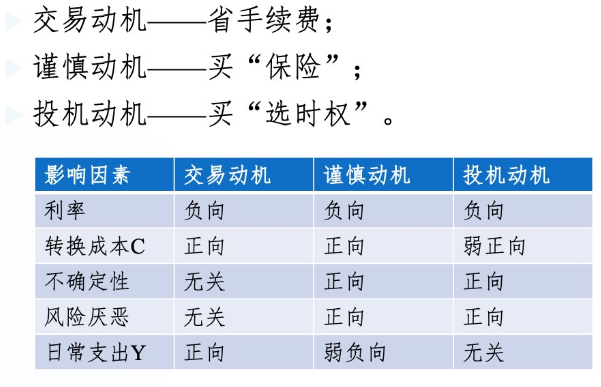 

#### 1.4 长期货币需求

从长期看，货币需求取决于实体经济中更基础的变量——物价水平。长期货币需求曲线函数：

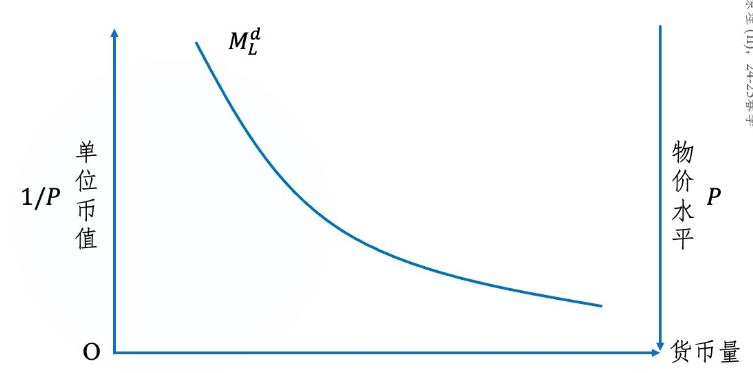 

奥利弗·布兰查德给出货币需求函数：$M^d = \$ Y \times L(i)$

- $\$Y$是名义GDP，$L(i)$是名义利率$i$的减函数。
- 布兰查德并没有强调长期货币需求，但其包含了长期和短期的考虑。

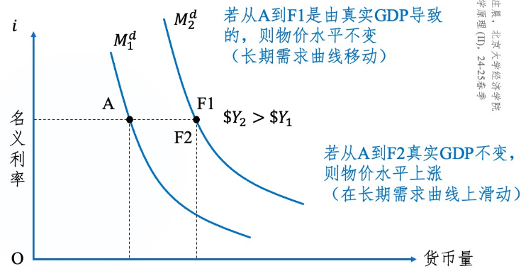

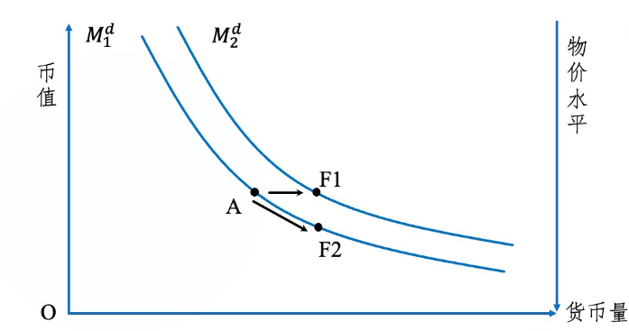

#### 1.5 货币供给与长期供求平衡

货币供应量由央行独立决定、可控，不受物价水平（或币值）的左右。长期货币供给曲线是一个竖直的线。

均衡的偏离与恢复是依靠物价水平变化来实现的。

### 2. 利率模型

### 3. 货币数量论

费雪交易方程式：$MV = PT$

- $M$：货币量；$V$：一定时期内货币转手的数量；$P$：物价水平；$T$：交易总量。

  $PT$可以表示名义GDP.

[^1]: 详见OneNote笔记“九”。
