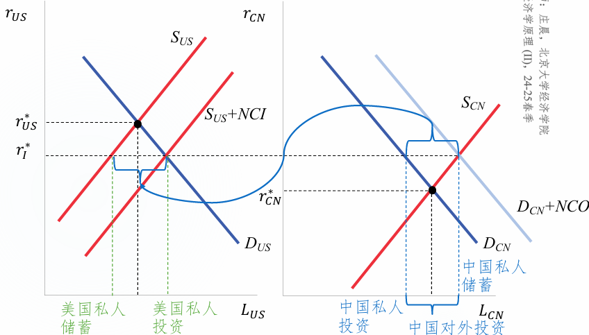
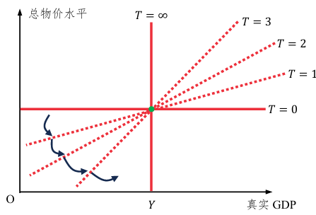

# 经济学原理2（下）

范围：期中后

## 正课七：失业

时间：2025年4月14日

历史：《就业、利息与货币通论》首先讨论失业。

- 凯恩斯主义以解决失业问题为中心，其逻辑起点是**有效需求原理**。
- 大萧条中，不是工资无法降，而是物价降得更快，导致真实工资上升。

### 1. 宏观劳动状态的划分

针对年满16岁的社会成员

1. 就业：有工作的人，无论是全职还是兼职，无论有没有报酬，也无论是否临时请假。
2. 失业：没有工作但能工作的人，且**4周内在找工作**。
3. 非劳动力：包括收租、在家炒股等方式为生的人，还包括全日制学生、退休人员。

### 2. 作为存量的失业率

流量：某个时期内发生的量。

存量：某个时点的量。
$$
\text{失业率} = \frac{\text{失业人口}}{\text{劳动力}}\\
\text{劳动参与率} = \frac{\text{劳动力}}{\text{成人人口}}\\
\frac{\text{失业人口}}{\text{成人人口}} = \text{失业率}\times\text{劳动参与率}
$$

### 3. 作为流量的失业率

成人人口在3种状态下“切换”，总共有6种组合:

1. EU: 由就业转为失业（失去工作）
2. EI: 由就业转为非劳动力（退休，辞职旅游……）
3. UE: 由失业转为就业（找到工作）
4. UI: 由失业转为非劳动力（放弃寻找工作）
5. IE: 由非劳动力转为就业（有工作机会，并加入劳动力市场）
6. IU: 由非劳动力转为失业（想要加入劳动力市场，但未找到工作）

注意，大部分人口不发生“切换”，记为EE, UU, II.

 初始为E的人口 = EE + EU + EI, 其它同理。

### 4. 自愿和非自愿失业

古典经济学家认为，工人之所以失业，是因为他们不愿意接受市场均衡工资，所以是**自愿的**。

凯恩斯主义者认为，工人愿意接受当前的工资，但求职人数仍然超过岗位数，因此是**非自愿的**。

有效需求不足和工资粘性时：

最低工资法导致非自愿事业：

特殊情况——部分工人在某工资水平上对是否工作无差异（工会会员）：

*水平线上有一段属于自愿失业的原因是：有一些既没有愿意，也没有不愿意的最终选择不工作的工人。*

还有效率工资中NSC条件导致的非自愿失业。

买方垄断造成的不是非自愿失业，加入工会或最低工资后可能引致非自愿失业。

### 5. 结构性失业

结构性失业：经济结构、体制等变动所导致的劳动力在技能、经验、主观意愿等方面的供给结构与需求不一致产生的失业。

- 这样的失业往往是非自愿的。
- **岗位创造**和**岗位毁灭**
- 既有失业又有职位空缺，但失业者不都胜任当前岗位。

模型刻画：

### 6. 摩擦性失业

摩擦性失业：找工作需要耗费的时间所导致的失业。

- 可以是自愿的：
  - 工作切换的过程，比较短暂
  
    *为了得到更好的平台，我愿意承受一段时间的失业。*
  
  - 为了“待价而沽”
  
    *有工作但我不去，我再看看有没有更好的。*
  
- 也可以是非自愿的：
  - 信息获取成本较高或信息不对称导致劳动力市场缺乏流动性。[^1]

### 7. 自然失业和周期性失业

经济体中结构性和摩擦性失业长期存在，往往是不可避免的。

自然失业率也可称为长期/正常失业率：
$$
\text{自然失业率} = \frac{\text{结构性失业人口}+\text{摩擦性失业人口}}{\text{劳动力人口}}
$$
长期失业不等于长时间失业，它表示这种失业是长期存在于社会中的；自然失业不等于自愿接受的失业，也不代表它是不变的。

周期性失业是实际失业偏离自然失业的程度。

- 实际失业 = 自然失业 + 周期性失业。

- 周期性失业与“商业周期”密切相关。

  

  经济衰退时，失业率上升，实际失业高于自然失业；经济过热时，企业盲目扩招，导致实际失业低于自然失业。
  
  经济衰退时各指标的变化：
  
  

### 8. 失业率指标存在的问题

忽略了以下人群：

1. 丧志工人：指想工作但放弃找工作的人。分子分母都低估。
   - 分子分母都被低估会导致失业率被低估。（道理是：2/3 < 3/4）
2. 准待业工人是指过去(12个月)找工作但最近(4周)没有找工作的人。分子分母都低估。
3. 未充分就业工人是指想全职工作但目前兼职工作的人。分子低估。
   - 也可以指名义上是全职但实际上无所事事的人，但这不太好衡量。

### 9. 奥肯定律

阿瑟奥肯提出的一个经验关系：失业率的变化和真实GDP的增长率负相关。

两个版本：

1. $\frac{Y-\bar{Y}}{\bar{Y}} = c(u - \bar{u})$，$\bar{Y}$是潜在产出，$\bar{u}$是自然失业率
2. $\frac{\Delta y}{y} = k - c\Delta u$，$k$是完全就业情况下真实GDP的平均增长率。

失业式复苏：经济已经开始复苏，但失业率仍在上升。

奥肯定律在中国可能不适用。

- 还应包括农业劳动力转移这一关键结构变量，从而将标准奥肯模型拓展为广义奥肯模型

### 10. 摩擦性失业的产生机制

#### 10.1 单边搜寻模型

假设不存在非劳动力，记$s$为退役(下岗)比例，分母为就业人口；$f$为找到工作的比例，分母为失业人口；$u$为存量的失业率。

动态均衡时存在关系：$\frac{u}{1-u} = \frac{s}{f}$ *失业和就业人员之比等于变为失业的人数和变为就业的人数之比*

一段时间内找到工作的概率：$f = \lambda[1-P(w\leq R)]$

- $\lambda$是企业发offer的概率；$[1-P(w\leq R)]$是申请者接受offer的概率。
  - $w$是企业愿意支付的工资；$R$是“保留工资”。
  - $w < R$意味着工资低于申请者的最低心理预期。
- 单边搜索模型将$\lambda$看作外生。企业不考虑如何发offer，只考虑申请者如何找工作。

利用动态均衡解出失业率：$u = \frac{s}{f+s} = \frac{s}{\lambda[1-P(w\leq R)]+s}$. 与$s,R$正相关，与$\lambda$负相关。

如何将$R$内生化？

- $R = b + E(w-b)$. 接受工作的机会成本：放弃的失业补助；放弃的更好工作机会。
- 规定期望超额工资$E(w-b)$满足：$s$提高时，降低；$\lambda$提高时，提高。
- 如果让$b$随失业率的提高而提高，将导致市场瓦解：$b\uparrow \Rightarrow R\uparrow \Rightarrow u\uparrow \Rightarrow b\uparrow\uparrow$.

模型存在自动制动/缓冲机制：

- $s$升高时，$u$升高，但同时$R$降低，$f$升高，所以$u$不会升高那么多。
- $\lambda$升高时，$u$下降，但同时$R$升高，$f$下降，所以$u$不会下降那么多。

#### 10.2 双边搜寻模型

将$\lambda$内生化，企业也在找员工。

双边搜寻模型不一定比单边搜寻模型更有效率，但更接近现实情况。

### 11. 长期就业政策

#### 11.1 减少摩擦性失业

对“信息”下手：

- 提高信息可获得性。
- 提高求职者的信息获取能力。
- 提高求职者的信息传达能力。

对失业福利$b$进行设计：

- 过高的$b$带来消极影响
- 维持一定的$b$，允许失业的存在，以便人们找到更适合自己的工作。

#### 11.2 减少结构性失业

针对技能不匹配带来的结构性失业

- 政府进行就业培训、转岗安置帮助再就业。

最低工资法、效率工资和工会导致的失业也可以被视为是一种广义的结构性失业，需要加以干预。

## 正课八：货币制度

时间：2025年4月21日

### 1. 货币

货币的定义一（传统）：货币是作为支付手段被普遍接受的一种商品或符号。

- 核心功能：最后能当作（最终）结清债务的工具与凭证。
- 必要条件：货币必须要被普遍接受。货币在什么范围内被普遍接受，就在什么范围内流通。
  - 网络效应：产品的价值随着流通范围的扩大而递增。
  - 美元霸权
- 存在形式：货币可以是一种商品，也可以是无内在价值的符号。
  - 商品货币：有内在价值的商品，如烟草、盐砖等
  - 商品支持货币：与某一商品（金银）自由兑换的货币
  - 法币：由政府法令确定的货币，包括纸币与铸币等。依托国家信用。

货币的定义二（现代）：政府和商业银行通过银行系统对公众发生的债务。

- 债务的三方结构：
  1. 债权人：公众。拥有对发行方的债权。
  2. 债务人：政府（通过央行发行法币）和商业银行（通过贷款创造存款货币）。
  3. 中介：银行系统。
- 解读：此定义特指“狭义”的货币（现金和活期存款）。银行系统中的现金、政府在银行账户中的现金和存款、**获得前**的信贷，这些不是对公众的债务，不算货币。另外，通过银行系统形成的对公众的债务才是货币，国库券是公开发行的，不是货币。

货币的职能：

1. 交易媒介和最终支付手段
2. 计价单位
3. 价值储藏手段

按照流动性从好到差，我国将货币分为：

1. $M_0$：流通中的钞票和铸币，也是银行体系之外各单位持有的现金。

   与消费密切相关，数值高反映手头宽裕。

2. $M_1$（狭义货币）：$M_0$ + 单位活期存款 + 个人活期存款 + 非银支付机构客户备付金（微信钱包、支付宝的个人资金）

   反映现实购买力，代表家庭和企业资金的松紧。

3. $M_2$（广义货币）：$M_1$ + 单位/个人存款 + 非存款类金融机构存款 + 非存款类金融机构持有的货币市场基金份额

   反映现实和潜在购买力，体现社会总需求和未来通胀压力。

4. $M_3$：$M_2$ + 金融债券 + 商业票据 + 大额可转让定期存单等（体现金融创新）

 

$M_1$增速 - $M_2$增速，即$M_1$和$M_2$的剪刀差，反映市场对经济的预期。

- 剪刀差为正：预期乐观，活钱增多，更多钱流入实体经济从而增加经济活力。
- 剪刀差为负：预期悲观，说明放水很多但消费和投资跟不上，钱都堆在金融体系内而不愿意进入实体经济。

### 2. 中央银行

央行基本目标：维持宏观经济稳定；维持金融稳定。

央行的发展里程：

1. 1668 - 1971：世界各国中央银行设立和发展。1668，瑞典国家银行，第一家央行。
2. 1971 - 2008：央行从被动变为主动。1971，尼克松冲击，美元不再兑换黄金。
3. 2008 - 今：央行职能全面强化。2008，金融危机让各国看到央行的作用。

中央银行的架构：

- 行领导

- 地区分支银行

  - 准备金：商业银行库存的现金按比例存放在中央银行的存款，目的是确保商业银行在遇到突然大量提取银行存款时，有相当充足的清偿能力。

    准备金是央行对商业银行的债务。

  - 改革：从大区管理到省级管理

- 政策委员会

### 3. 金本位

金本位下，政府货币管理服从3条规则

1. 黄金与流动中纸币的比价固定。黄金的纸币价格，又称铸币价格。
2. 铸币价格与黄金市场上的买卖价相等
3. 铸币活动法定化

黄金的供给、需求与币值示意如下图：

需求中有一部分是货币需要，另一部分可能是装饰等需求。

总币值 = $(Q_2 - Q_1)P_m$

物价水平 = $\frac{\text{总币值}}{\text{产品与服务量}}$，币值与物价同向变动。

当黄金供给增加时（$S \to S_1$），总币值增加，物价水平上涨。

当非货币黄金需求增加，在$P_m$的水平，总币值减少，物价水平下降。

- 穿金戴银的风气导致通货紧缩，节俭的风气导致通货膨胀。

金本位的问题：

1. 物价水平受非货币用途的黄金需求与黄金总供给曲线变动的影响，即受非真实经济供求影响。（如上）
2. 金本位制下的汇率是固定汇率，难有独立货币政策
3. 现实中难以维持金价和铸币价的相等性，易遭受投机冲击。

### 4. 央行的货币政策工具

#### 4.1 公开市场操作

公开市场操作，就是买卖政府债券。

- 央行购买债券是放出货币
- 卖出债券是收回货币

主要买卖国库券。

美联储资产负债表：

联邦储备券就是美联储印的钞；逆回购协议是市场参与者购买美联储手上持有证券的协议。

#### 4.2 法定准备金率

央行要求所有存款机构把存款的一个最低百分比，即法定准备金率$rrr$，作为准备金放到央行的账户。

实际准备金率$R \geq rrr$.

差别准备金率：按存款规模不同设定不同准备金率。

部分准备金制度：$0<rrr<1$.

假设初始新增存款$\Delta D_1$，则货币创造量$\Delta M = \frac{\Delta D_1}{rrr}$. 存款货币乘数$\frac{\Delta M}{\Delta D_1} = \frac{1}{rrr}$

当$rrr = 1$时，没有额外的货币创造；当$rrr \to 0$时，货币创造趋于无限大。

#### 4.3 贴现率和联邦基金利率

美联储直接控制贴现利率，间接控制联邦基金利率。二者都是基准利率。

贴现率：当存款机构在美联储中的准备金低于法定准备金率时向美联储贷款所付的利率。

联邦基金利率：银行之间相互拆借所形成的市场利率，由准备金的供需决定。

提高贴现率或联邦基金利率，可以降低$rrr$（银行将更多的钱作为准备金）。

## 正课九：货币增长与通货膨胀

时间：2025年4月28日

### 1. 货币需求与供给

凯恩斯理论认为货币需求来源于：交易、谨慎、投机。

凯恩斯称货币需求为“流动性偏好”。

这里的货币在M1层面。

#### 1.1 交易需求

**鲍莫尔-托宾模型**：一个1950年代基于物理现金管理的模型。

模型假设：

- 可以将收入存在名义利率为$i$的银行账户，日常交易不能直接从这个账户里支付。

- 把这部分钱转化为手持现金$M$需要支付一笔固定费用$C$（如交通、手续费等）。
- 取钱的频率为$N$.

总成本 = $N\times C + i\times\frac{\$ Y}{2N}$

- $N\times C$：取钱的固定费用。$N$越小越好。
- $i\times\frac{\$Y}{2N}$：持有钱的机会成本。$N$越大越好。
- $N$的大小存在权衡取舍。

最小化总成本（求导or不等式）得到：$N^* = (\frac{i\times \$ Y}{2C})^{0.5}，M^*=\frac{\$ Y}{2N^*}=(\frac{C\times \$Y}{2i})^{0.5}$

#### 1.2 谨慎需求

谨慎需求也被称为预防性需求。是为了防止意外发生时的临时花费或收入损失而持有货币的需求。

权衡取舍：平均机会成本与资金波动成本。

 

#### 1.3 投机需求

货币的投机需求：是为了能够随时买入有价证券而持有货币的需要。

权衡取舍：平均机会成本和收益波动成本。

 

#### 1.4 长期货币需求

从长期看，货币需求取决于实体经济中更基础的变量——物价水平。长期货币需求曲线函数：

 

奥利弗·布兰查德给出货币需求函数：$M^d = \$ Y \times L(i)$

- $\$Y$是名义GDP，$L(i)$是名义利率$i$的减函数。
- 布兰查德并没有强调长期货币需求，但其包含了长期和短期的考虑。

#### 1.5 货币供给与长期供求平衡

货币供应量由央行独立决定、可控，不受物价水平（或币值）的左右。长期货币供给曲线是一个竖直的线。

均衡的偏离与恢复是依靠物价水平变化来实现的。

### 2. 利率模型

### 3. 货币数量论

费雪交易方程式：$MV = PT$

- $M$：货币量；$V$：一定时期内货币转手的数量；$P$：物价水平；$T$：交易总量。

  $PT$可以表示名义GDP.

## 正课十：开放宏观经济学

时间：2025年5月12日

### 1. 二十世纪以来世界经济五大特点

特点：

1. 经济稳定性：动荡 - 稳定 - 动荡。

2. 开放度不断提高。

   衡量开放度的指标：$\frac{X+M}{GDP}\times 100\%$，进口+出口占GDP的比重。

3. 开放度在产业间形成差异与不平衡。

4. 国际贸易中，服务贸易的占比上升明显。

5. 资本流动的规模与方向在世界范围内发生较大变化。

   美国由债权国变为债务国；中国和日本成为债权国。

### 2. 国际收支平衡表

#### 2.1 贷方/负债、借方/资产和差额

BOP（Balance of Payment）中的数字都是流量，是当年流入和流出中国的资本量。

BOP中的**贷**就是**外汇流入**（出口产品和服务）的项目，而**借**就是**外汇流出**（进口产品和服务）的项目。

- “贷”来外汇，“借”出外汇。

*加粗字体是判断借方、贷方的最主要依据。判断外汇流入还是流出，需要谨记，在一国进行购买、投资等行为都要使用该国货币。最终通过货币兑换形成外汇的流入和流出。*

BOP中还有资产和负债的科目

- <u>负债对应贷方，资产对应借方</u>

  - 为什么负债对应贷方？

    贷方意味着资金从外国流入我国，我国金融资产被外国持有，则外国可以在未来向我国索取本金和利息。这就是负债。

    相应地，资产对应借方。

#### 2.1 经常项目

经常项目的分类：

- 货物和服务
  - 货物
  - 服务
- 初次收入
  - 雇员报酬
  - 投资收益
  - 其他初次收入
- 二次收入

货物和服务这个大类的贷方对应的是出口额（X），借方就是进口额（M）， 因此<u>差额就是净出口（NX）</u>。

<u>我国的劳动、资本等要素</u>在外国的收益是贷方，因为会导致外汇流入我国。外国的劳动、资本等要素在我国的收益则是借方，因为会导致外汇流出我国。

二次收入主要是<u>中国华侨（非中国居民）</u>单方面向中国的家属寄钱（贷方、外汇流入），或在中国的外国侨民向他们在母国的亲属汇钱（借方、外汇流出）。

#### 2.3 资本账户

美国单列的一个大类，在我国属于“资本和金融账户”下的一个中类。

资本账户记录的是与<u>非金融资产</u>的购买、销售以及相关的资本转移活动。仍然分为借方和贷方。

- 资本转移：包括债务减免（被减免相当于外汇流入，贷方）、捐赠和大额遗产或礼物的跨国转移（接受转移相当于资产流入，贷方）。
- 非金融资产的国际交易，如土地和不动产的购买和销售（与捐赠、大额遗产的区别在于，购买不动产这一项导致外汇流出，所以是借方）。[^6]
- 其他资本流动，移民相关的一次性款项、各种赔偿金的支付、以及国际机构或国家间的特定资金转移，如为特定项目提供的资金等。

#### 2.4 金融账户

美国单列的一个大类，在我国属于“资本和金融账户”下的一个中类。

金融账户：一国与它国之间金融资产和负债的流动，包括对外直接投资、证券投资、金融衍生工具的交易（前三个是非储备性质的）以及官方储备资产的变动。

- FDI：一国对它国企业投资，旨在获得<u>持久的管理权或显著影响力</u>，通常持股大于等于10%。
- 储备资产只计算余额变动，值为负，可能意味着外汇储备资产大幅增加。因为储备资产项目站在央行操作视角，其流入、流出<u>与国家整体视角恰好相反，因此负值反而代表增加</u>。

金融账户这个类的贷方对应的是资本流入（CI），借方就是资本流出[^7]（CO）， 因此<u>差额就是净出口（NCI）</u>。

#### 2.5 NX = NCO

广义的NX除了货物与服务一项，还包括初次收入和二次转移。于是广义NX就是经常项目的差额。

净误差和遗漏一项反映资本外逃，可以融入NCO中。

<u>在BOP中，NX恒等于NCO</u>. NX必然意味着外汇净流入，而外汇可以被当作一种外国资产，因此就相当于投资了外汇，自然就是净资本流出NCO。

### 3. 资本流动与可贷资金市场

假设最开始$r_{US}^* = 6\% > r_{CN}^* = 3\%$:

 

中国投资者可以在国内市场上以低利率借钱，并在美国获得高利率收益，从而实现套利。

 

最终美国利率下降，中国利率上升。

NCO、NCI与一国利率的关系：

 

### 4. 外汇市场

**外汇市场**：不同货币进行交易的场所， 能够形成汇率——外汇市场的价格，即 一种货币与另一种货币交易的价格。

**两种汇率**表示方法：

1. 单位外币可兑换的本币数量。
2. 单位本币可兑换的外币数量。

本课使用汇率1.

本币升值，汇率1下降，汇率2上升；本币贬值，汇率1上升，汇率2下降。

#### 4.1 名义汇率和真实汇率

**名义汇率**：外汇交易中心公布的外汇牌价，记汇率1为$E$.

**真实汇率**：一单位外国商品能够换多少单位的本国商品，$\text{RER} = E \times \frac{P_{\text{foreign}}}{P_{\text{domestic}}}$.

- $\text{RER} > 1$：本国产品更具国际竞争力。

- 不同产品有不同的$\text{RER}$，宏观经济学家关注一篮子加总的价格。

  - $\text{RER}_t = E_t \times \frac{\text{CPI}_{\text{foreign},t} \times TC_{\text{foreign},\text{base}}}{\text{CPI}_{\text{domestic},t} \times TC_{\text{domestic},\text{base}}}$

  - $TC_{\text{base}}$代表基期篮子总成本，其比值为常数。

  - 判断本国产品竞争力走强还是走弱看$E_t \times \frac{\text{CPI}_{\text{foreign},t}}{\text{CPI}_{\text{domestic},t}}$的变化。

    $\frac{\Delta E_{t}}{E_{t}}+\frac{\Delta \text{CPI}_{\text {foreign }, t}}{\text{CPI}_{\text {foreign }, t}}-\frac{\Delta \text{CPI}_{\text {domestic }, t}}{\text{CPI}_{\text {domestic }, t}}=\frac{\Delta \text{RER}_{t}}{\text{RER}_{t}} $.

    *取对数，并求全微分得到上述公式。*

    可以通过名义汇率的变化率和两国CPI的变化率（通货膨胀率）来判断一国产品的国际竞争力的走向。

    $\frac{\Delta \text{RER}_{t}}{\text{RER}_{t}} > 0$<u>意味着国际竞争力走强</u>。

  - 如果名义汇率的变化大于本国通货膨胀率，且外国物价不变

    $\underbrace{\frac{\Delta E_t}{E_t}-\frac{\Delta \text{CPI}_{\mathrm{domestic,}t}}{\text{CPI}_{\mathrm{domestic,}t}}}_{>0}+\underbrace{\frac{\Delta \text{CPI}_{\mathrm{foreign,}t}}{\text{CPI}_{\mathrm{foreign,}t}}}_{=0}=\frac{\Delta \text{RER}_t}{\text{RER}_t}>0$

    控制通货膨胀，提高名义汇率（汇率1），有利于提高本国产品的国际竞争力。

    名义汇率提高不代表真实汇率也提高，这还取决于两国相对价格的变化。

#### 4.2 均衡汇率的决定

<u>外汇市场中一种货币的需求量是另一种货币的供给量。</u>*开展分析的基本逻辑。*

- 例如：我们对美元的需求量，对外国来说就是人民币的供给量[^8]（因为我们用人民币换美元）。

接下来分析中美外汇市场。

**我国对美元的需求：**

 

*为何使用汇率1？因为它代表了美元的人民币价格。我们研究的正是美元数量随其价格的变化。自然不能用人民币的美元价格。*

向下倾斜的原因：

1. 贸易角度：汇率1降低，人民币升值，美国产品竞争力提高，进口增加，导致我国兑换美元的需求量增加。
2. 投机角度：汇率1降低，是逢低加仓美元的好时机。

**美国对人民币的需求：**

 

*同理，此时使用汇率2，人民币的美元价格。*

**美国对美元的供给：**

 

向上倾斜的原因：

1. 贸易角度：汇率1上升，本币升值，中国产品竞争力提高，进口增加，美国兑换人民币的需求增加，因为“一种货币的需求量是另一种货币的供给量”，所以美元供给量增加。
2. 投机角度：汇率1上升，是逢低加仓人民币的好时机。

外汇市场的均衡：

均衡汇率不仅是供求相等的汇率，还是无套利的汇率。

均衡汇率还需要使国际收支平衡表中的“经常与资本项目”和“金融项目”能相互抵消。

- 如果“金融项目”有赤字，我国就需要用外币支付，从而提高对外币的需求，这就使得外币汇率提高（本币贬值），而这又会促使出口增加、进口减少，从而使“经常与资本项目”产生盈余；当这个盈余不能抵消赤字时，这个机制就会继续下去。
- 反过来说，当“金融项目”有盈余时，我国就需要将外币换成本币，从而使本币升值，NX下降直到赤字能抵消盈余。

曼昆认为的外汇供给是“净供给”，不取决于真实汇率。这是一个长期视角。

- 曼昆将NCO作为外汇净供给。[^9]
- 已知NCO取决于利率[^10]，则$S'(\text{RER}) = \text{NCO}'(\text{RER})$.
- 可能存在NCO < 0的情况，此时我们将NCI作为外汇净需求。

左边是NX小于0时；右边是NX大于0时。

> 为什么右图人民币净供给和汇率无关，但是净需求却和汇率有关
>
> 净供给来自于NCO = NX（贸易顺差时中国央行决定提供多少人民币给外国人兑换来买中国产品），而净需求来自于外国人实际上想要兑换多少来买中国产品。第二种真实汇率越低，中国产品的国际竞争力越高，外国人就更想兑换人民币来买中国产品。这里曼昆忽略了供给侧中间传递环节，直接假设一步到位由央行操控因此供给是垂线。
>
> 当NX<0，一种货币的需求是另一种货币的供给，则把逻辑反过来即可（镜面）。

### 5. 购买力平价理论

**购买力平价（PPP）理论**，是一种长期汇率决定理论：<u>长期内</u>两国物价水平的比率决定两种货币的兑换汇率。此也被称为**汇率的通货膨胀理论**。

- 根据PPP理论，1单位美元在中国也要有相同的购买力，即$\text{RER} = 1$.

- 现实中，名义汇率围绕着购买力平价波动。

  波动原因：

  1. “一物一价”的基础是货物和服务在全球畅通无阻，国际竞争充分、完全。
  2. “一物”过于理想化，物品间存在差异。

### 6. 利率平价理论

利率平价理论基于“资本不折腾条件”，即在本国存钱和跑到外国存钱的收益是一样的。

假设荷兰人投资1欧元，欧洲的回报率为$r_t^*$，一年后有$1 + r_t^*$欧元。

如果到回报率为$r_t$的美国投资，即期汇率（第一种）为$S_t$，一年后有$\frac{1}{S_t}(1 + r_t)$美元。

投资者通过远期汇率市场锁定$t+1$期的汇率$F_t^{t+1}$.

资本不折腾条件：$\frac{1}{S_t}(1 + r_t)F_t^{t+1} = 1 + r_t^*$

**利率平价公式：**$\frac{F_t^{t+1}}{S_t} = \frac{1 + r_t^*}{1 + r_t}$.

- 当$r_t^* > r_t$时，$F_{t+1} > S_t$（预期美元升值，欧元贬值）。

### 7. 汇率制度

IMF对汇率制度的分类为硬挂钩、软挂钩和浮动。

两个极端：完全自由的浮动汇率、完全固定汇率。美加英非常接近前者；我国“有管理的”浮动汇率制度被归类为软挂钩。

浮动汇率下，央行可以通过调整利率来控制美元需求，从而调节利率。

有管理的浮动汇率下，央行直接对外汇市场干预。如果本币贬值，央行可以抛售外汇。

## 正课十一：总需求与总供给

时间：2025年5月19日

### 1. 收入与支出模型

#### 1.1 乘数

乘数这个概念与边际消费倾向MPC有关

- 例：你花15块钱买咖啡；咖啡店主花12块钱买水果；水果摊主花2块钱买报纸……这就是支出带来的乘数效应。

- $\Delta Y_1 = 15, \Delta Y_2 = MPC \times 15, \Delta Y_3 = MPC^2 \times 15$，最终$\Delta Y = \frac{1}{1-MPC} \times 15$

- 总支出最初的变化$\Delta Y_1$称为**自主变化**，记为$\Delta AAS$.

  连锁反应$\Delta Y_2 + \Delta Y_3 + ... = \frac{MPC}{1-MPC} \times \Delta AAS$.

  总支出的变化$\Delta Y = \frac{1}{1-MPC} \times \Delta AAS$.

  **支出乘数**：$\frac{\Delta Y}{\Delta AAS} = \frac{1}{1-MPC}$. $MPC$与支出乘数正相关。

#### 1.2 总消费函数

$$
C = C_0 + MPC \times (Y-T) = C_0 + MPC \times Y_D
$$

$C_0$称为初始消费或**自主消费**。

总消费函数的位移：

- **持久收入假说**（PIH）：弗里德曼认为消费者支出主要取决于持久性收入而非暂时性收入（消费者决定支出不会考虑未来中彩票的情况）。

  当未来预期可支配收入提高，总消费函数上移。

- **生命周期假说**：消费者会规划他们一生的财富以平滑每期消费。

  贷款买房（每个月要用大笔收入还房贷） 的人，若房价上升，总消费函数上移。

#### 1.3 投资支出

投资支出：$I = I_{\text{planned}} + I_{\text{unplanned}}$

- $I_{\text{planned}}$是计划投资支出；$I_{\text{unplanned}}$是非计划库存投资。

$I_{\text{planned}}$是企业打算在一定时期内的投资额度，主要取决于：

1. 利率（负相关）；
2. 生产能力（负相关）：如果生产能力大于预期销售额，则不需要投入那么多；
3. 预期未来真实GDP（正相关）。

$I_{\text{unplanned}}$：实际销售额与预期销售额的差别

#### 1.4 收入与支出模型

1. $GDP = Y = C + I$（忽略进出口和政府支出）

2. $Y_D = Y$（D: disposable. 假设无税收）

3. $C = A + MPC \times Y_D$

4. $I = I_{\text{planned}} + I_{\text{unplanned}}$

5. 计划总支出：$AE_{\text{planned}} = C + I_{\text{planned}}$

    

收入-支出均衡：当总收入（真实GDP或Y）与计划总支出相等， 经济处于均衡状态。

- 当$AE_{\text{planned}} > Y$时，$I_{\text{unplanned}} < 0$，库存不足，企业努力增加产出。
- 当$AE_{\text{planned}} < Y$时，$I_{\text{unplanned}} > 0$，库存富余，企业减少产出。
- 库存的变化被认为是未来经济状态的先行指标。

经济体会自发回到$AE_{\text{planned}} = Y$.

### 2. 长期效应和短期效应

长期是所有经济变量回到<u>充分就业所对应的潜在GDP</u>（自然产出水平）所决定的均衡水平所需要的时间长度。

短期是经济从一个潜在GDP到另一个潜在GDP对应的均衡期间所有时点的集合。在此期间，失业率偏离自然失业率。

为了减少经济的波动性，政府往往采取**稳定化政策**，也称**反周期政策**。在收缩期，采取扩张性政策；在扩张期，有采取紧缩性政策。

### 3. AD与AS模型

#### 3.1 总需求模型

总需求（AD），描述物价水平$P$与所有货物与服务的需求量$Y$的关系。

- $AD = Y = C + I + G + NX$.
- 这个关系不分长期和短期。
- 不存在“替代效应”——因为不是相对价格的变化，而是总物价的变化。

AD曲线向右下方倾斜的原因：

1. **真实余额效应或庇古效应**

   微观需求曲线向右下方倾向来自替代效应和**收入效应**，而AD排除了前者。

   真实余额：$M/P$. 给定$M$，$P$越低，$M/P$越高。这就是AD曲线的收入效应。

   总财富提高使得总消费函数上移，则$AE_{\text{planned}}$上移，均衡GDP提高。

   

2. **利率变动效应**

   物价下降，货币需求$M^d(P)$下降——参考货币需求函数$M^d(P) = PY \times L(i)$[^2]，$Y$是真实GDP.

   家庭会将$M$替换为流动性更低的、非货币的资产形式。均衡利率下降。

   - 如果用$M$买债券，债券价格上升，则债券利率下降[^3]。
   - 如果家庭将$M$存为有利率的定期，银行机构会将利率下调。

   于是，可贷资金市场均衡沿着投资曲线向右下方移动，投资增加。

   $AE_{\text{planned}}$上升，均衡GDP提高。

3. **真实汇率效应**

   第一种表示方法的真实汇率（1单位外货能换多少本货）：$RER = E \times \frac{P_{\text{foreign}}}{P_{\text{domestic}}}$

   当本国物价$P$下降，会产生两方面影响：

   - $\frac{P_{\text{foreign}}}{P_{\text{domestic}}}$上升。
   
   - 根据原因2，$P$下降导致利率下降，于是资本外流。资本外流导致本币兑换外币的需求上升，本币贬值，外币升值，$E$上升。

   - 总体而言，$RER$上升。

​	本国产品的国际竞争力提高，扩大了净出口$NX$，因此本国$AE_{\text{planned}}$上升[^4]。

AD曲线位移的原因：

1. 预期的变化。若家庭和企业变得更乐观，AD曲线外移；若家庭和企业变得更悲观，AD曲线内移。

   相关数据：消费者信心指数，CCI.

2. $P$以外因素导致的财富变化。如果资产价值增加，AD曲线外移；如果资产价值降低，AD曲线内移。

   比如股价上涨、房产升值等会增加消费。
   
3. 实物资本的存量。企业的支出动机部分取决于实物资本存量。如果近年来企业建造了大量房屋，这将抑制新房的投资需求。
   
4. 货币政策。
   
5. 财政政策。

#### 3.2 总供给模型

**凯恩斯情形**：AS曲线为水平线。

 

水平原因：大萧条时期，有大量失业工人，在当前工资成本下，企业能找到无数工人。即使提高总产量， 社会也不需要提高物价水平。

**刘易斯拐点**：劳动力由过剩到短缺存在转折点。随着农村富余劳动力向非农产业转移，农村富余劳动力由减少变为短缺。

 

刘易斯拐点前，AS曲线水平，此时均衡$Y$取决于AD.

**古典经济学情形**（LRAS，long-run）：AS曲线是垂直的。

 

其含义是，经济的产出水平与物价这种名义量无关。

- 隐含假设：社会已处于充分就业状态，故资源已被充分利用。物价再怎么提高，企业也无法供应更多。

凯恩斯情形与古典经济学情形的对立，实际上与其考虑的**时际**有关。

- 凯恩斯考虑瞬时、当下的问题；古典经济学家考虑长期的问题。

- 产量的物价弹性$\lambda$：$\frac{\partial \lambda}{\partial t} < 0, \lim_{t \to 0} {\lambda} = +\infin, \lim_{t \to +\infin} {\lambda} = 0$

   

总供给曲线（SRAS，short-run）向右上方倾斜的原因：

1. **粘性工资**（最有说服力的一条）：单位利润 = 单位价格 − 单位生产成本。当<u>物价水平上涨</u>时，单位价格比单位生产成本上升的快，单位利润提高，企业有激励<u>进行更多生产</u>。反之，企业减产。

2. **粘性价格**：一个出其不意的紧缩性冲击使得物价水平下降，但由于菜单成本等原因，部分企业短期内没能调整价格，这些企业的销量会下降，导致他们裁员减产——部分P下降， 另一部分Y下降。

   若有扩张性冲击，一些企业在短期内仍然没有涨价，这些企业的销量会上升、招募工人和增加产量——部分P上升，另一部分Y上升。

3. **错觉**：物价水平的降低可能使生产者错误地认为他们的相对价格降低，从而减少生产。工资的降低可能使劳动者误以为相对工资降低，从而减少劳动供给。

SRAS的两个公式：

1. $Y = Y^* + \alpha (P-P^e)$

   $P^e$是企业预期的价格。

   $\alpha$是预期效应参数，衡量产出对价格变化的敏感性。

   $Y^*$是潜在产出。

   公式含义：当价格高于预期价格时，实际产出高于潜在产出。

2. $P_{t+1} = P_{t+1}^e[1+\lambda (Y-Y^*)]$

   一般来说，代入$P_{t+1}^e = P_t$.

   公式含义：下一期的价格水平$P_{t+1}$取决于当期的产出缺口$Y-Y^*$.

   $\lambda$表述产出缺口对价格调整的力度。

公式1关注“当期”，公式2关注“跨期调整”。

LRAS曲线位移的原因包括充分就业的劳动量、资本、科技水平等，其位移会造成SRAS曲线的位移。

*第二张图的价格上升幅度太大，以至于反向位移。*

导致SRAS和LRAS位移不同的原因：

1. 预期物价水平的变动。

   SRAS曲线$Y = Y - \alpha P^e + \alpha P$，横轴截距$Y - \alpha P^e$与$P^e$变动方向相反。$P^e$上升，SRAS左移。

2. 大宗商品价格变化。

   大宗商品的价格决定生成成本。

## 4. AD-AS模型与经济波动

SRAS与AD的交点不一定在LRAS上。在短期，产出水平不一定等于潜在水平。

**产出缺口**就是实际产出与潜在产出的百分比差距：$\text{OG} = \frac{Y-Y^*}{Y^*} \times 100$

- 产出缺口为正，称其为通货膨胀缺口。[^5]
- 产出缺口为负，称其为通货紧缩缺口。

 

供给和需求冲击：

不同的短期均衡，对应经济周期与波动不同的位置和状态：

- 真实GDP偏高：高涨、暖和的平稳增长。

- 真实GDP偏低：萧条、滞涨。

 

**短期需求冲击后，长期产出能够恢复到原有水平**：

 

以上是负向冲击，正向冲击同理。通过总供给函数的位移回到均衡。负向冲击位移的原因是失业率增加，劳动力成本下降；正向冲击位移的原因包括劳动力成本上升和供不应求时企业自发的价格调整。

**供给方的冲击难以自我修正**：

- 滞涨发生时，$P^e$上升，名义工资提高，SRAS曲线进一步内移，然后物价进一步上涨……直到没有企业雇佣工人或工资不再上涨。
  - 滞涨的两难：为了控制通胀，可能使经济更加低迷；为了刺激经济，通胀更严重。
- 另一个方向则是良性的，直到资源极限。

## 正课十二：货币政策和财政政策

时间：2025年5月26日

### 1. 货币政策

货币政策可以通过改变**货币供应量**或者**基准利率**实现。

- 中国以货币供应量为主要调整目标。
  - 原因：银行间融资为主，控制货币量更直接；债券市场深度不够，利率传导链条受阻。
  - 缺点：容易导致资金空转。
  
- 欧美发达国家将基准利率作为货币政策工具。

  - 原因：直接融资占比高，利率传导更顺畅。
  - 缺点：存在零利率下限的问题。

- 2种方法本质都是改变货币供应量。

  基准利率提高 - 准备金率上升[^11] - 货币乘数下降 - 货币供应量下降

利率下降的影响

- 对内需（C + I + G）：耐用消费品贷款需求增加；预期可支配收入的现值提高。
- 对外需（NX）：第一种名义汇率上升，国际竞争力提高。

短期货币市场均衡的实现：

货币政策与AD曲线：

1. 给定货币供应量，不同物价水平对应不同名义货币需求。

   

2. 给定货币需求，不同货币供应量对应不同总需求。

   

零利率下的量化宽松

- 传统观点认为在名义利率为0的情况下，货币政策对总需求几乎没有影响。

- **量化宽松（QE）**：央行在零利率政策后，通过购买国债等中长期债券，增加基础货币供给，向市场注入大量流动性资金的干预方式。

- 事实证明，量化宽松刺激了总需求回升。

  两种解释：

  1. 短期利率接近0，但是长期资产利率仍然大于0，QE可以刺激长期投资。
  2. 名义利率为0时，增发货币提高通胀预期，真实利率进一步下降，刺激投资需求。

货币政策的管理范围：

1. 窄派：稳定币值
2. 宽派：稳定物价、经济增长、就业和金融体系
3. 鹰派：关注通胀，支持高利率。
4. 鸽派：关注就业和增长，支持低利率。

对待金融泡沫的几种态度：

1. 等待和收拾烂摊子。格林斯潘时期。

2. 预防性政策干预。

3. 逐步调整政策。

4. 沟通和前瞻性指引。

5. 曼昆认为，央行应对金融市场的资产价格作出反应。

   放任资产价格升高，人们会对价格上涨形成预期，吹大泡沫。

   应该升息。升息导致贴现率提高，债券、股票估值下降，价格下跌。或者，企业融资成本提高、总需求下降，企业的盈利预期下降，降低股价。

金融领域，**杠杆**是指用小资金，通过借钱，放大投资的结果。

宏观杠杆率就是负债率。等于$\frac{\text{经济总负债}}{\text{名义GDP}}$。

去杠杆的方法：

- 减少分子
  1. 债务减记——避免破产清算。*以免逼得太狠，把企业逼死了。*
  2. 打破刚性兑付——减少过度借贷。
  3. 降低债务扩展速度。
- 提高分母
  1. 增加通胀——提高名义GDP.
  2. 增加真实GDP增速。

**泰勒规则**：联邦基金利率与通货膨胀率和产出缺口或失业率缺口挂钩。

- $i = \pi_t + r_t^* + \alpha_{\pi} \times (\pi_t - \pi_t^*) + \alpha_y \times (y_t - \bar{y}_t)$.
- $r_t^*$是长期真实自然利率；$\pi_t^*$是通胀目标；$y_t - \bar{y}_t$是产出缺口。
- 泰勒规则在金融危机后失效。取而代之，许多央行**盯住通胀**，即明确通胀率目标，并通过货币政策达到这个目标。
- 盯住通胀是前瞻性的，根据未来通胀的预测行事。<u>泰勒法则是滞后的</u>，根据过去通胀来调整政策。

### 2. 财政政策

财政支出：政府采购$G$和转移支付$TR$正向影响AD。

财政收入：税收$T$或税率$t$负向影响AD。

货币或利率本身不是AD的一部分；政府收支本身是AD的一部分。

预算盈余/预算余额/政府储蓄：$BS = T - G - TR$

- $BS > 0$，紧缩
- $BS < 0$，扩张、积极
- $BS = 0$，中性

**结构性预算赤字**：与充分就业的潜在GDP所对应的经济中发生的赤字。

$-BS^* = G^* + TR^* - tY^*$

**周期性预算赤字**：经济偏离充分就业目标、潜在GDP时发生的超过结构性预算赤字的部分。

$-(BS - BS^*) = (G - G^*) + (TR - TR^*) - t(Y - Y^*)$

$-BS = \text{结构性预算赤字} + \text{周期性预算赤字}$

当财政赤字时，政府发债融资，赤字变为新增债务。债务是存量，赤字是流量。

**净债务**：公众持有的政府债券价值 + 非债券的对政府的债权

**总债务**：净债务 + 政府自身持有的政府债券

财政政策的乘数效应：

- $G$的乘数：与$\Delta C$类似，$G$本身就是总需求的一部分，$\frac{\Delta Y}{\Delta C} = \frac{1}{1 - MPC}$.

- “一次性总付税”的乘数：$\Delta TR > 0$，$\frac{\Delta Y}{\Delta TR} = \frac{MPC}{1-MPC}$.

  转移支付借消费者之手提高总需求，只有“连锁反应”，没有“自主变化”。

- 含税率$t$的支出乘数：$\Delta Y = \Delta C + \Delta G = MPC \cdot (1-t) \Delta Y + \Delta G$，因此$\frac{\Delta Y}{\Delta G} = \frac{1}{1-MPC(1-t)}$.

政府支出为什么不总是挤出私人花费？

- 尽管政府的钱都来自私营部门，但政府促进了这些钱的有效利用。
- 当经济有<u>衰退缺口</u>时，经济中有未被充分利用的资源，扩张性财政政策使这些未被利用的资源得到使用。
- 只有充分就业时，政府支出才挤出私人花费。

政府借贷总是挤出私人投资什么时候成立？

- 充分就业时，利率上升导致政府借款挤出私人投资。
- 经济低迷时，财政扩张增加收入，给定利率下储蓄增加，政府能在不推高利率的情况下借款。

**巴罗-李嘉图等价命题**：理性的经济主体会预期到未来税收的增加，从而调整当前的储蓄和消费行为，因此抵消了财政扩张的效果。

“自动稳定器”：

1. 比例所得税：$Y$升高，$T = tY$也升高，抑制消费需求，给AD降温。反之亦然。
2. 失业救济金：经济高涨时，失业率降低，$TR$也降低；反之亦然。

## 正课十三：通胀与失业

时间：2025年5月26日

### 1. 菲利普斯曲线

**菲利普斯曲线：**一个关于通胀与失业的短期权衡取舍的图像模型。

物价变化率与失业率存在负相关。

菲利普斯曲线展示了通胀与失业在短期的不同组合，而这些组合实际上是AD曲线在移动时与SRAS曲线交点的轨迹。

### 2. 长期菲利普斯曲线

弗里德曼和费尔普斯指出，在长期$M$的增长是通胀的主要决定因素，不影响失业率。长期菲利普斯曲线（LRPC）是垂直的，位于自然失业率的位置。

这意味着货币中性。货币政策在长期只影响名义变量（物价水平、通胀率），不影响真实变量（产出、失业率）。

为了弥合两种菲利普斯曲线的差距——引入预期通胀。

- 菲利普斯曲线表达式：$U = U^* - a(\pi - \pi^e)$，$U$是失业率。

- 短期，美联储可以让$\pi \neq \pi^*$；长期，$\pi = \pi^e, U = U^*$.

- 长期，随着人们预期通胀的提高，菲利普斯曲线上移（右移）。

  

### 3. 降低通胀的成本

为了降低通胀，央行需要实施紧缩性的货币政策来减少AD。

短期，产出下降，失业上升；长期，产出和失业回到自然水平。

**牺牲率**：为了降低通胀率1个百分点，在此过程中产出（用年度GDP）降低多少百分点。通常是5.

[^1]: 详见OneNote笔记“九”。
[^2]: 就是费雪交易方程式的改写。
[^3]: 债券的价格是未来现金流的折现值，折现因子为利率。
[^4]: 前面的AE_{planned}不考虑G和NX。完整的AE是应该加上G和NX的。
[^5]: 之所以称为通货膨胀缺口，是因为这个缺口会导致通货膨胀。实际产出大于潜在产出，经济过热，会导致价格上涨。详见下文或OneNote笔记。
[^6]: 资本账户的借贷实际上看的仍然是外汇，不看资产，唯一特殊的是捐赠和大额遗产，不涉及外汇的流入和流出，但我们可以理解为它是天上掉馅饼，可以将其兑换成等值外汇，从而变成外汇流入。
[^7]: 储备资产也视为资本流出。
[^8]: 注意这里的供给量是外汇市场上人民币的供给量，而不是人民币的总供给量。
[^9]: 可以这样考虑：恒等式NCO = NX，NX表示外币流入。外币流入要不是外国人为了购买中国产品兑换人民币导致；要不就是直接将外币用于支付，中国商人拿到外币后迟早要将其换成人民币。所以NCO是人民币的供给。
[^10]: 见“资本流动与可贷资金市场”。
[^11]: 银行拆借成本提高，不希望欠央行的钱，所以提高准备金率以免发生意外。
