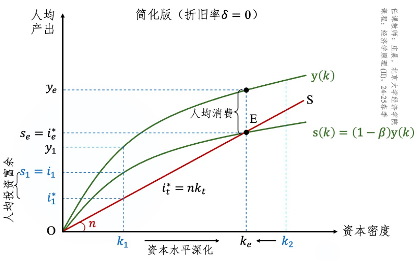
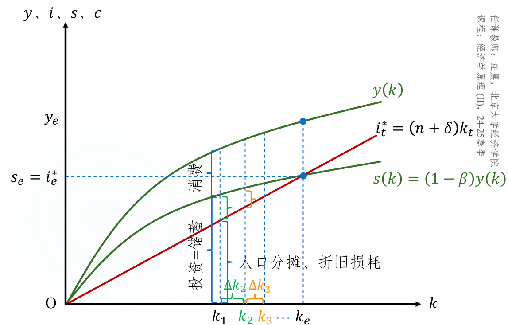
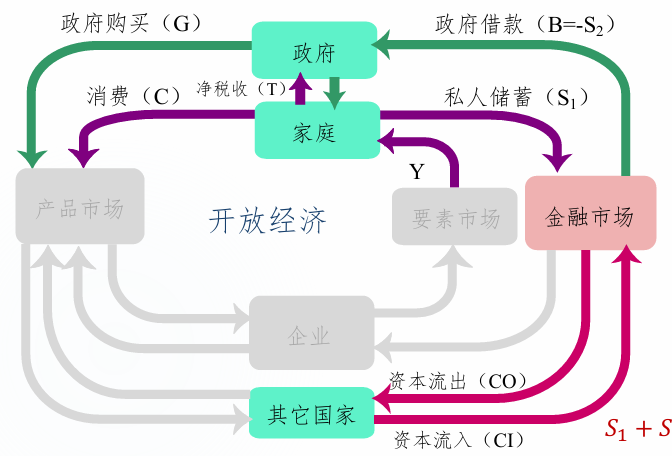
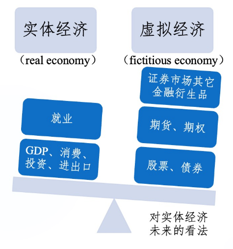
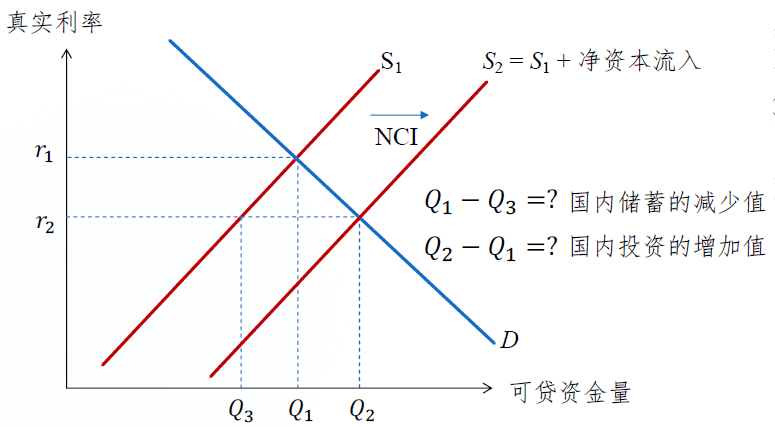

# 经济学原理2

授课老师：庄晨

笔记内容均参考庄晨的讲义与PPT。

斜体和角标为批注。

## 正课一：宏观经济学的起源、原理和税制

时间：2025年2月17日

宏观经济学起源的重要人物：

| 人物               | 贡献                                                         |
| ------------------ | ------------------------------------------------------------ |
| 西斯蒙第           | 周期性危机理论                                               |
| 哥白尼、博丹、休谟 | 货币数量论                                                   |
| 凯恩斯             | 写出宏观经济学开山之作《通论》 指出大萧条的原因是总需求不足 解决方案是政府增加之处 |

 

宏观经济学研究三个问题：

1. 经济增长问题：一国的经济增长率取决于什么？
2. 失业问题：一国的失业率取决于什么？
3. 通货膨胀与通货紧缩问题：一国的通货膨胀率取决于什么？一国又为何陷入通货紧缩

宏观与微观的区别与联系：

- 微观关注家庭（或个人）及企业；宏观关注经济系统现象。二者关注不同对象，使用不同模型。

- 宏观经济学要有微观基础。

  辛普森悖论：在分组比较中都占优的一方在总评中反而失势，即分层统计和统一统计结果不一。

- 但是也要有宏观视野。

  节俭悖论：经济不景气$\to$家庭或个人减少花费$\to$经济更加不景气。

宏观经济学的三大原理：

| 曼昆                                                         | 克鲁格曼                                                     |
| ------------------------------------------------------------ | ------------------------------------------------------------ |
| 原理10：**一国的生活水平取决于它生产产品和服务的能力。** 侧重生产力方面——隐含的假设是：经济处于良性循环，只要生产出来就有人消费（转化为收入） 这是一个长期逻辑 生产力是生活水平的前提 良性循环时，只需关注生产力 | 原理10：**一个人的花费是另一个人的收入。** 侧重生产力转化为生活水平的机制——有生产才有人支出，有人支出才有收入，有收入才能提升生活水平 |
| 原理11：**政府发行过多货币时，物价上升。** 货币数量论：货币数量增长，货币价值下降（这是长期机制） 对应的克鲁格曼原理强调短期的机制：当人们手中有更多货币时，消费需求可能同比例上升（物价自然上升） | 原理11：**总花费有时候与经济的生产能力不匹配。** 从长期来看，生活水平取决于生产力；从短期来看，生活水平与生产力可能不匹配。 有时候，产品或服务无人消费，如大萧条 有时候，产品或服务无法满足所有人的消费需求 |
| 原理12：**社会面临通货膨胀与失业之间的短期权衡取舍** 这个原理侧重短期 货币注入短期影响：刺激花费$\to$企业为提高生产雇佣更多员工$\to$失业率下降 | 原理12：**政府政策可以影响花费。** 当总花费与生产能力不匹配时，政府可以采取一些政策工具影响花费：如政府消费、税收、控制货币数量等 |

**平均税率**与**边际税率**：

- 平均税率是税额和收入之比。纳税人的税负用平均税率来解释。
- 边际税率是每增加一单位收入需要交的税。税收对激励的扭曲用边际税率来解释（因为理性人考虑边际）。

> 假设某人的年收入为10万元，根据累进税率表：
>
> - 应税所得不超过3万元，税率为10%；
> - 应税所得在3万到8万元之间，税率为20%；
> - 应税所得超过8万元，税率为30%。
>
> 如果某人的应税所得为10万元，那么其边际税率就是30%，因为其最后一单位应税所得（超过8万元的部分）适用30%的税率。
>
> 他的平均税率为19%：$3 \times 10\% + (8-3) \times 20\% + (10-8)\times 30\% = 1.9$

税收种类：

1. 个人所得税

   - 计算公式：应纳税 = 应纳税额 $\times$ 适用税率 - 速算扣除额；应纳税额 = 年收入额 - 起征点 - 专项扣除等。

   - 速算扣除额是由于未按照阶梯税制计算多出的税。没有速算扣除额时，按照阶梯税制计算。见例。

   > 例：数据同上。起征点为0，无专项扣除。
   >
   > 无速算扣除额的个税计算：$(10-8)\times 30\% + (8-3) \times 20\% + 3 \times 10\% = 1.9$
   >
   > 超过8万元的速算扣除额的计算：$(8-3) \times (30\%-20\%) + 3 \times (30\%-10\%) = 1.1$

2. 公司所得税

3. 社会保险税：雇主从员工工资中拿出一部分交给政府，用于医保和社保等。

   - 中国“费改税”。

4. 增值税（VAT）：是对商品生产、流通、劳务服务中多个环节的新增价值或商品的附加值征收的一种流转税。

5. 产品和服务税（GST）

   - 中国：特种消费行为税（简称消费税）

     美国：销售税和特种消费行为税

   - 销售税针对大部分产品和服务

     消费税针对小部分产品和服务，如烟酒、奢侈品等

   - 美国的销售税类似中国的增值税。美国对消费者征收，中国对销售商和生产商征收。

从价税和从量税：销售税往往是从价税（每100元征收10元）；货物税往往是从量税（每一吨征收10元）。

累进税和累退税：

- 所谓进退，看的是税额和收入之比，而不是和应纳税额之比。
- 收入税往往是累进税；GST和VAT往往是累退税，因为花费占富人收入的比重明显更小。

征税的消极影响：

1. 无谓损失。但是在有负外部性时，庇古税可以消除无谓损失。

2. 行政负担。如报税系统的建立和运营成本。在所难免。

实现税收公平的原则：

1. 受益原则：将纳税人从政府公共支出中受益的多少作为税收负担分配的标准

2. 支付能力原则：根据纳税人所能承受的负担来征税
   - 纵向公平：支付能力强的人应纳更多的税。
   
     累退税率是否违背纵向公平？不违背。累退税率不是累退
   
     税额，依然满足挣得多交得多。
   
   - 横向公平：有相似支付能力的人应纳等量税收。
   
     同一个收入等级（甚至有相同收入）的家庭未必有相似的支付能力，比如要赡养老人的家庭。

考量是否公平应考虑税收归宿：

1. 法律归宿：法律规定的纳税义务人
2. 经济归宿：税收的最终实际承担者

## 正课二：收入与不平等

时间：2025年2月24日 & 2025年3月3日

库兹涅茨曲线

 

### 1. 新古典主义分配理论和工资的决定

从需求方来看：

- 工资是劳动的租金，反映支付意愿（WTP）。
- VMP（边际产品价值）= MP $\times$ P.
- 完全竞争时：WTP最终将等于VMP。
- 买房垄断：WTP能够小于（$\leq$）VMP。

从供给方来看：

- 租金是一段时间内的收入，反映出让意愿（WTS）。
- MC（边际成本）是一种货币化的闲暇的价值。
- 完全竞争：WTS最终将等于MC
- 卖方垄断：WTS能够大于（$\geq$）MC。

 

加总后不呈现弓形是因为，不断有新的工人因为工资的增加进入市场。

 

上面两个曲线的交点决定均衡工资。

### 2. 收入的主要来源

1. 工资收入
2. 资本收入
   - 直接：居民储蓄（居民投资、企业融资后投资）
   - 间接：企业自留资金
3. 土地收入
   - 农村土地流转

### 3. 工资的差别

#### 3.1 补偿性工资差别

补偿性工资差别：由不同工作的非货币特征引起的工资差异。

- 工资改变，工时/雇员数在曲线上移动；当非货币特征改变，曲线发生位移，从而改变均衡工资。

   

补偿性工资差别的前提假设：

1. 雇员最求效用最大化而不是工资最大化。
2. 雇员对工作的特征信息有一定了解。
3. 雇员有流动性。

如果所有雇员都是同质性的：

 

在某一个工资水平，要么所有雇员都愿意工作，要么所有都不愿意。

#### 3.2 人力资本

人力资本包括：教育文化水平、知识技能、健康状况……

人力资本越高，工资越高：

- 需求角度：人力资本越高，MPL（劳动者的边际产出）越高，VMPL也越高。*对应WTP = VMP的思路。*
- 供给角度：人力资本投资的成本需要被补偿。*对应WTS = MC的思路。*

#### 3.3 天赋、努力和机遇

外貌是一种天赋，它如何影响工资？

1. 良好的外貌能提升MPL.
2. 外貌反映了其它方面的能力。
3. 外貌歧视。

努力如何影响工资？

- 努力可以提高MPL.
- 雇主会通过薪酬设计激发员工努力。

机遇如何影响工资？

- 时代红利，如土木专业与房地产。

#### 3.4 信号

人力资本理论：教育提高MPL。

信号理论：教育只是筛选出具有更高能力或MPL（难以观察）的人。

#### 3.5 超级明星现象

超级明星需要市场具备两个特征：

1. 每一个消费者都希望享受最出色的生产者提供的产品。
2. 技术使得最出色的生产者能够以较低成本将该产品提供给每一个顾客。

### 4. 高于均衡水平的工资

上面是影响完全竞争均衡水平的工资的5个因素。而工资可能高于均衡水平。

#### 4.1 最低工资法

作为价格下限，最低工资可能无约束力，也可能造成劳动力过剩。

买方垄断时，可能增加就业。

- 某家公司垄断，已知劳动供给曲线为$w(L)$，代表工资是工人数$L$的函数。

- 公司考虑总花费$E = w(L)\times L$，使得边际花费$ME = w(L) + \frac{dw}{dL}\times L$等于边际劳动产品价值。

  

  需求曲线与VMPL重合，ME和需求曲线的交点决定了垄断水平。

- 如果最低工资恰好设在完全竞争的均衡水平，会改变ME的函数，使得工人数回到均衡水平。

  

#### 4.2 工会

工会能够提高劳动者的卖方势力，从而改变价格。美国工会会员比非会员工资高10-20%。

#### 4.3 效率工资

高工资可促进MPL：减少人员流动、提高努力程度、吸引更优秀人才等。*（可以思考为什么高工资会到来后面三个好处？）*

企业通过高工资激励员工认真工作。

“怠工模型”中的NSC曲线与需求曲线相交确定效率工资$w^*$，$w^*>w$，劳动供给剩余，一旦失去这份工作就会失业。

### 5. 歧视

歧视就是向**除了以下个人特征以外**相似的雇员提供不同工作机会的情况：

1. 种族、民族
2. 性别
3. 年龄
4. 其它与MPL无关的客观特征

对于雇主而言，不歧视员工更利于发现套利机会，追逐更高利润。

- 新雇主可以雇佣相同能力的被歧视群体降低生产成本
- 由被歧视群体组成的新公司不断抢占市场份额
- 对被歧视群体的需求上升，正常群体的需求下降，直到工资差别消失

雇主的逐利动机可能无法完全修正歧视，因为市场中还存在消费者和政府力量。

- 消费者反感特定群体的服务
- 政府颁发歧视性法律

歧视的另一个成因，是统计性歧视——基于群体平均特征而对个体区别对待的行为。

### 6. 收入不平等

衡量方式：

1. 税前收入最高1%人群的收入份额
2. 收入最高10%人群的收入份额
3. Palma比值：收入最高10%与收入最低40%的收入份额比值
4. 五等份比值：高收入组（收入最高20%）和低收入组（收入最低20%）的收入份额比值
5. 基尼系数
6. 贫困率

#### 6.1 基尼系数

洛伦兹曲线：一国或地区内，将人从最贫穷到富有排列，累积人口份额与累积收入份额之间的关系。

45°向上直线为绝对平均线。

记洛伦兹曲线与绝对平均线之间面积为$A$，洛伦兹曲线与横轴之间面积为$B$，则基尼系数 = $A/(A+B)$.

基尼系数取值在0到1之间，越靠近0越平等。

- < 0.2：过于平均
- 0.2 - 0.3：较平均
- 0.3 - 0.4：较合理
- 0.4 - 0.5：较不平等
- \> 0.5：差距悬殊

 

#### 6.2 贫困率

贫困率：一国或地区低于贫困线的人口比例。贫困线是一个具体的收入值。

有绝对贫困、相对贫困、弱相对贫困（假如每个人收入提高相同比例，贫困线也有所上调，但比例低于收入提高比例）。

世行贫困率数据，中国 < 美国，存在的问题：

1. 用2017年1美元在美国的购买力换算各年各国的实际价值可能不可靠。
2. 美国贫困率根据收入调查计算；中国根据消费调查计算。后者易低估不平等程度。
   - 收入 = 消费 + 储蓄 - 借贷
   - 收入分布首尾两端的收入和消费有差别。

#### 6.3 衡量不平等的其它问题

前面的方法基于年度税前货币收入计算，可能高估。

- 税前货币收入：忽略了实物转移等非货币收入和税款抵免。
- 年度收入：不是长期收入，忽略了收入在人生中的波动性。

### 7. 经济流动性

代际流动性将贫困衡量的尺度拓展到了子子孙孙。

代际流动性与其它不平等的衡量相关，如基尼系数（了不起的盖茨比曲线）

 

代际流动性除了用代际间收入的相关性衡量，还可以用健康、教育等指标衡量。

### 8. 收入分配的政治哲学

| 政治哲学     | 代表人物                 | 主要观点                                                     | 应用                                                         |
| ------------ | ------------------------ | ------------------------------------------------------------ | ------------------------------------------------------------ |
| 功利主义     | 边沁、约翰·斯图亚特·穆勒 | 政府应该选择最大化社会中所有人的总效用的政策                 | 边际效用递减：政府应将富人收入分配给穷人 人们对激励（收入）做出反应（努力）：应在提升穷人效用和降低社会总收入之间寻找平衡 |
| 自由主义     | 约翰·罗尔斯              | 政府应选择“无知之幕”背后的公正旁观者认为公平的政策。         | 对于不确定自己收入将落入哪个阶层的人，**更担心**自己落入最低收入阶层的福利。 最大最小原则：政府应最大限度改善社会中状况最糟的人的福利。 考虑效率，不会完全平等 |
| 自由至上主义 | 罗伯特·诺齐克            | “无知之幕”背后真正的公正旁观者应该更关注过程公平，保证“能者多得”。 | 政府应惩罚犯罪，执行自愿协议，而不应该再分配收入。 只要收入分配的过程是自由公平的，那么结果也是公平的——无论它有多么不均。 |

### 9. 减贫政策

政策：

1. 福利项目：如美国的贫困家庭临时援助项目

2. 负值所得税：应该给低收入者直接补贴，即负值所得税。

   如：应缴所得税 = 0.2 $\times$ 收入 - 10000

   年收入低于50000的人将获得补贴；所有人收入 $\geq$ 10000.

3. 实物支付转移：如食品券

人们对边际税率做出反应：收入提高可能使减贫受惠者失去所有补助，而补助高于收入的提高，则有效边际税率 > 100%.

*假设原有10元补贴，多赚1元，补贴消失，相当于边际税率为1000%*

解决方法：

1. 限制受惠年限
2. 工作福利制：接受福利还要接受一份工作
3. 渐进地减少福利，使有效边际税率 < 100%*(即赚钱比失去补贴要好)*

## 正课三：一国收入的衡量

时间：2025年3月3日 & 2025年3月10日

### 1. 概念

库兹涅茨提出了国民生产总值（GNP）的概念。

凯恩斯是现代意义的国内生产总值（GDP）之父。

GDP与GNP的差别：

- 初代GNP：一定时期内一国公民拥有的生产要素生产的最终产品和服务的市场价值。
- GDP：一定时期内一国内所有生产的最终产品和服务的市场价值。
- GNP强调国籍，GDP强调地理。
- 共同点：“一定时期”、“一国”、“最终产品和服务”、“市场价值”

全球经济一体化使得很少有商品纯粹由一国公民生产，GDP被广泛采用。

为了更好地衡量一国公民生活水平，使用国民总收入（GNI）

- GNI（改变GNP）= 初代GNP + 来自国外的净支付转移（非要素收入，如经济援助、捐赠等）

我国从物质产品平衡表体系（MPS）向国民账户体系（SNA）过渡

- MPS强调物质生产；SNA包括所有产品和服务。
- 旧核算体系存在问题：
  1. 重复计算中间产品
  2. 忽略非物质生产部门

### 2. 收入-支出循环流量图

“一个人的花费是另一个人的收入”，因此GDP既能衡量总收入，又能衡量总支出。

图中隐含的简化设定：

1. 家庭拥有所有生产要素（劳动、资本和土地）。体现在“工资”、“利息”、“地租”流向家庭。
2. 企业所有权属于家庭，自留利润是家庭收入。税收负担和补贴福利最终落在家庭身上。
3. 政府不直接参与生产和投资。

从实体经济来看：

- 产品和服务市场资金流出：向企业支付$Y$.
- 产品和服务市场资金流入：政府的购买$G$，家庭的消费$C$，企业的投资$I$，净出口$NX$.
  - $G$包括消费类（如购买教育和医疗服务）和投资类（如基础设施建设）转移支付是再分配，不属于$G$.
  - $I$包含实物资本和库存变化[^1]的投资。投资的目的是生产不是投机。
  - $NX = X - M$.

 $Y = G + C + I + NX$

上述公式是会计等式，而不是行为等式。[^2]

### 3. GDP的计算

定义拆解：

- “所有”：包括有形的产品，也包括无形的服务。

- “生产”：强调生产而不是转移（排除了二手交易、政府转移支付）。

  购买股票、债券是金融所有权的转移，被视为“二手”。

- “最终”：避免重复计算问题。

  产品滞销先算作今年的存货投资，明年卖出去了再扣除。

  原料没有完或产品生产到一半，都视作“最终产品”计入库存。

- “市场价值”：将各种生产活动换算为可比的单位。

  不一定要发生正式交易，比如住自己买的房子，也可将其产生的“居住价值”经济增加值纳入GDP。[^3]

  许多非正式、非市场化交易的活动未被计入，如家庭内部的交易、非法交易。

  GDP一定意义上也反映市场化程度。

#### 3.1 支出法

$$
\text{GDP} = Y = C + G + I + NX
$$

支出法公式中四个组成部分的相对占比体现GDP结构

- $C/Y$：消费占GDP比重。2023年中国的C/Y为39.6%，内需不足，美国为67.9%。
- $(C+G)/Y$：最终消费占GDP比重。

我国消费占比低反应了高储蓄率和投资率：

- 家庭视角：$Y = C + S + (T - TR)$[^4]，$T$和$TR$分别是tax和tax return. $C/Y$较低，则$S/Y$较高。
  - 不想花：收入税低，对储蓄负向激励低。
  - 不敢花：预防性储蓄。
- $C + G + I + NX = C + S + (T - TR)$, 整理得到$(G + TR - T) + I + NX = S$，财政赤字$G + TR - T$和贸易顺差$NX$占比小，$I$和$S$近似相等。

#### 3.2 生产法

$$
GDP = \sum_i VA_i
$$

$VA_i$代表行业或部门i的增加值。

#### 3.3 收入法

$$
GDP = R + T_F + \sigma_F + \pi_F
$$

- $R$：在我国指劳动者报酬。其他国家还包含利息、租金。
- $T_F$：生产税净额
- $\sigma_F$：固定资产折旧
- $\pi_F$：净营业盈余。加上$\sigma_F$后时总营业盈余。

这个方法源自会计恒等式：收入 - 成本 = 利润。$\pi_F$为利润，其余为成本。

国内生产净值（NDP）= Y - 折旧。

#### 3.4 名义与真实

名义GDP：使用当期价格计算GDP。

真实GDP：使用某个基期的价格计算GDP。

#### 3.5 GDP平减指数

$$
\text{GDP平减指数} = \frac{\text{名义GDP}}{\text{真实GDP}} \times 100 = \frac{P_tQ_t}{P_0Q_t} \times 100
$$

GDP平减指数的三个要点：

1. 同年分子和分母使用相同的商品篮子。
2. 不同年份的商品篮子不固定。
   - GDP平减指数的变化率取决于基期的选择[^5]。                                                                                                                                                                                                                                                                                                                                                                                                                                                                                                                                                                                                                                                                                                                                                                                                                                                                                                                                                                                                                                                                                                                                                                                                                                                                                                                                                                                                                                                                                                                                                                                                                                                                                                                                                                                                                                                                                                
3. 商品篮子包含经济体中所有商品和劳务。

[返回CPI与其它价格指数的比较](# 5.3 CPI和其它物价指数的关系)

### 4. 其它一国收入的衡量指标

1. GNI = GDP + 境内要素在境外的收入 - 境外要素在境内的收入

   GDP > GNI，外资在中国赚钱比中资在外国赚钱多。

2. NNI = GNI - 折旧

3. 个人收入PI = NNI - 企业留利 - 社保税 - 公司所得税 + 个人利息收入

4. 个人可支配收入PDI = PI - 个人所得税

### 5. 物价指数

#### 5.1 CLI和CPI

生活费用指数（CLI）：一定时期内一个代表性家庭为了**达到某一生活水准**（福利或效用）所需要的**最小总费用**的度量。

消费物价指数（CPI）：一定时期内一个代表性家庭的**一篮子产品与服务的总费用**的度量。

#### 5.2 CPI的计算

方法一：

1. 固定篮子（包括种类和数量）

2. 确定价格

3. 按照价格计算篮子费用

4. 选择基期并计算
   $$
   \text{CPI} = \frac{\text{当期篮子费用}}{\text{基期篮子费用}} \times 100
   $$

5. 继而可以计算通货膨胀率
   $$
   \text{通货膨胀率} = \frac{\text{CPI}_t-\text{CPI}_{t-1}} {\text{CPI}_t} \times 100\%
   $$

方法二：

1. 计算**消费**权重
2. 计算每个商品的CPI
3. 加权平均

实际统计中，篮子内“代表规格品”的选择：

1. 消费量大，前景较好
2. 合格产品
3. 选中的规格品与未选中的规格品之间价格变动**相关性越高越好**。*代表性好*
4. 同一基本分类的规格品之间价格变动**相关性越低越好**。*有差异性*

#### 5.3 CPI和其它物价指数的关系

1. CPI和[GDP平减指数](# 3.5 GDP平减指数)

   联系：二者同向变动

   区别：GDP平减指数的篮子随时改变；CPI的篮子在一段时间内固定。

   当所有产品和服务价格同比例变动时，无论二者覆盖的产品和服务是什么，二者都相等。[^6]

2. CPI和核心CPI

   核心CPI是剔除了短期波动大的产品和服务后的CPI，比如食品和能源。

3. CPI和PPI

   PPI：工业产品出厂价格指数

   国家统计局的PPI篮子包括：原材料或中间产品的价格、最终产品的价格（批发价）

   PPI是CPI的价格先导；PPI波动较大，因为生产一个产品或服务往往需要多个原材料。

   PPI变动率为负说明企业面临利润下滑的压力。

4. CPI和PCE

   PCE是美联储衡量通胀的常用指标。

   PCE的篮子更大。CPI往往基于居民消费的**平均支出习惯**；PCE则基于整个经济的**实际消费情况**。

   PCE篮子在各期不固定，从而考虑了“替代效应”。

   PCE指数的编制方法不同。CPI是拉氏价格指数，PCE则是链式加权价格指数。

### 6. 编制指数的方法

1. 拉氏价格指数——使用0期的商品篮子，$Q_0$
   $$
   \frac{P_tQ_0}{P_{t'}Q_0} \times 100\%
   $$
   月度同比：$t' = t - 12$

   月度环比：$t' = t -1$

   我国将第0期定为1978、1985或1990年，并令$t' = 0$以计算**定基指数**。

   *$t' = 0$时，拉氏就是CPI.*

2. 帕氏价格指数——使用t期的商品篮子，$Q_t$
   $$
   \frac{P_tQ_t}{P_{t'}Q_t} \times 100\%
   $$
   *帕氏是基期为t的CPI.*

3. 费雪价格指数——拉氏指数和帕氏指数的几何平均
   $$
   \sqrt{\frac{P_tQ_0}{P_{t'}Q_0} \times \frac{P_tQ_t}{P_{t'}Q_t}} \times 100\%
   $$

4. 链式加权价格指数[^7]——费雪价格指数的改版
   $$
   F_{t,t-1} = \sqrt{\frac{P_tQ_{t-1}}{P_{t'}Q_{t-1}} \times \frac{P_tQ_t}{P_{t'}Q_t}}
   $$
   定义$F_{t,t'} = F_{t,t-1} \times F_{t-1,t-2} \times ... \times F_{t'+1,t'}$

   若令$t' = 0$，则可以称$F_{t,0}$为**定基费雪价格指数**。

   *$F_{t,t-1}$和费雪价格指数类似，只是将其中的$Q_0$改成了$Q_{t-1}$*.

### 7. CPI的应用

1. 帮助我们近似度量消费者的生活费用，调整工资、养老金等契约关系。
2. 帮助我们估算货币量、财产数以及一系列价值的时间序列。
   - 1975年的100元，今天值多少钱。$100 \times \frac{\text{CPI}_{2025}}{\text{CPI}_{1975}}$.
3. 帮助我们把握名义利率与真实利率的关系，指导宏观调控政策，维护社会的和谐稳定。
   - 社会稳定要求借贷关系的稳定
   - 真实利率 $\approx$ 名义利率 - 通货膨胀率
   - 通过CPI计算通货膨胀率，调控名义利率，维持真实利率不变。

### 8. CPI存在的问题

1. 忽略“替代效应”对篮子中物品的影响。
   - 有自愿替代和被迫替代两种。
   - 前者是人们对价格变化作出反应；后者是质量变化导致。
2. 不衡量产品或服务的质量。
   - 质量上涨的同时价格上涨，则高估了生活成本
   - 质量下降的同时价格下降，则低估了生活成本
   - 解决方案：享乐质量调整[^8]
3. 不及时反映新产品引进与新服务模式的出现。

## 正课四：生产与增长

时间：2025年3月10日 & 2025年3月17日 & 2025年3月24日

### 1. 经济增长的度量

真实GDP增长率：

- $t$年度增长率：$\frac{Y_t - Y_{t-1}}{Y_{t-1}} \times 100\%$
- $t$年度人均增长率：$\frac{y_t - y_{t-1}}{y_{t-1}} \times 100\%$
- 人均增长率 $\approx$ 增长率 - 人口增长率

GDP增长率的计算还可以使用一些指数：

1. 拉氏指数——使用基期0的价格，$P_0$
   $$
   (\frac{P_0Q_t}{P_0Q_{t-1}}-1)\times 100\%
   $$

2. 帕氏指数——使用基期t的价格，$P_0$
   $$
   (\frac{P_tQ_t}{P_tQ_{t-1}}-1)\times 100\%
   $$

3. 费雪指数——拉氏与帕氏的几何平均
   $$
   (\sqrt{\frac{P_0Q_t}{P_0Q_{t-1}}\times \frac{P_tQ_t}{P_tQ_{t-1}}} - 1) \times 100\%
   $$

4. 链式加权指数——选取$t-1$作为基期0的费雪公式
   $$
   F_{t,t-1}=(\sqrt{\frac{P_{t-1}Q_t}{P_{t-1}Q_{t-1}}\times \frac{P_tQ_t}{P_tQ_{t-1}}} - 1) \times 100\%
   $$
   

链式加权指数的好处：

1. 避免增长率结果过于依赖基期的选择。
2. 对产品价格进行动态调整，避免价格脱离实际。

环比费雪经济指数：
$$
F_{t,t-1}=\sqrt{\frac{P_{t-1}Q_t}{P_{t-1}Q_{t-1}}\times \frac{P_tQ_t}{P_tQ_{t-1}}} \times 100
$$
定基费雪经济指数：
$$
F_{t,0} = (\frac{F_{t,t-1}}{100}\times...\times \frac{F_{1,0}}{100}) \times 100
$$
70规则：如果一国的真实GDP以每年$x\%$的速度增长，GDP翻一番需要$\frac{70}{x}$年。

$(1 + \frac{x}{100})^n = 2$，取对数，$n = \frac{\ln2}{\ln(1+x/100)} = \frac{100\ln2}{x}$

70规则可以用于计算赶超时间，$n = log_2^k \times \frac{70}{\Delta x}$，$k$是GDP的比率（大比小），$\Delta x$是增速之差。[^9]

### 2. 经济增长的影响因素

#### 2.1 劳动投入$L$

起最基本作用，可以用总劳动时数衡量。

$L$可以被分解为三个元素的乘积：

1. 工作年龄的人口
2. 就业人口/工作年龄人口（就业比例）
3. 总劳动时数/就业人口（工人平均劳动时间）

#### 2.2 实物资本$K$

实物资本是用于生产的所有设备和结构，其增长取决于储蓄和投资决策。

#### 2.3 人力资本$H$

人力资本是人本身积累的技能和知识。

#### 2.4 自然资源$N$

分为可再生和不可再生。

随着资源约束的显性化、可持续发展的要求凸显，$N$进入生产函数。

#### 2.5 技术$A$

社会对生产产品和服务的最优方式的了解程度。

$A$可以是公共品，也可是私人品（专利）。

#### 2.6 生产函数

总生产函数：$Y_t = A_tf(L_t,K_t,H_t,N_t)$

若规模报酬不变，人均生产函数：$y_t = A_tf(1,\frac{K_t}{L_t},\frac{H_t}{L_t},\frac{N_t}{L_t})$

生产函数形式的变化作为**长期经济增长**的源泉与动力，可能来自于**制度变迁**。

### 3. 马尔萨斯陷阱

生产函数：

$y = \frac{Y}{N}$既是人均产量，也是人均收入，代表人均生活水平。

$y$和N的关系：

- 体现为原点与生产函数上的点的连线的斜率。
- $y$是$N$的函数，随$N$的增加而递减。

人口增长模型：
$$
\frac{\Delta N}{N}(y) = b(y) - d(y)
$$

- $b(y)$是出生率；$d(y)$是死亡率。
- 为了简化，$b(y)$恒定。
- $d(y)$随着$y$的提高而下降。

 

均衡条件为

1. 供求相等，即$Y = yN$。
2. 人口规模不变。
3. 生活水平不变（人口规模不变，生活水平自然就不变）。

稳定的均衡：发生偏离（冲击）后，能自发回到均衡点。

OS线：$Y_S = y_SN$，斜率为$y_s$，表示人口不变时的人均收入。

均衡是生产函数与OS线的交点，满足稳定的均衡：

- 发生战争，人口锐减，产出富余($Y_H > Y_s$)，人均收入增加，人口增长
- 外来人口，人口增加，产出稀缺($Y_H < Y_s$)，人均收入减少，人口减少

 

这个均衡水平是收入较低的水平，是个难以自拔的“陷阱”。

如何摆脱马尔萨斯陷阱：

1. 提高生产效率，使得生产函数上移，不改变人均收入。
2. 改善公共设施，降低维持人口稳定的最低生活水平$y_s$.

然而，只要制度不变，经济总归是落入某种“陷阱”。

### 4. 索罗增长模型

索罗全名**罗伯特**·莫顿·索罗。

生产函数：$Y_t = AK_t^\alpha N_t^{1-\alpha}$, $\alpha < 1$.

- 柯布道格拉斯函数
- 边际产出递减
- 规模报酬不变

人均生产函数：除以$N_t$，得到$y_t = Ak_t^\alpha$，其中$k_t = \frac{K_t}{N_t}$. *规模报酬不变是能够写出人均生产函数的关键。*

- $k_t$的含义：资本密度
- 边际产出递减

消费占GDP比重固定为$\beta$，人均消费量$c_t = \beta y_t$，人均新增储蓄量$s_t = (1 - \beta)y_t$，人均投资$i_t = s_t$.

引理：

1. 资本量$K_t$和人口量$N_t$以相同速度增长，则资本密度不变。
2. 假设折旧率为0，若$I_t = nK_t$（$n$是人口增长率），则资本密度不变
   - $I_t = K_{t+1} - K_t$.
   - $k_{t+1} = \frac{K_t + nK_t}{(1+n)N} = \frac{K_t}{N_t} = k_t$.

定义$i_t = nk_t$为**资本水平扩张**（虽然$k_t = k_{t+1}$，但是$K_t$增加了）；$i_t > nk_t$为**资本水平深化**。

OS曲线此时表示资本水平扩张，$i = nk$. OS曲线和储蓄曲线的交点为均衡：

- 战败赔款，资本密度减少，人均投资富余，资本水平深化。
- 发现新大陆，资本密度增加，人均投资缺乏，无法维持资本水平扩张。
- 在稳态均衡点，总产量、总资本、总消费都以人口增长率$n$增长，进入黄金时期。

不改变$n,\alpha,A,\beta$，改变$K,N$的初始值不会改变均衡。人均不变，但是总量可能不同。

黄金规则：

- 目标：最大化$c(k^*)$.
- $\max c(k^*) = \max A(k^*)^\alpha - nk^*$，$k^{gold} = (\frac{n}{\alpha A})^{1/\alpha-1}$，$k^{gold}$就是满足黄金规则的资本密度。
- 代入$s(k^*) = nk^*$，得到$\beta^{gold} = 1 - \alpha$.

更完整的索罗增长模型，加入资本折旧。$\delta >0$，新的OS线为$i_t^* = (n+\delta)k_t$.

 

如果$k^* < k^{gold}$，根据$\beta^* = 1 - \frac{n(k^*)^{1-\alpha}}{A}$，可知$\beta^* > \beta^{gold}$，需要提高储蓄率。

如果在某一期，储蓄率突然上升：

- $\beta$升高，$s(k)$曲线上扬，新的均衡资本密度增加，产出、消费、投资都相应增加

 

过去200年，人均GDP持续增长，并没有进入均衡

- 因为前面的讨论将$A$固定为常数。

- 如果$A$持续上升，$s(k)$和$y(k)$都持续上扬，均衡点不断右移

- 技术进步对经济增长的贡献的估算公式：$\frac{\Delta y_{t+1}}{y_t} = \frac{1}{3}(\frac{\Delta k_{t+1}}{k_t}) + \text{索罗余项}$

   

  $\frac{1}{3}$是索罗对美国的生产函数估算得出的。如何得到上述公式，下一节给出答案。

### 5. 经济增长的分解

考虑一国总生产函数为$Y = AK^\alpha L^{1-\alpha}$.

拆解$\frac{\Delta Y}{Y}$

- 利用全微分的思路，$\Delta Y = K^\alpha L^{1-\alpha} \Delta A + A\alpha K^{\alpha-1}L^{1-\alpha} \Delta K + A(1-\alpha) K^{\alpha}L^{-\alpha} \Delta K$
- 等式两边同除$Y$，得$\frac{\Delta Y}{Y} = \frac{\Delta A}{A} + \alpha \frac{\Delta K}{K} + (1-\alpha)\frac{\Delta L}{L}$

在完全竞争的情况下，$\alpha$和$1-\alpha$是资本和劳动的收入份额。

- $P_K = MP_K = \frac{\partial Y}{\partial K} = \frac{\alpha Y}{K}$, $P_L = \frac{(1-\alpha)Y}{L}$

- 劳动收入：$P_K K = \alpha Y$

  劳动收入：$P_L L = (1-\alpha)Y$

- 从拆解可以看出，$\alpha$和$1-\alpha$也反应资本和劳动对经济的贡献率。

  所以，产出越高，收入也越高。

拆解$\frac{\Delta y}{y}$

- 已知$y = YN^{-1}$，$\Delta y = N^{-1}\Delta Y - YN^{-2}\Delta N$
- 两边同除$y$，$\frac{\Delta y}{y} = \frac{\Delta Y}{Y} - \frac{\Delta N}{N}$, 可以将上面的$\frac{\Delta Y}{Y}$代入
- 假设劳动人口比例确定，$L = 0.8N$，则$\frac{\Delta L}{L}=\frac{\Delta N}{N}$，$\frac{\Delta y}{y} = \frac{\Delta A}{A} + \alpha (\frac{\Delta K}{K} - \frac{\Delta N}{N})$，利用人均增长率的估算，得到索罗估算公式$\frac{\Delta y}{y} = \alpha \frac{\Delta k}{k} + \frac{\Delta A}{A}$

两个应用：

### 6. 经济增长的收敛性

绝对收敛：给定$A,n,\alpha,\beta$，最终经济都收敛于同一均衡。

条件收敛：各国的$A,n,\alpha,\beta$不同，人均GDP不会趋同，但差距会稳定。

储蓄率不影响稳态时的GDP增长率。*GDP就是Y，其增长率应等于人口增长率。*

罗伯特·巴罗的观点：

1. 部分OECD国家满足条件收敛。
2. 一国内部不同地区的趋同也可以用条件收敛解释。
3. 收敛快慢有明显不同。储蓄率、科技水平和初始劳动投入对收敛速度没有影响。

### 7. 内生增长理论

内生变量：在一个经济模型中，这些变量的数值由系统内的函数关系决定。

外生变量：系统外条件决定的变量。

#### 7.1 AK模型

AK模型想要解决储蓄率是什么决定的。

储蓄的本质是当前消费和未来消费的权衡取舍。

- 消费：立刻获得当前消费的边际效用，放弃未来消费
- 储蓄：消耗了耐心，但获得一笔利息作为补偿，获得未来消费的边际效用

欧拉方程：

- 当期消费的边际效用$\times$当期消费1元 = 未来消费的边际效用$\times$未来消费(1+R)元$\times$主观折现因子
- $u'(c_t) = u'(c_{t+1})(1+R)\beta$，$R$是资本的社会净回报率
- 假设一个人能活T期，他的终身效用的现值为：$\sum_{t=0}^{\infin}\beta^t u(c_t)$
- 主观折现因子不好衡量，可以用客观折现因子来近似，$\beta = \frac{1}{1+r}$，$r$是利率。

生产函数：$Y_t = F(K_t, L_t) = AK_t$，资本积累过程中产生了知识外溢或技术改进(研发、干中学)，抵消边际资本产品递减。

生产的目的是最大化终身效用。

资源约束条件：$c_t+i_t\leq y_t$，$c_t+[k_{t+1}-(1-\delta)k_t]\leq f(k_t)$，$c_t+k_{t+1}=(1+A-\delta)k_t=(1+R)k_t$

定义社会**累积**储蓄$s_t$和**累积**储蓄率$s$：

- $c_t + s_t = (1+R)k_t$. *右边是累积资本的收入，左边是消费和累积储蓄的权衡*
- 定义累积储蓄率$s = \frac{s_t}{(1+R)k_t}$, $1-s = \frac{c_t}{(1+R)k_t}$
- 由上式可得$c_t = (1-s)(1+R)k_t$. 代入资源约束条件得$k_{t+1} = s(1+R)k_t$，$s$是待确定的内生变量。

从上面的一系列等式不难发现$\frac{c_{t+1}}{c_t}=\frac{k_{t+1}}{k_t}=\frac{y_{t+1}}{y_t}$. 已有$\frac{k_{t+1}}{k_t} = s(1+R)$一个关系式，又由欧拉方程可以得到$\frac{c_{t+1}}{c_t} = [\rho(1+R)]^\sigma$（这里假设$u(c_t)=\frac{c^{1-\frac{1}{\sigma}}-1}{1- \frac{1}{\sigma}}$，$\sigma$代表跨期替代弹性；折现因子$\beta=\rho=\frac{1}{1+r}$)。

解出$s = \rho^\sigma (1+R)^{\sigma-1}$

1. 如果$\sigma = 1$，则$s = \rho < 1$.
2. 如果$\sigma < 1$, $s = \frac{\rho^{\sigma}}{(1+R)^{\sigma-1}}$，分子<1，分母>1，则$s < 1$.
3. 如果$\sigma>1$，则$s$可能无解（大于1）。

$\frac{c_{t+1}}{c_t}=\frac{k_{t+1}}{k_t}=\frac{y_{t+1}}{y_t} = [\rho(1+R)]^\sigma$，一般投资回报率$R$要大于无风险利率$r$，$\rho(1+R)>1$.

- 经济增长可能不收敛。

## 正课五：消费、投入、储蓄与投资

时间：2025年3月24日 & 2025年3月31日

### 1. 衡量一国某年的储蓄量

#### 1.1 边际消费倾向（MPC）

消费函数：$C = C_0 + \alpha(Y-T)$

- $C_0$是初始消费，满足最基本的需求。
- $\alpha$是MPC，表示可支配收入增加，消费增加的比例。通常要求$0 \leq \alpha \leq 1$.
- $\alpha = \frac{\Delta C}{\Delta (Y-T)}$
- 相关概念：平均消费倾向$\text{APC} = \frac{C}{(Y-T)}$

收支相抵点：

多数情况下，MPC随收入增加而递减。

计算MPC的例题：

 

#### 1.2 边际储蓄倾向（MPS）

$\text{MPS} = \frac{\Delta S}{\Delta(Y-T)}$

$\text{MPC} + \text{MPS} = 1$

#### 1.3 衡量一国某年的储蓄量

某年的储蓄量是一个**流量**的概念，衡量方式有：

1. 利用收入-支出循环流量图。

2. 考虑存量，例如存款余额在两年之间的差。

   - AK模型中的存款余额：$Y_t+(1-\delta)K_t$

   - 问题：现实中储蓄不一定是存款余额。比如，储藏货币，不进入流通，从而未参与投资。

在简化经济中：

 

家庭角度：$Y = C + S$

社会角度：$Y = C + I$

$S = I$

在封闭经济中：

 

家庭角度：$Y = C + S_1 + T$

社会角度：$Y = C + I + G$

$I = S_1 + T - G = S_1 + S_2$，$S_1$为私人储蓄，$S_2$为公共储蓄，政府借款$B = -S_2$.

在开放经济中：

 

家庭角度：$Y=C+S_1+T$

社会角度：$Y = C + I + G + NX$

储蓄投资等式可以写作：$S_1+S_2=I+NX$，把NX当作投资；也可以写作$S_1+S_2-NX=I$，把NX当作储蓄。

- 当NX > 0时，资本净流出（$NCO=CO-CI>0$），钱净流入，外币最终变成对外**投资**。
- 当NX < 0时，资本净流入（$NCI=CI-CO>0$），钱净流出，外国增加对本国的投资，变成**储蓄**。
- $NX$相当于$NGO$；$-NX$相当于$NCI$；$S_1=S_{\text{Private}},S_2=S_{\text{Public}},S_{\text{Private}}+S_{\text{Public}} = S_{\text{National}}.$

### 2. 金融市场和金融中介

#### 2.1 实体经济和虚拟经济

货币体系应当瞄准实体经济价格（如CPI）和GDP增速来变动利率以调控经济。

#### 2.2 金融市场

匹配有资金无机会的借出方和和有机会无资金的借入方的市场。

- 直接融资：通过金融市场将资金的供需双方直接匹配。

股本融资：出售股票来筹资。

- 上市：企业的资产所有权在股票市场上出售发行。

- 首次公开发行股票（IPO）：企业第一次将它的股份向公众出售。

- 一级市场：使未上市的公司完成上市的市场。*公司发行新股在一级市场。*

- 二级市场：一般指证券交易市场。二级市场保证有价证券的流动性。

股价：股票在股票市场的价格。包括个股价格和指数价格。

股息红利、留利、与股息收益：

- 股息红利：上市公司分配给股东的利润，包括现金股息和股票红利（*公司手中会持有一部分股票*）。
- 留利：没有支付给股东的利润，用于增加企业的投资。
- 股息收益：红利与（派息日）股价的比率。

**市盈率（P/E）：使股价（P）和每股盈利（EPS）的比率。**

- EPS = （股息红利+留利）/流通的总股数

买卖价差：要价和出价之差，反映交易成本和市场流动性。

债务筹资：公司通过出售债券来筹资的行为。

- 低风险、低回报
- 低监督成本

债券三要素：本金、利息、到期日

利率是发债成本的主要成分。

债券利率的决定因素：

1. 期限：到期日越远，风险越大，耐心消耗越大，因而利率越高。
2. 信用等级：信用评级越高，利率越低。
3. 税收待遇：若利息收入不计入个人所得税，发行机构可以适当降低利率。

债券在到期日前可以在二级市场上交易，价格是债券的现值：

- $P_b = \frac{x_1}{1+r} + \frac{x_2}{(1+r)^2} + ... + \frac{x_T + F}{(1+r)^T}$
- $x_t$为第$t$年支付的息票额；$F$为面值；$T$是现在和到期日之间相差的年份数；$r$是当下通行的利率，不是债券上的利率。
- 企业信用等级提高，融资成本，低于市场通行利率，会使得的债券价格提高；宏观环境变差，市场通行利率降低，也会使债券价格提高。

企业和政府的融资选择：

|              | 企业           | 政府                                 |
| ------------ | -------------- | ------------------------------------ |
| **债务融资** | 顺风顺水       | 企业难以满足信息披露要求，但风险可控 |
| **股权融资** | 波动大，风险大 | 企业难以承受破产的风险               |

#### 2.3 金融中介

金融中介是储蓄者不能与投资者直接接触时所借助的中间融资机构。

我国主要的金融中介：银行和共同基金。

1. 间接的直接融资：投资者 $\to$ **基金** $\to$ 企业/政府有价证券
2. 完全间接融资：投资者 $\to$ **银行** $\to$ 企业/政府贷款

共同基金：向公众出售股份（公募基金），并用其收入购买各种股票、债券或资产组合。

- 开放式：每个交易日都能向基金机构买卖股份
- 封闭式：封闭期内不可赎回，但可在公开市场转手。

共同基金的好处：规模利益

1. 资金管理的边际成本低，使得平均成本低。
2. 通过合理分工、聘请专业人士继续降低边际和平均成本
3. 通过分散投资，合理配置风险

共同基金的特点：

1. 证券[^10]形式单一，只有股份
2. 基金的负债就是它的股份，回报没有先后级。
3. 没有挤兑风险。资产和负债同幅变化。
   - 资产是基金赚的钱；负债是基金欠基民的钱
   - 因为基金的负债和它的收益挂钩，所以同幅变化。

银行的基本功能：

1. 间接融资平台
2. 充当支付媒介，大大减少了交易次数，提高交易效率。

银行的特点：

1. 证券形式多样，如存款凭证、股票。
2. 存在挤兑风险。资产与负债并非同幅变化。
   - 银行的负债就是本金和承诺的利息，如果收益不好，就会出现净资产的缩水。
3. 股权融资可以增强银行抗风险能力。

### 3. 可贷资金市场

可贷资金市场：将实现储蓄与投资统一的市场。利率$r$作为价格信号引导双方。

- 在AK模型中，储蓄直接转化为投资，无需通过利率$r$调节供需。

  且由$s = \rho^\sigma(1+R)^\sigma$可知[^11]，$r$上升导致储蓄率降低。这是长期逻辑，收入效应主导（$r$增加 $\to$ 总收入提高 $\to$ 现在可以多花 $\to$ 减少长期储蓄）。

  经济增长摊薄了储蓄率。

- 短期的情况有所不同。

可贷资金的供给是利率的增函数。

- 替代效应主导
- 短期经济无增长

可贷资金的需求是利率的减函数。

- 家庭投资：$r$提升导致月供变高，贷款买房需求下降
- 企业投资：$r$提升导致投资的机会成本提高（NPV降低）。

将可贷资金市场模型加入AK模型之中的困难：

- 过度约束，模型无解
- 技术回报率$R$与市场利率$r$的偏离导致存在无限套利的问题

可贷资金市场**需求影响因素**：

*在没有外部因素影响时，可贷资金的供给和需求曲线代表私人储蓄和私人投资。*

1. 商业机会的预期

2. 政府借债（财政赤字）

   存在挤出效应

   

   如果预算赤字减少（没有消除）

   

3. 贸易顺差/净资本流程

   

可贷资金市场**供给影响因素**：

1. 财富（或贫穷）的幻觉

2. 贸易逆差/净资本流入

   

通货膨胀同时影响资金的供给和需求

- 欧文·费雪指出，存在**长期关系**：真实利率 $\approx$ 名义利率 - 通货膨胀率（费雪效应）

- 预期通胀率在长期趋于通胀率，因此真实利率不受通胀预期的影响。

  

可贷资金市场的静态分析（例题）：

> 假设中国可贷资金市场处于图3的E点
>
>  
>
> (1) 若在E点处，中国政府已经存在预算赤字且出口已经大于进口，则均衡可贷资金量等于私人储蓄吗？为什么？
>
> 答：预算赤字和净资本流出影响的是可贷资金需求曲线，供给曲线不移动，仍然表示私人储蓄，所以均衡可贷资金量等于私人储蓄 。
>
> (2) 基于(1)的假设，如果政府预算赤字减小（但没有清零），请画图展示这一变化对公共储蓄、私人储蓄、国内储蓄、可贷资金量和利率的影响。
>
>  
>
> 公共储蓄增加，私人储蓄减少，国内储蓄增加，可贷资金量减少，利率下降。

## 正课六：金融学的基本工具

时间：2025年3月31日

### 1. 风险管理与风险配置

#### 1.1 期望收益率和风险

期望收益：

- 一般：$\mu = E(X) = \sum_{i=1}^n P_iX_i$
- 等可能性
  - 算数平均：$\mu = \bar{X}$. 算术平均易受极端高收益影响。
  - 几何平均：$\mu = (X_1\cdot ...\cdot X_n)^{\frac{1}{n}}$. 给极端低的收益更高的权重、极端高的收益更低的权重。

为了防止负利率，依然使用算术平均，额外引入方差衡量风险。

- $\sigma^2 = Var(X) = \sum_{i=1}^n P_i(X_i -\mu)^2$

风险越高，期望收益率也越高

 

#### 1.2 风险厌恶

效用函数$u(W)$，$u'(W) > 0, u''(W) < 0$.

#### 1.3 风险配置和事件独立

风险分摊：将个体的（特有）风险分散到社会上尽可能多的人身上。

- 事件独立$P(A\cap B) = P(A)P(B)$

  事件正相关$P(A\cap B) > P(A)P(B)$

  事件负相关$P(A\cap B) < P(A)P(B)$

- 在风险分摊的背景下，事件独立性是一个理想的情况，一个个体的损失不会增加其他个体的风险，这使得风险分摊更加有效。

- 在实际情况中，事件之间可能存在相关性。例如，在金融危机中，一个金融机构的失败可能会增加其他金融机构失败的风险。

#### 1.4 保险与道德风险

事前道德风险：事故之前，防止损失的行为减少。

事后道德风险：事故之后，减少损失的行为减少（使用昂贵药）。

我国医疗费用的增长，部分来自医保扩张带来的道德风险问题。

#### 1.5 保险与逆向选择

信息优势方倾向于使信息劣势方受损从而导致市场效率降低的情况。

- 一款年费2000元的医疗保险，购买者是花费大于2000元的；公司于是提高价格至3000元；购买者是花费大于3000元的……

- “劣币驱逐良币”，最终**市场瓦解**。

### 2. 证券与资产组合

某股第一年股利为$D$，此后每年大约以$g$的增长率增加。

DDM模型：若证券市场上的贴现率为$r$（$r>g$），股价为$\frac{D}{r-g}$.

肥尾理论：一般认为投资回报遵从正态分布，收益率极高和极低的概率不超过5%；而肥尾理论认为收益率极低的事件并非小概率。

系统风险：市场风险，无法规避。

非系统风险：企业特有风险，可以用多样化组合冲销。

例题：

现实中，每个资产$i$承受的系统风险不同。我们将大盘的风险视为1，考察个股收益率和大盘的关系。

考虑一个含有$n$个权重相同、相互独立的证券组合，证券同质（期望收益和方差相同）。

- 资产组合的收益：$R_p = \frac{1}{n}R_1+\frac{1}{n}R_2+...+\frac{1}{n}R_n = R$.

  收益无变化。

- 方差：$\sigma_p^2 = \frac{1}{n^2}\sigma_1^2+\frac{1}{n^2}\sigma_2^2+...+ \frac{1}{n^2}\sigma_n^2 =  \frac{1}{n}\sigma^2$.

  风险降低。

不独立的资产组合：

- 风险-期望收益率曲线

  

  哈里·马科维茨提出有效边界（上图），它表示在给定风险水平下可以获得的最高期望收益率，或者在给定期望收益率下可以承受的最低风险。

  边界右侧的组合可行但不有效。

  金融决策一般考虑红点。

### 3. 有效市场假说与资产泡沫

尤金·法玛提出“有效市场”：

1. 有效市场中，由于竞争，证券内在价值的信息迅速反映在其瞬时价格上。
2. 股价反映当天所有新的信息。
3. 无法用过去股价预测未来股价。因为今天的信息已经全部体现在股价中。

哈里·罗伯茨提出三种的有效性：

1. 弱式有效：**过去交易信息**已经反映在股价之中。
2. 半强有效：**公开的信息**也已经反映在股价之中。
3. 强式有效：**内部信息**也已经反映在股价之中

罗伯特·希勒认为股市未能消化全部信息，股票的定价未必有效，存在获利机会。

有效市场假说无法解释“资产泡沫”

- 泡沫：是资产价格与它内在价值发生背离，渐行渐远。
- 产生愿意：市场上存在预期投资者（即投机者），他们的买入会抬高股价，使得“低价买进，高价卖出”成为“自我实现”的均衡。

[^1]: 库存变化的投资指的是没卖出的商品以市场价算作存货投资计入当年GDP。详见OneNote笔记。
[^2]: 会计等式是事后核算，记录已经发生的经济活动，强制要求GDP = G + C + I + NX；行为等式是事前计算，估计未来的经济行为，不要求相等。详见OneNote笔记。
[^3]: 目的是平衡自住房和出租房在GDP中的地位。居住价值是一种虚拟租金，按照同地段同品质住房的租金计算。目前，中国的农村自建房被排除在GDP外。详见OneNote笔记。

[^4]: 企业收入Y最终流向家庭。
[^5]: 与向量乘法运算有关。详见OneNote笔记。
[^6]: 根据定义写出表达式，将向量展开为求和，即可证明。详见OneNote笔记。
[^7]: 链式加权价格指数可以通过基期为t和t-1的CPI计算。取对数，并利用对数和一次函数的估计式。详见OneNote笔记。
[^8]: 将价格与质量挂钩。详见OneNote笔记。
[^9]: 70规则本质上就是100ln2约等于70+对数与一次函数转换. 公式证明见OneNote笔记。
[^10]: 证券可以理解为一种金融索取权。
[^11]: \rho = 1/1-r

